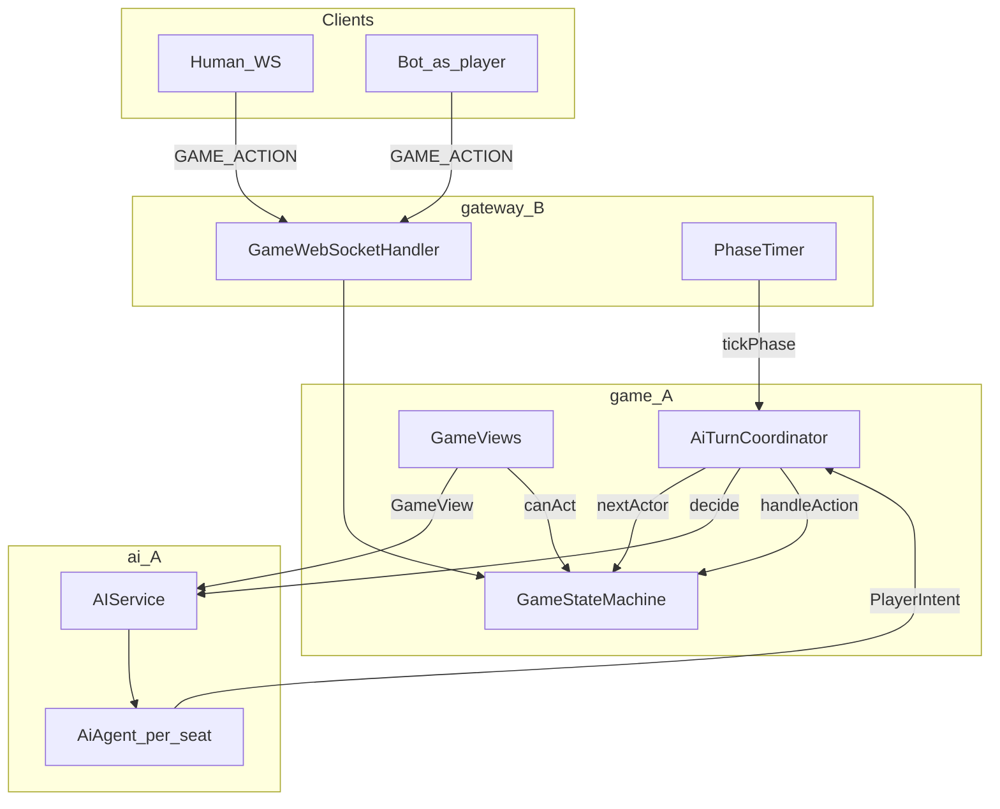

# ADR-003: AI integration — requirements, topology, and scheduling

| 属性 | 值 |
|------|-----|
| 状态 | **已采纳（Accepted）** — 2026-05-17 团队设计冻结 |
| 日期 | 2026-05-17 |
| 决策者 | 游戏引擎 + AI（A）；Gateway/Bot（B/C）评审 |
| 关联 | [PRD §4.5 / §4.3.7](../progress/requirements-mvp-v0.1.md)、[architecture §8.3–9](../architecture/architecture-design-spec.md)、[gateway-integration](../reference/gateway-integration.md)、ADR-001/002、[ADR-004](004-ai-seat-memory.md) |

## 背景

Week1 已在内存态跑通 **Mock 无人干预整局**（`MockGameRunner` + `AIService`），并接入 LangChain4j / DeepSeek 骨架。实现提前混合了三条故事线：**编排落在 `game` 包**、**单例无 Memory 的 AIService**、**未与 `PhaseSyncBuilder` 共享的 GameView**，导致 Week2 LLM 演示与 B/C WS 联调边界不清。

本 ADR **冻结** AI 接入的产品范围、模块边界、调度语义与 Week2 交付路径；代码迁移见 §9。

---

## 1. 范围与非目标

### 1.1 MVP Week2（本 ADR 范围内）

| 项 | 说明 |
|----|------|
| 场景 | **S2** 纯 AI 对局（12 服务端 AI 座位）为默认可演示路径；S1 混合房、S3 全真人规则不变 |
| Agent | 每座位逻辑独立上下文；**单轮** `System + User(记忆 + GameView) → JSON`（记忆见 [ADR-004](004-ai-seat-memory.md)） |
| LLM | DeepSeek 官方 API；单局单模型；3s 超时 → Mock fallback；JSON 解析失败重试 **0** |
| 出口 | `PlayerIntent` → `GameStateMachine.handleAction`（禁止绕过 SM） |
| 可观测 | `thinking` / `modelId` 写入 `action_log`（内存 → B 持久化） |

### 1.2 非目标（Week2 不做）

- 进阶 ① 通用 Agent 自演化、③ 在线自进化写回 Prompt
- `GameTools` LangChain4j agent 多轮 Tool 循环（**Phase B**，见 §5.3）
- 观战专用协议、排行榜
- Bot（C）实现游戏规则

---

## 2. 用户场景与验收

| 场景 | 路径 | Week2 验收 |
|------|------|------------|
| **S2** 纯 AI | `aiCount=12`，`userId=NULL` 座位由 **`AiTurnCoordinator` + `AIService`** 驱动 | dev：`DEEPSEEK_API_KEY` + `wolves-only` 狼夜可演示；`wolves-only=false` 内存整局至 `GAME_OVER` |
| **S2-alt** 12×Bot | Python Bot 按 `PHASE_SYNC` 发 `GAME_ACTION`，**不**调 `AIService` | Week1 联调；与 S2 **互斥默认可演示** |
| **S1** 混合 | 真人 WS + AI 补位 | 仅 `userId=NULL` 座位走 `AIService` |
| **S3** 全真人 | `aiCount=0` | 不调用 `AIService` |

**可演示定义（P0.5）**：一局进入 `NIGHT_WOLF`，至少一狼座位 LLM 产出合法 `WOLF_CHAT` 或 `KILL`，`action_log` 含非 `mock` 前缀的 `thinking` 或 LLM `reason`。

**可演示定义（P1）**：`wolves-only=false`，内存整局结束；50 次 LLM 响应 **解析成功率 > 95%**（`AiIntentParser`，单测/脚本）。

---

## 3. 运行时拓扑



与 PRD §4.5.8、架构 §8.4 一致：**一座位一 Agent 逻辑实例**，**单房间 SM 串行**接纳意图。

---

## 4. 模块边界与调用链

| 组件 | 包 | 职责 |
|------|-----|------|
| `GameStateMachine` | `game` | 权威状态、`handleAction`、阶段推进 |
| `TurnActorResolver` | `game` | 根据 `phase` 解析 **本步行动者** `Optional<Integer>`（无随机策略） |
| `AiTurnCoordinator` | `game` | 单步 tick：announce → `advanceDayAnnounce`；玩家阶段 → 调 `AIService` → `handleAction` |
| `GameViews` / `GameView` | `game.view` | 按座位+阶段裁剪可见信息；`SeatVisibility.canAct` 与 `PhaseSyncBuilder` 同源 |
| `SeatPerceptionProjector` | `game.view` | `action_log` → 按座 `VisibleEvent`（ADR-004） |
| `MemoryPromptFormatter` | `ai.memory` | episodic slice → Prompt「本局记忆」段 |
| `AIService` | `ai` | LLM + Mock fallback；`decide` 内投影 + 格式化记忆 |
| `MockAIPlayer` | `ai` | 全部 Mock 策略（禁止再堆在 Runner 内） |
| `MockGameRunner` | `game` | **dev/压测**：循环 `AiTurnCoordinator` 直至终局 |
| `GamePhaseScheduler` | `game` | Gateway 单次 `tick` 入口 |

**禁止**

- AI 直写 DB / WS / 绕过 SM
- Bot 实现规则
- 对 **`userId != null`** 的真人座位调用 `AIService`（S1）

**依赖**（不变）：`game` → `ai`；`ai` 不依赖 `gateway`。

---

## 5. 包结构（功能分类）

详见 [code-modules.md](../reference/code-modules.md)。摘要：

| 功能 | 子包 |
|------|------|
| 门面 / 契约 | `ai.api` |
| Agent | `ai.agent` |
| 感知 | `ai.perceive` |
| 提示词 | `ai.prompt` |
| 解析 | `ai.parse` |
| 策略兜底 | `ai.policy` |
| 校验 | `ai.guard` |
| 工具（预留） | `ai.tools` |
| 配置 | `ai.config` |

## 6. 数据契约

### 6.1 `GameView`（`game.view`）

与 `PHASE_SYNC` 定向子集对齐，供 Prompt 与后续 Gateway 复用：

| 字段 | 可见性 |
|------|--------|
| `seat`, `yourRole`, `phase`, `round`, `aliveSeats` | 本座位合法可见 |
| `wolfTeammates` | 仅狼 |
| `pendingWolfKill`, `witchAntidoteLeft`, `witchPoisonLeft` | 仅女巫 @ `NIGHT_WITCH` |
| `lastSeerResult`, `lastSeerTarget` | 仅预言家 |
| `wolfChatDone` | 狼 @ `NIGHT_WOLF` |
| `currentSpeaker` | `DAY_DISCUSS` / `LAST_WORDS` |
| `canAct` | 与 `PhaseSyncBuilder` 一致 |

构建入口：`GameViews.forSeat(room, playerId)`。

`ai.perceive.GameViewContext` 保留为 **Prompt 适配层**，委托 `GameViews.forSeat`（不重复裁剪逻辑）。

### 6.2 LLM JSON → `PlayerIntent` → `GAME_ACTION`

冻结 PRD §4.5.3：

```json
{
  "thinking": "string, max 100 chars",
  "action": "KILL | ...",
  "target": 3,
  "reason": "string, max 30 chars",
  "content": "optional for SPEAK / WOLF_CHAT"
}
```

映射：`PlayerIntent` → `GameActionCommand`（含 `content`）→ SM。

### 6.3 `GameTools`（Phase B）

LangChain4j `@Tool` 只读查询；Week2 **不**接入 `AIService` 主路径。启用条件：ADR 修订 + P1 Memory 稳定后。

---

## 7. 调度与时序

基于 [gateway-integration.md §2](../reference/gateway-integration.md#2-gamephaschedulertickb-侧定时器)，本 ADR **补全**：

| 语义 | 冻结行为 |
|------|----------|
| 单次 `tick` | **最多一步** `handleAction` 或一次 `advanceDayAnnounce` |
| 多狼 / 多人发言 | `TurnActorResolver` 选下一个未行动合法座位 |
| `STUCK` | 无 actor、intent 空、或 SM 拒绝；Gateway **应在阶段总超时** 调 SM 兜底（狼随机刀非狼等，PRD §4.3.3）— **MVP 优先 SM 实现**，Coordinator 仅返回 `STUCK` |
| LLM 3s | 虚拟线程/异步调用；超时 → Mock；**不**长时间占用房间写锁 |
| `mock-auto-play` | **仅 dev/压测**；生产 = 定时 `tick` + WS |
| internal HTTP | B 未就绪临时方案；**删除条件**：P-01 WS `phase-tick` 等价上线 |

`GamePhaseScheduler.tick` 返回：`ADVANCED` | `AI_STEP` | `STUCK` | `NO_OP` | `GAME_OVER`。

---

## 8. LLM 分阶段交付

| 阶段 | 配置 | 验收 |
|------|------|------|
| **P0.5** | `werewolf.ai.wolves-only=true` | 狼夜 `WOLF_CHAT`/`KILL` 可演示 + `action_log` |
| **P1** | `wolves-only=false` | 内存整局；`AiJsonParseSuccessRateTest` ≥ 95% |
| **指标** | PRD §1.2 P1 | 50 次解析；`modelId` 记入 log |

---

## 9. 可观测

- 成功 LLM 路径：`ActionLogService.recordAiThinking`（`thinking` 不广播）
- 每步玩家 action：`recordAction`（含 `requestId` 当 WS 接入后）
- `modelId`：`AiProperties.modelId` → log 行

---

## 10. 现状 vs 目标与迁移

| 项 | 迁移前 | 迁移后（本仓库） |
|----|--------|------------------|
| 编排 | `MockGameRunner` 内选 actor | `TurnActorResolver` + `AiTurnCoordinator` |
| 视图 | `GameViewContext` 独立裁剪 | `GameViews` + `PhaseSyncBuilder` 共用 `canAct` |
| Agent | 单例 `AIService` | `AiAgent` per `roomId:seat` |
| Scheduler | → `MockGameRunner` | → `AiTurnCoordinator` |

| 里程碑 | 内容 |
|--------|------|
| **M1** | `AiTurnCoordinator` + `TurnActorResolver`（`MockGameRunner` 委托） |
| **M2** | `GameView` / `GameViews` 共享 |
| **M3** | P0.5 狼夜 LLM 演示测试 |
| **M4** | P1 全角色 + 50 次 JSON 解析率 |

---

## 11. 开放问题 — 已冻结决议

| # | 问题 | **决议** | 确认 |
|---|------|----------|------|
| 1 | `AiTurnCoordinator` 放哪？ | **`game` 包**（`game`→`ai` 已冻结） | [x] A |
| 2 | S2 默认演示路径？ | **12×服务端 AI 座位**（`AIService`）；Bot 路径为 S2-alt | [x] A/C |
| 3 | `GameView` 谁构建？ | **`GameViews.forSeat`**；`PhaseSyncBuilder` 复用 `canAct` | [x] A/B |
| 4 | R17a 狼聊门闩？ | LLM **应**先 `WOLF_CHAT` 再刀狼；非法由 SM 拒绝 + Mock 兜底 | [x] A |
| 5 | 阶段超时 fallback？ | **SM** 阶段末兜底；Coordinator `STUCK` 不注入随机 intent | [x] A |
| 6 | Week2 `SPEAK`？ | **以 `SKIP_SPEAK` 为主**；Mock/LLM 可选短 `content` 演示 | [x] A |
| 7 | S1 真人座位？ | **禁止** `AIService` 处理 `userId != null` 座位 | [x] A/B |

---

## 12. 评审分工（A/B/C）

| 章节 | 负责人 | 状态 |
|------|--------|------|
| §2 场景与验收 | C（Bot 路径）+ A | 已对齐 |
| §4、§6 调度与 Gateway | B | 待 WS 实现时对照 §6 |
| §5 Agent / GameView | A | 已实现 M1–M2 |
| §10 冻结表 | 全员 | 已勾选 |

---

## 13. 后果

- **正面**：B 可实现唯一 `tickPhase` 契约；Week2 LLM 演示路径清晰；GameView 与推送一致。
- **负面**：`MockGameRunner` 名称保留但语义降为 dev 别名；短期 internal HTTP 仍存在。
- **跟进**：SM 阶段超时兜底（G-02）、`GameTools` Phase B、混合房集成测试。

---

## 变更记录

| 版本 | 日期 | 说明 |
|------|------|------|
| 1.0 | 2026-05-17 | 初版采纳；§10 七项决议冻结 |
