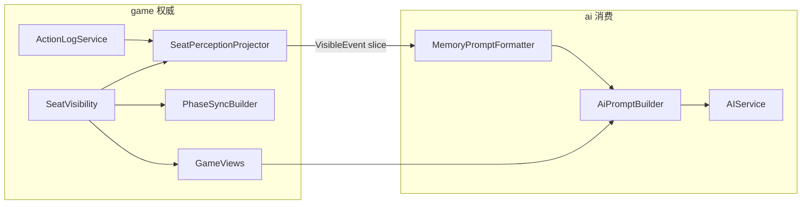

# ADR-004: AI seat memory — structured projection from action_log

| 属性 | 值 |
|------|-----|
| 状态 | **已采纳（Accepted）** — 2026-05-18 |
| 日期 | 2026-05-18 |
| 决策者 | 游戏引擎 + AI（A） |
| 关联 | [PRD §4.5 / §4.5.8 / §4.7.3](../progress/requirements-mvp-v0.1.md)、[ADR-003](003-ai-integration.md)、[code-modules.md](../reference/code-modules.md)、[architecture §6.3](../architecture/architecture-design-spec.md) |

## 背景

[ADR-003](003-ai-integration.md) 冻结了单轮 `System + User(GameView) → JSON` 的 LLM 路径。模型缺少跨回合因果（发言、投票、死讯、狼聊、己方技能），无法满足 PRD §4.5.8「推理、记忆、伪装」与 §4.5.1 对 Memory 的课题要求。

本 ADR **冻结** Memory 的产品语义、与 `action_log` 的契约、投影可见性、Prompt 结构与验收；**实现**采用 **split_game_ai**：投影与可见性在 `game.view`，Prompt 格式化在 `ai.memory`（见 §5）。

**团队已确认取向（2026-05-18）**：

- **主模型**：结构化「座位可见事件」+ 当前 `GameView`（Working Memory）
- **事实源**：`ActionLogService.getLog(roomId)` 按座位投影（decide 时现算；可选增量缓存）
- **非主路径**：LangChain4j `MessageWindowChatMemory` 不作为主存储；P1 可完全不接

---

## 1. 范围与非目标

### 1.1 范围内（M3 — Memory）

| 项 | 说明 |
|----|------|
| `game.view.SeatPerceptionProjector` | `action_log` → `SeatPerceptionSlice`（按座脱敏） |
| `game.view.SeatVisibility` | 与 `GameViews` / `PhaseSyncBuilder` 同源的可见性 API |
| `ai.memory.MemoryPromptFormatter` | Slice → Prompt「本局记忆」段 |
| `AiPromptBuilder` | User 消息双段：**记忆** + **当前局面** + 合法 action |
| `action_log` 补齐 | §4 审计表中 **P0** 项在 M3 实现前写入 SM |

### 1.2 非目标

- Redis / 跨实例 Memory 持久化（MVP 进程内；架构 §6.3 后续选型）
- Semantic Memory（怀疑表、信念状态）— 课题进阶③
- `GameTools` 多轮 Tool 循环 — 仍属 ADR-003 Phase B；须在 M3 稳定后
- 用 Memory 替代 `action_log` 做复盘/评测（`action_log` 仍为上帝视角全量真相）

---

## 2. 逻辑模型：三层记忆



| 层 | 内容 | 存储 | 更新 |
|----|------|------|------|
| **Working** | 当前 phase、存活、角色私密字段 | 无；`GameViews.forSeat` | 每次 `decide` |
| **Episodic** | 本座可见历史事件 | 由 `action_log` **投影**；可选 `roomId:seat` 缓存 | `decide` 前 refresh；`GAME_OVER` 清除缓存 |
| **Semantic** | 阵营信念、怀疑表 | 无（Phase B+） | — |

**原则**：Working 与 Episodic **不重复** — GameView 只描述「现在」；Episodic 描述「怎么走到现在」。**禁止**把历史整段 GameView 快照写入 Memory（避免死者仍显示存活等矛盾）。

---

## 3. 包与类型契约（实现目标）

### 3.1 `game.view`（投影 + 可见性）

| 类型 | 职责 |
|------|------|
| `PerceptionEventKind` | 见 §3.3 |
| `VisibleEvent` | `round`, `phase`, `kind`, `actorSeat`, `targetSeat`, `summary`（无 Prompt 文案） |
| `SeatPerceptionSlice` | `List<VisibleEvent> events` |
| `SeatPerceptionProjector` | `project(room, seat, log)` → slice |
| `SeatVisibility` | `visibilityForEntry`、`knowsRole`、`canAct`（唯一真源） |
| `LogVisibility` | `HIDDEN` \| `PUBLIC` \| `WOLF_ONLY` \| … |

`GameViews`、`PhaseSyncBuilder` **委托** `SeatVisibility.canAct`；**禁止**在 `ai` 内再实现可见性。

### 3.2 `ai.memory`（仅 LLM 呈现）

| 类型 | 职责 |
|------|------|
| `MemoryPromptFormatter` | `format(SeatPerceptionSlice, FormatOptions)` → 中文短句；`maxEvents` / `maxChars` 截断 |
| `SeatMemoryCache`（可选 P1） | 增量投影；`GAME_OVER` 清除 |

### 3.3 `game.view.SeatVisibility`（API 摘要）

**目的**：`GameViews`、`PhaseSyncBuilder`、`SeatMemoryProjector` **共用**可见性判定，避免双份逻辑漂移。

| 方法（草案） | 用途 |
|--------------|------|
| `boolean isWolf(GameRoomState room, int seat)` | 狼队友、狼频道 |
| `boolean knowsRole(GameRoomState room, int viewer, int target)` | 是否可对 `target` 使用角色词（狼看队友、已翻愚者等） |
| `LogVisibility visibilityForEntry(GameRoomState room, int viewer, ActionLogEntry entry)` | 本条 log 对该座是否可见及脱敏级别 |
| `boolean canAct(GameRoomState room, int seat)` | 委托现有 `GameViews.canAct` |

`LogVisibility` 枚举：`HIDDEN` | `PUBLIC` | `WOLF_ONLY` | `SELF_ONLY` | `SEER_SELF` | `WITCH_SELF`。

### 3.4 `PerceptionEventKind`

| kind | `action_log` 来源 | 投影可见性 |
|------|-------------------|------------|
| `SELF_ACTION` | `playerId == seat` 的玩家行 | 本座；文本含 `action`/`target`/`content`；**不含**完整 `thinking`（见 §6 决议） |
| `SELF_THINKING` | `recordAiThinking` 且 `playerId == seat` | 本座；仅当配置 `werewolf.ai.memory.include-own-thinking=true`（默认 **false**） |
| `PUBLIC_SPEAK` | `SPEAK` / `LAST_WORDS` + `content` | 全场 |
| `PUBLIC_VOTE` | `VOTE` / `SKIP_VOTE`（各行） | 全场（投票行为公开） |
| `VOTE_RESULT` | 系统行 `VOTE_*` / `EXILE_RESOLVED` | 全场 |
| `WOLF_CHAT` | `WOLF_CHAT` + `content` | 仅狼 |
| `WOLF_KILL_RESOLVED` | 系统行 `WOLF_KILL_RESOLVED` | 仅狼；文本仅「本夜刀口：座位 N」，**不含** `votes=` 明细 |
| `NIGHT_DEATH` | 系统行 `NIGHT_DEATHS`（§4 P0） | 全场；仅死亡名单 |
| `EXILE_DEATH` | 系统行 `EXILE_ANNOUNCED`（§4 P0） | 全场 |
| `IDIOT_REVEAL` | 系统行 `IDIOT_REVEALED`（§4 P0） | 全场 |
| `SEER_RESULT` | 本座 `CHECK` 成功行 | 仅预言家本座；用 `GOOD`/`WOLF`，不写底层 `Role` |
| `WITCH_SELF` | 本座 `SAVE`/`POISON`/`SKIP` @ `NIGHT_WITCH` | 仅女巫本座 |
| `HUNTER_SHOOT` | 系统行或公开 `SHOOT`（§4 P0） | 全场 |
| `GAME_OVER` | 系统行 `GAME_OVER`（§4 P0） | 全场 |

### 3.5 脱敏规则（冻结）

1. `ActionLogEntry.role` **不得**直接进入他座 Memory 文案；用「座位 N」。
2. 他座 `thinking` **一律** `HIDDEN`。
3. 他座夜技能（`CHECK`/`SAVE`/`POISON`/`KILL`）在结算前 **HIDDEN**；狼刀决议对非狼 **HIDDEN**（狼仅见 §3.3 `WOLF_KILL_RESOLVED` 摘要）。
4. 已公开身份（愚者翻牌、`GAME_OVER` 复盘）可按 PRD 公开范围写角色词。

---

## 4. action_log 覆盖度审计

### 4.1 已写入（2026-05-18 代码审计）

| 事件 | 写入点 | 条目形态 |
|------|--------|----------|
| 玩家操作 | `GameEngineService.submitAction`、`AiTurnCoordinator` | `recordPlayerAction`（含 `content`） |
| LLM thinking | `AIService.recordLlmThinking` | `recordAiThinking`（`thinking` 字段） |
| 狼刀决议 | `GameStateMachine.onWolfKillResolved` | `WOLF_KILL_RESOLVED target=… votes=…` |
| 投票结算 | `GameStateMachine.logVoteResolution` | `VOTE_EMPTY` / `VOTE_TIE` / `EXILE_RESOLVED` |
| 公布阶段推进 | `advanceDayAnnounce` 路径 | `advanceDayAnnounce`（**不含**死亡名单） |

### 4.2 缺口 — 须在 M3 实现前补齐（`recordSystemEvent`）

| 优先级 | 触发点（SM / 子流程） | 建议 `message` 格式 | Memory kind |
|--------|----------------------|---------------------|-------------|
| **P0** | 进入或离开 `NIGHT_DEATH_ANNOUNCE`（有死者） | `NIGHT_DEATHS seats=8,11` | `NIGHT_DEATH` |
| **P0** | 进入或离开 `EXILE_DEATH_ANNOUNCE`（有放逐） | `EXILE_ANNOUNCED seat=5` | `EXILE_DEATH` |
| **P0** | 愚者 R19 翻牌 | `IDIOT_REVEALED seat=5` | `IDIOT_REVEAL` |
| **P0** | `GAME_OVER` | `GAME_OVER winner=WOLVES\|VILLAGERS` | `GAME_OVER` |
| **P1** | `HUNTER_SHOOT` 结算后（公开死亡） | `HUNTER_SHOT seat=3 target=7` | `HUNTER_SHOOT` |
| **P1** | `VOTE_RESULT` 阶段进入（若与 §4.1 重复可合并） | 可选；**已有** `EXILE_RESOLVED` 时 P1 可跳过 |

**说明**：首夜遗言、白天发言、逐票 `VOTE` 已由 `recordPlayerAction` 覆盖；Memory 不依赖 `GAME_EVENT` WS  payload。

### 4.3 可选 schema 演进（非冻结，实现期评估）

在 `ActionLogEntry` 增加 `visibility`（`PUBLIC|WOLF|SEAT`）可减少投影器分支；**M3 可不改 schema**，靠 `SeatVisibility` + `message` 前缀解析。

---

## 5. decide 时数据流

1. `GameView view = GameViews.forSeat(room, seat)` → Working Memory
2. `List<ActionLogEntry> log = actionLog.getLog(roomId)`
3. `SeatPerceptionSlice slice = SeatPerceptionProjector.project(room, seat, log)`
4. `String memoryBlock = MemoryPromptFormatter.format(slice, options)`
5. `AiPromptBuilder.userMessage(view, allowed, memoryBlock)` — 见 §7
6. LLM → `PlayerIntent` → SM → **追加** log → 下次 `decide` 可见新行

**死后座位**：继续投影 **公开** 事件；`AiTurnCoordinator` / `AIService` **不**为死者产出技能类 intent（§4.3.7，与 ADR-003 一致）。

---

## 6. 开放项决议（§9 关闭）

| # | 问题 | **决议** | 确认 |
|---|------|----------|------|
| 1 | log 覆盖度 | §4.2 **P0** 四项在 M3 编码前补齐；P1 猎人可选 | [x] |
| 2 | token 预算 | `maxEvents=30`，`maxChars≈2000`（UTF-8 字符）；超出设 `truncated=true` 并保留**最近**事件 | [x] |
| 3 | 更早回合压缩 | **P1** 才做「按 round 合并一行」；M3 仅 tail 截断 | [x] |
| 4 | 投影缓存 | M3 **允许**全量扫描；单局 &lt;300 条可接受；优化为增量 **非阻塞** | [x] |
| 5 | 自有 thinking | 默认 **仅** `reason`+`action` 入 `SELF_ACTION`；`thinking` 仅 `action_log` + 可选配置 | [x] |
| 6 | LangChain4j ChatMemory | **不接入**主路径；若接入仅保留最近 1～2 条 Assistant JSON（可选） | [x] |

### 6.1 `MemoryPromptFormatter.FormatOptions`（冻结默认值）

| 字段 | 默认 |
|------|------|
| `maxEvents` | 30 |
| `maxChars` | 2000 |
| `includeOwnThinking` | false |
| `locale` | 中文短句 |

---

## 7. Prompt 结构（冻结）

```
System: 规则摘要 + Persona（不变，ADR-003）

User:
  ## 本局记忆（仅你可见）
  - [R1 NIGHT_WOLF] 你在狼频道说：……
  - [R1 DAY_DISCUSS] 座位5发言：……
  - [R1 NIGHT_DEATH_ANNOUNCE] 昨夜死亡：8, 11
  （若 truncated：首行注明「更早事件已省略，详见当前局面」）

  ## 当前局面
  （现有 GameViewContext 字段，不重复记忆段已有静态事实）

  ## 本回合合法 action
  KILL, WOLF_CHAT, …

  请输出 JSON。
```

- 记忆段**在前**，当前局面在后，避免模型忽略历史。
- `content` 过长时 formatter 单条截断至 120 字并加「…」。

---

## 8. 生命周期与存储

| 事件 | 行为 |
|------|------|
| 建房 / `START_GAME` | 无预分配 |
| 每步 `decide` | 投影 → Prompt → LLM |
| `GAME_OVER` | `SeatMemoryCache.clear(roomId)`；`action_log` 保留供 B 持久化 |
| 进程重启 | Memory 丢失可接受（MVP）；重连对局以 `action_log` 重投影 |

存储键：`roomId:playerId`（进程内 `ConcurrentHashMap`）。

---

## 9. 验收标准与测试清单（M3）

### 9.1 文档 / 单测 ID

| ID | 类型 | 场景 | 通过条件 |
|----|------|------|----------|
| **M3a** | 单元 | 固定 `List<ActionLogEntry>` + `room` 快照 | 好人座 slice **无** `WOLF_CHAT` / `WOLF_KILL_RESOLVED`；**无**他座 `role` 字样；**无**他座 `thinking` |
| **M3a-wolf** | 单元 | 同上，狼座 | 含 `WOLF_CHAT`；`WOLF_KILL_RESOLVED` 文本**无** `votes=` |
| **M3b** | 集成 | Mock 整局第 2 天 `DAY_DISCUSS` 前 `decide` | `userMessage` 含第 1 轮 `NIGHT_DEATH` 与自己 `VOTE` 行 |
| **M3c** | 集成 | 同房狼座 vs 好人座投影 | 狼座 `WOLF_CHAT` count ≥ 1；好人座 count = 0 |
| **M3d** | 集成 | 死者座位 | `AIService.decide` 对死者返回 empty 或仅 Mock 不触发 LLM；公开死讯仍可在 slice 中出现 |
| **M3e** | 单元 | 31+ 条事件 | `truncated==true` 且保留最后 30 条；字符总长 ≤ 2000 |

### 9.2 建议测试类（实现期）

- `SeatPerceptionProjectorTest`（`game.view`）— M3a、M3a-wolf、M3c
- `MemoryPromptFormatterTest`（`ai.memory`）— M3e 截断与格式
- `AIServiceMemoryIntegrationTest` — M3b、M3c（可复用 `MockAIFullGameTest` .harness）

---

## 10. 与 ADR-003 / PRD 的关系

- **ADR-003 §1.1**「单轮 User(GameView)」在 M3 后修订为「User(记忆 + GameView)」；编排、出口、fallback **不变**。
- **PRD §4.5.1** `ChatMemory`：实现为 **SeatMemory 投影**（见 PRD 脚注 v1.0.13）。
- **GameTools Phase B**：`describeGameView` / 新 Tool `summarizeMemory` 读 `SeatMemorySlice`，禁止直读 SM 私密字段。

---

## 11. 后果

- **正面**：信息隔离可测；评测仍用全量 `action_log`；Prompt 可解释。
- **负面**：M3 前需 SM 补 log；投影器与 `SeatVisibility` 需与规则变更同步维护。
- **跟进**：M3 实现 → ADR-003 变更记录；`GameTools` Phase B。

---

## 变更记录

| 版本 | 日期 | 说明 |
|------|------|------|
| 1.0 | 2026-05-18 | 初版采纳；关闭 §6 开放项；§4 审计；§9 测试清单 |
| 1.1 | 2026-05-18 | split_game_ai：投影迁至 `game.view.SeatPerceptionProjector`；Formatter 留 `ai.memory` |
