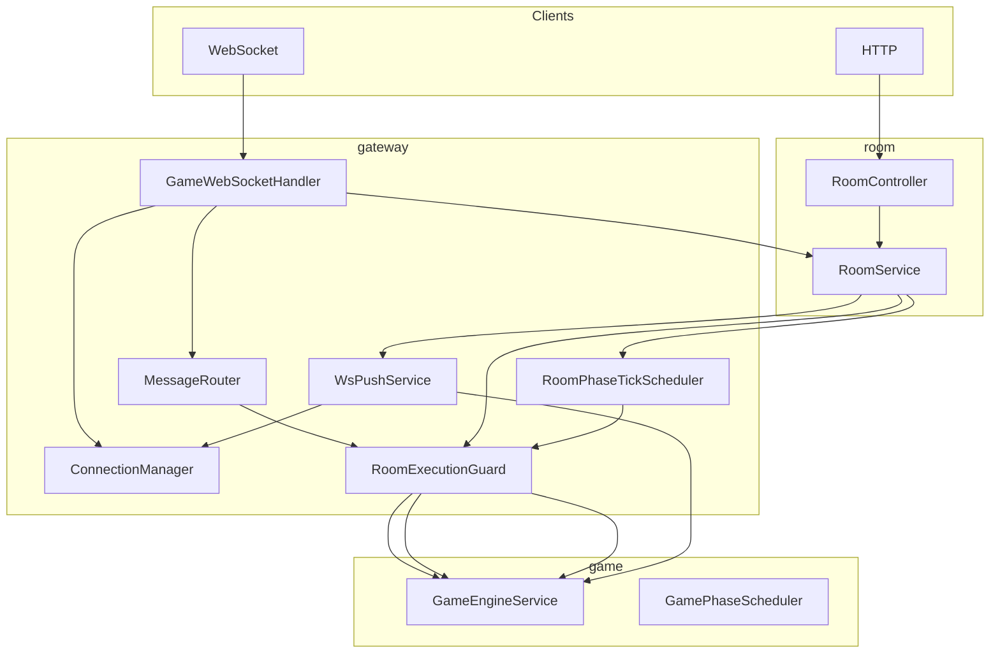

# ADR-005: Gateway Formal 路径（决策、实现与选型）

| 属性 | 值 |
|------|-----|
| 状态 | **已采纳（Accepted）** — 决策 2026-05-18；P0 实现 2026-05-25 |
| 日期 | 2026-05-25 |
| 决策者 | B（gateway/room 牵头）；A/C 评审 |
| 关联 | [PRD §4.6、§6、§8.5](../progress/requirements-mvp-v0.1.md)、[status](../progress/status.md)、[gateway-room-modules](../reference/gateway-room-modules.md)、[ADR-003](003-ai-integration.md) |

> 实现进度以 [status.md](../progress/status.md) 为准。

---

## 背景

`game` + `ai` 已在内存态跑通整局。2026-05-18 Gateway 仅有 WS 请求-响应；2026-05-25 Formal 路径 B 已完成 **定向推送、房间锁、phase-tick（HTTP/WS/定时）**，并通过 `formal-path-smoke` / `formal-llm-smoke` 验证。

本篇冻结：**出站语义**、**定时挂接**、**并发边界**、**已落地选型**；不改变 PRD 已冻结的 WS `type` 全集（`PHASE_TICK` 为 dev 扩展，见 §6.2）。

---

## 第一部分 — 决策（契约）

### 1. 推送真源与裁剪

- **真源**：`GameEngineService.buildPhaseSync(roomId, seatId)`（`PhaseSyncBuilder` + `GameViews`）。
- **裁剪**：与 AI `GameView`、PRD §4.6.5 同源；Gateway **不得**自行拼私密字段。
- **信封**（TargetedPhaseSync）：

```json
{
  "type": "PHASE_SYNC",
  "payload": { "seatId": 3, "phaseSync": { "currentPhase": "NIGHT_WOLF" } }
}
```

**禁止**：将 `ActionResult.phaseSyncs` 无 `seatId` 标注地广播给全房。

### 2. 必须推送的事件（契约）

| 事件 | 接收者 | 附带 |
|------|--------|------|
| `JOIN_ROOM` 成功 | 该座 | `PHASE_SYNC` |
| `start` 成功 | 已绑定 WS 各座 | 各座 `PHASE_SYNC` |
| `submitAction` 且局面变化 | 受影响座（契约）；MVP 见 §4.2 | `ACTION_ACK` + `PHASE_SYNC` |
| `tick` 推进 | 同房已连接座 | `PHASE_SYNC` |
| 愚者/死亡公布等 | PRD 可见性集合 | `GAME_EVENT` + `PHASE_SYNC`（P1） |

### 3. 阶段定时器

- **组件**：`GamePhaseScheduler.tick`（`game.orchestration`）。
- **调用方**：Gateway `RoomPhaseTickScheduler`；等价 Internal `POST .../phase-tick`。
- **禁止**：`while` busy-wait 占满线程。

| `GamePhase` | `tick` 行为 |
|-------------|-------------|
| `NIGHT_DEATH_ANNOUNCE` / `EXILE_DEATH_ANNOUNCE` | `advanceDayAnnounce` |
| `NIGHT_WOLF` / `NIGHT_SEER` / `NIGHT_WITCH` / `DAY_DISCUSS` / `DAY_VOTE` / `HUNTER_SHOOT` / `LAST_WORDS` | `AiTurnCoordinator.tickOneStep` |
| `GAME_OVER` | 终局 |
| 其他 | `NO_OP` |

### 4. `countdown`（P-05，2026-05-25 已实现）

- **权威**：`GameRoomState.phaseDeadlineEpochMs` + `game.sync.PhaseCountdown`（时长表对齐 PRD §4.3.3）；`PhaseSyncBuilder` 输出剩余整秒（向上取整，误差 ≤1s）。
- **下发**：随 `PHASE_SYNC.countdown`；客户端**不得**本地推算。
- **推进**：`GamePhaseScheduler.tick` 在倒计时未到期时返回 `COUNTDOWN`（不提前 `AiTurnCoordinator`）；到期由 `PhaseTimeoutHandler` 执行 §4.3.3 兜底（复用 `MockAIPlayer` + 夜无角色 `NightActions.applyTimedNoActorFallback`）。
- **推送**：`RoomPhaseTickScheduler` 在 `TickResult.status == COUNTDOWN` 时仍 `pushPhaseSyncToConnected`（约每 `phase-tick-interval-ms` 递减一次）。
- **配置**：`werewolf.game.phase-countdown-enabled`（默认 `true`）；单测 `application.properties` 为 `false` 以免拖慢 `mvn test`。
- **夜阶段**：狼票齐后不再 `runAutopilot` 秒跳过 `NIGHT_SEER`/`NIGHT_WITCH`，须等倒计时或玩家操作（§4.3.7）。

### 5. 单房间写串行

- 同一 `roomId` 的 `submitAction`、`tick`、`start` **串行**；WS、HTTP、定时器 **共用**锁域。

### 6. `GAME_EVENT`（P1）

- SM / `DeathBus` 发布领域事件 → Gateway 转 WS；MVP 可先仅靠 `PHASE_SYNC`。

### 7. Redis 会话（P2）

- MVP 内存 `ConnectionManager`；目标 `werewolf:ws:conn:{roomId}:{playerId}` + 30s 重连（[auth-session](../reference/auth-session.md)）。

---

## 第二部分 — 实现架构

### 8. 运行时拓扑



### 9. 技术选型

| 决策点 | 采纳 | 延后 | 理由 |
|--------|------|------|------|
| 实时通道 | Spring `TextWebSocketHandler` | STOMP | PRD JSON 信封已冻结 |
| 序列化 | Jackson → `Map` 信封 | 全链路强类型 DTO | 与现有 Handler 一致 |
| 连接表 | 内存双索引 `ConnectionManager` | Redis | 单实例 MVP |
| 房间锁 | `RoomExecutionGuard`（`synchronized`） | DB 行锁 | ADR §5 |
| 定时 | `ScheduledExecutorService` 每房 fixed-rate | 全局 `@Scheduled` | 开局注册、终局取消 |
| 推送范围 MVP | 全 **已连接** 座各推裁剪 sync | 仅受影响座 | 不串座、实现简单 |
| tick 入口 | HTTP + 自动调度 + WS `PHASE_TICK` | 单入口 | 联调/产品/调试分流 |
| 错误 | `ERROR` 信封，不断开 | 1011 断线 | 联调稳定 |

**配置**：`werewolf.gateway.phase-tick-enabled`（默认 `true`）、`phase-tick-interval-ms`（默认 `1500`）。单测 profile 关闭自动 tick。

### 10. 组件职责

| 类 | 职责 |
|----|------|
| `ConnectionManager` | `sessionId` ↔ `(roomId, seatId)` |
| `WsPushService` | 定向 `PHASE_SYNC` 出站 |
| `RoomExecutionGuard` | 每房 mutating 串行 |
| `RoomPhaseTickScheduler` | 定时 + `tickOnce` + 推送 + 终局 `stop` |
| `MessageRouter` | `GAME_ACTION` / `PHASE_SYNC` 拉取 |
| `GameWebSocketHandler` | 连接生命周期、`JOIN_ROOM`/`READY`/`PHASE_TICK` |
| `RoomService` / `RoomController` | HTTP 房间 + `POST .../phase-tick` |

### 11. 出站推送（实现）

#### 11.1 MVP 与契约差异

| 契约理想 | 当前实现 |
|----------|----------|
| 仅推受影响座 | `pushPhaseSyncToConnected`（全连接座，**内容按座裁剪**） |
| `tick` 后按变更集 | `ADVANCED` / `AI_STEP` / `GAME_OVER` 时全连接座推送 |

#### 11.2 触发（已实现）

| 事件 | 行为 |
|------|------|
| `JOIN_ROOM` | `pushPhaseSync(roomId, seatId)` |
| `start` | `pushPhaseSyncToConnected` + `phaseTickScheduler.start` |
| `GAME_ACTION`（`phaseSyncs` 非空） | 全连接座推送 + 请求方 `ACTION_ACK` |
| `tickOnce`（`shouldPushAfterTick`） | 全连接座推送（含 `COUNTDOWN`） |
| `PHASE_SYNC` 拉取 | 仅请求 session |

#### 11.3 AI 链（Gateway 不直连 `AIService`）

```text
tickOnce → GamePhaseScheduler → AiTurnCoordinator → AIService → SM.handleAction
```

### 12. 阶段推进三入口

| 入口 | 路径 |
|------|------|
| 自动 | `start` → `RoomPhaseTickScheduler.start` |
| HTTP | `POST /api/room/{roomId}/phase-tick` |
| WS | `PHASE_TICK`（**dev**，未入 PRD 冻结枚举） |

---

## 第三部分 — 状态、验收与债项

### 13. 实现清单

| ID | 项 | 优先级 | 状态 |
|----|-----|--------|------|
| P-01 | `WsPushService` | P0 | ✅ |
| P-02 | JOIN / start / action / tick 后推送 | P0 | ✅（MVP 全连接座） |
| P-03 | `RoomExecutionGuard` | P0 | ✅ |
| P-04 | 定时 + Formal `phase-tick` | P0 | ✅ |
| P-05 | `countdown` | P1 | ✅ |
| P-06 | `GAME_EVENT` 桥接 | P1 | ❌ |
| P-07 | Redis 会话 | P2 | ❌ |
| P-08 | 推送收窄 `affectedSeats` | P1 | ❌ |

### 14. 验收

#### 14.1 `formal-path-smoke` 与 countdown（实现注记）

- 脚本在短时间内**连续**调用 `POST .../phase-tick`，在狼人阶段 30s 墙钟未结束前会反复得到 `status=COUNTDOWN`，**不等于**正式环境卡死。
- **正式对局**依赖 `RoomPhaseTickScheduler`（默认 `werewolf.gateway.phase-tick-enabled=true`）按墙钟 tick + WS 推送；Bot/前端应以 **WS `PHASE_SYNC.countdown`** 为准，HTTP `phase-tick` 仅作联调辅助。
- 验收 P-05 优先：`python scripts/countdown-observe.py`（需已部署含 P-05 的进程；勿用未重启的旧 8080 实例对照）。

| 脚本 | 路径 | 说明 |
|------|------|------|
| `formal-path-smoke.py` | B + Mock AI | 联调项 7/8 常见（见 §14.1）；2026-05-25 曾 8/8（无 countdown 时） |
| `countdown-observe.py` | B + WS | 观察 `countdown` 递减（推荐验收 P-05） |
| `formal-llm-smoke.py` | B + LLM tick | 整局 `GAME_OVER`；`action_log_llm` 依赖 API Key |
| `bot/run_day4_formal.py` | Day4 五项 | 10/10（2026-05-25） |
| `mvnw test` | 含 gateway 单测 | 68 测（2026-05-25） |

### 15. 风险与技术债

| 风险 | 缓解 |
|------|------|
| 每步最多 12 条 WS | P1 收窄座位集 |
| HTTP tick 与自动调度叠加 | 默认双入口并存；smoke 狂刷 HTTP 时以 WS/墙钟为准，见 §14.1 |
| `PHASE_TICK` 非 PRD | 标注 dev-only 或走变更流程 |
| 多实例无共享连接表 | P2 Redis + sticky |

### 16. 开放问题（P1）

1. `ActionResult` / `TickResult` 返回 `affectedSeats`  
2. 独立 `GAME_OVER` WS 消息  
3. ~~`countdown` 权威字段~~（P-05 已落地）  
4. `PHASE_TICK` 是否入 PRD  

### 17. 相关代码

`gateway/*`、`room/RoomService.java`、`room/RoomController.java`、`scripts/formal-*-smoke.py`

---

## 变更记录

| 版本 | 日期 | 说明 |
|------|------|------|
| 1.0 | 2026-05-18 | 初稿：推送与定时决策（原 005 文件名） |
| 2.0 | 2026-05-25 | 决策与实现合并为一篇；P0 实现与选型入篇 |
| 2.1 | 2026-05-25 | P-05 countdown：`PhaseCountdown`、超时兜底、`COUNTDOWN` tick；§14.1 smoke 注记 |
