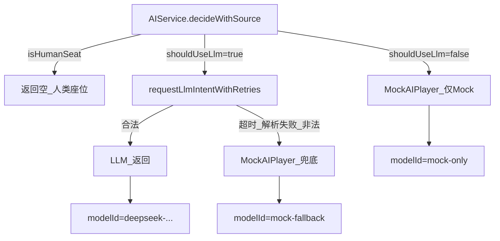

# ADR-006: Mock AI 与 LLM 意图决策 — 现状、问题与排查

| 属性 | 值 |
|------|-----|
| 状态 | **已采纳（Accepted）** — 2026-05-26；v1.1 对齐 PRD v1.0.17 |
| 日期 | 2026-05-26（修订 2026-05-26） |
| 决策者 | 游戏引擎 + AI |
| 关联 | [ADR-003](003-ai-integration.md)、[ADR-004](004-ai-seat-memory.md)、[PRD §4.5](../progress/requirements-mvp-v0.1.md) |

## 背景

产品期望：**AI 座位通过大模型生成 JSON 意图**（`thinking` / `action` / `target` / `content`），而不是使用 `MockAIPlayer` 的随机/固定规则。

当前实现中，`MockAIPlayer` **不是**首选路径，而是 `AIService` 在 LLM 不可用或失败时的**兜底**。但在实际联调中，用户经常只看到 Mock 行为（例如讨论阶段大量 `SKIP_SPEAK`、固定发言模板），误以为系统「只用 Mock」。

本 ADR 冻结：**Mock 与 LLM 的分工**、**为何会看到 Mock**、**如何排查**、以及**向 LLM-only 演进的方向**。

---

## 1. 架构：LLM 优先 + Mock 兜底



### 1.1 `MockAIPlayer` 是什么

| 属性 | 说明 |
|------|------|
| 位置 | `ai.policy.MockAIPlayer` |
| 作用 | **不调用 LLM**，按阶段返回预设/随机 `PlayerIntent` |
| 设计意图 | Week1 无人干预整局、LLM 不可用时的**确定性兜底** |
| 不是 | 大模型推理、智能发言、策略分析 |

### 1.2 `AIService` 如何选用 LLM

`AIService` 在 `shouldUseLlm(room, playerId)` 为真时调用 LLM；否则直接走 Mock（`MOCK_ONLY`）。

**LLM 调用条件**（全部满足）：

1. 座位为 AI（`humanUserId == null`）
2. `werewolf.ai.enabled=true`
3. `ChatModel` Bean 存在（通常需要有效的 `DEEPSEEK_API_KEY`）
4. 若 `werewolf.ai.wolves-only=true`，则**仅** `NIGHT_WOLF` 阶段的狼人座位调用 LLM；其他阶段/角色 → Mock

**Mock 兜底条件**（`MOCK_FALLBACK`）：

- LLM 超时（PRD v1.0.17：**6s**，`werewolf.ai.llm-timeout-seconds` / `langchain4j` timeout）
- LLM 响应为空
- JSON 解析失败（`AiIntentParser`）
- 解析出的意图在当前阶段**不合法**（`AiLegalActions`）
- 异常（网络错误、API 错误等）

---

## 2. 为什么你会「只看到 Mock」

### 2.1 常见原因对照表

| # | 原因 | 表现 | 排查 |
|---|------|------|------|
| 1 | **`enabled=false`** | 所有 AI 座位只用 Mock | 检查 `werewolf.ai.enabled`；测试环境默认 `false` |
| 2 | **缺少 API Key** | `ChatModel` 不存在 → `shouldUseLlm=false` | 设置 `DEEPSEEK_API_KEY`；`langchain4j.open-ai.chat-model.api-key` |
| 3 | **`wolves-only=true`** | 非狼夜阶段全部 Mock | 设置 `werewolf.ai.wolves-only=false` |
| 4 | **LLM 超时** | **6s** 内未返回 → Mock fallback | 提高 `llm-timeout-seconds`；检查网络/API |
| 5 | **JSON 解析失败** | DeepSeek `reasoning_content` 非标准 JSON | 查看日志 `LLM failed`；检查 `AiIntentParser` |
| 6 | **意图不合法** | LLM 返回了非法 action → Mock fallback | 日志 `LLM illegal intent` |
| 7 | **人类座位** | 真人座位不调用 AI | 正常；`AIService` 返回空 |
| 8 | **误以为 Mock** | 讨论阶段 AI 快速 `SKIP_SPEAK` | 可能是 Mock **或** LLM 选择了 `SKIP_SPEAK` |

### 2.2 如何区分 Mock 与 LLM

查看 `action_log` 或后端日志中的 **`modelId`**：

| modelId | 含义 |
|---------|------|
| `deepseek-v4-flash`（或配置的 `modelId`） | **LLM 成功** |
| `mock-only` | LLM 未启用/不可用，**仅 Mock** |
| `mock-fallback` | LLM 尝试过但失败，**Mock 兜底** |

`DecisionResult.Source`：

- `LLM` → 大模型成功
- `MOCK_ONLY` → 未调用 LLM
- `MOCK_FALLBACK` → LLM 失败后的 Mock

---

## 3. 当前问题（阻碍 LLM 为主）

### 3.1 设计层面

| 问题 | 说明 |
|------|------|
| **无 LLM-only 模式** | 系统**没有**「禁止 Mock 兜底」的配置；失败时必然 fallback |
| **超时** | PRD v1.0.17 已改为 **6s** 单次调用上限 |
| **重试** | PRD v1.0.17：**JSON 解析失败最多重试 2 次**；非法 intent 不重试 |
| **Mock 与 LLM 行为差异大** | Mock 讨论阶段约 70% `SPEAK`、30% `SKIP_SPEAK`；LLM 可能更保守 |

### 3.2 技术层面（已知）

| 问题 | 说明 |
|------|------|
| **DeepSeek 非标准 JSON** | `reasoning_content` 可能不含 `{` 或格式异常；需 `AiIntentParser.normalizeLlmPayload` 修复 |
| **编码问题** | Windows 环境中文乱码可能导致解析失败（见 UTF-8 配置） |
| **LLM 超时与客户端超时** | `llm-timeout-seconds` 与 `langchain4j...timeout` 需一致 |

### 3.3 用户期望 vs 现状

| 用户期望 | 现状 |
|----------|------|
| 大模型生成 JSON 意图 | ✅ 架构支持，但需正确配置 + 解析成功 |
| 不要 Mock | ❌ Mock 是**强制兜底**；无法完全禁用 |
| 讨论阶段有真实发言 | 依赖 LLM 成功；失败则 Mock 快速 `SKIP_SPEAK` |

---

## 4. 如何达到「大模型生成 JSON」

### 4.1 最低配置（LLM 可用）

```properties
# 必须
werewolf.ai.enabled=true
werewolf.ai.wolves-only=false

# 环境变量
DEEPSEEK_API_KEY=<your-key>

# 可选：延长超时
werewolf.ai.llm-timeout-seconds=10
```

### 4.2 验证步骤

1. 启动后端，确认日志中有 LLM 调用（`langchain4j...log-requests=true`）
2. 创建房间，开始游戏
3. 查看 `GET /internal/game/rooms/{id}/action-log` 或后端日志
4. 确认 `modelId` 为 `deepseek-v4-flash` 而非 `mock-only`/`mock-fallback`
5. 运行 `scripts/formal/formal_llm_smoke.py` 或 `A02FullGameLlmAcceptanceTest`

### 4.3 失败时的排查

| 日志/现象 | 可能原因 | 处理 |
|-----------|----------|------|
| `LLM timeout after 6s` | 超时 | 提高 `llm-timeout-seconds` |
| `LLM failed: invalid JSON` | 解析失败 | 检查 `AiIntentParser`；查看 LLM 原始响应 |
| `LLM illegal intent` | 意图不合法 | 检查 Prompt；确认 action 在当前阶段合法 |
| `mock-only` | LLM 未启用 | 检查 `enabled` 和 API Key |
| `mock-fallback` | LLM 失败 | 按上述日志排查 |

---

## 5. 决策：Mock 兜底、重试与预取（PRD v1.0.17）

### 5.1 已冻结（产品）

| 决策 | 说明 |
|------|------|
| **Mock 保留** | LLM 不可用或仍失败时，用 `MockAIPlayer` 兜底，保证对局可推进 |
| **LLM 优先** | `werewolf.ai.enabled=true` 且 `DEEPSEEK_API_KEY` 有效时，AI 座优先 `decide` 时调 LLM |
| **单次 LLM 超时 6s** | 取代原 3s；与 `langchain4j.open-ai.chat-model.timeout` 对齐 |
| **解析重试最多 2 次** | 仅 **JSON 解析失败**重试；**非法 intent 不重试**；仍失败 → Mock |
| **不做 LLM 预取** | 须等前序发言/行动写入 `action_log` 后再 `decide`，避免 Episodic Memory 过时（[ADR-004](004-ai-seat-memory.md)） |

### 5.2 实现状态（代码，2026-05-27）

| 项 | 说明 | 状态 |
|----|------|------|
| `AiProperties.maxLlmRetries = 2` | 配置化，与 PRD 一致 | ✅ |
| `llmTimeoutSeconds = 6` | 默认 6s；`application-dev.properties` 同步 | ✅ |
| `AIService.requestLlmIntentWithRetries` | 仅 `IllegalArgumentException`（解析）重试；超时/非法 intent 不重试 | ✅ |
| `AIServiceRetryTest` | 单测覆盖重试与 Mock fallback | ✅ |
| 前端 | 超时/失败 Toast、预取缓存 | **未做**（预取明确不做） |

---

## 6. 后果

- **正面**：明确 Mock 与 LLM 的分工；用户可诊断为何看到 Mock；配置路径清晰。
- **负面**：Mock 仍会在失败时出现；用户期望「完全不要 Mock」需后续实现 `mock-fallback=false`。
- **跟进**：实现 `mock-fallback` 配置；改进 LLM 解析成功率；前端显示 `modelId` 区分 Mock/LLM。

---

## 变更记录

| 版本 | 日期 | 说明 |
|------|------|------|
| 1.0 | 2026-05-26 | 初版：Mock vs LLM 分工、问题诊断、排查清单 |
| 1.1 | 2026-05-26 | 对齐 PRD v1.0.17：LLM 超时 6s、解析最多重试 2 次、明确不做预取 |
| 1.2 | 2026-05-27 | §5.2 标为已实现；排查表 6s 口径 |
