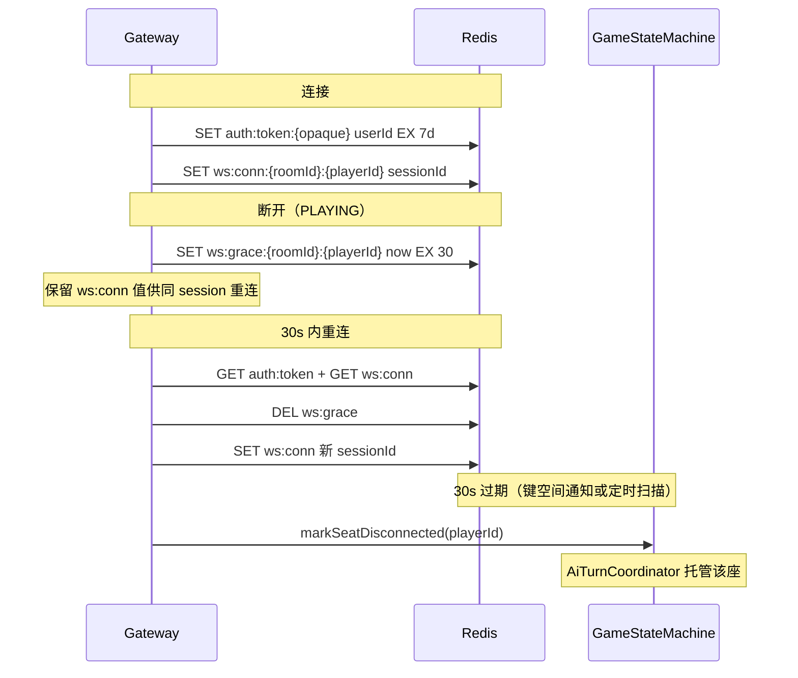

# ADR-007: Redis + MySQL 持久化（决策、分阶段与实现）

| 属性 | 值 |
|------|-----|
| 状态 | **已采纳（Accepted）** — 2026-05-27 |
| 日期 | 2026-05-27 |
| 决策者 | B（gateway/room/Redis 牵头）；A（归档/SM 钩子）；C 评审 |
| 需求真源 | [PRD v1.0.17 §4.7](../progress/requirements-mvp-v0.1.md#47-数据持久化模块b) |
| 速查 | [persistence-rollout](../reference/persistence-rollout.md)（阶段 checklist） |
| 鉴权 | [auth-session.md](../reference/auth-session.md) |
| 进度 | [status.md](../progress/status.md)（**G-04**、**P-07**） |
| 关联 | [ADR-005](005-gateway-formal-path.md) · [ADR-004](004-ai-seat-memory.md) |

> 实现进度以 [status.md](../progress/status.md) 为准。本文 **不修改** PRD §0.3 已冻结 WS/HTTP 协议。

---

## 背景

`game` + `gateway` P0 已在内存态跑通整局；MySQL / Redis 在 PRD §4.7 仅有表与 Key **语义**，缺少 DDL、TTL、迁移开关与断线时序的**实现决策**。本篇冻结：单写者规则、阶段 1～3 交付边界、Flyway 与 Profile 组合、30s 重连与 AI 托管；**不改变** PRD 已冻结的消息 type 全集（MVP **不**新增 `PLAYER_DISCONNECTED` WS 类型，见 §5.2）。

---

## 第一部分 — 决策（契约）

| # | 决策 | 说明 |
|---|------|------|
| D1 | **SM 为局内真源** | `GameStateMachine` 内存为 phase / 存活 / 技能唯一 mutator；Redis **不得**与 SM 并行接受写 |
| D2 | **Lobby 写穿、局内不写 MySQL** | `WAITING` 同步 `room` / `room_player`；`PLAYING` 不每 tick 刷盘 |
| D3 | **终局一次归档** | `GAME_OVER` 单事务写 `game_record` + JSON `action_log`；默认 **fail-fast**（归档失败不 evict 内存） |
| D4 | **Redis 会话（阶段 3）** | `auth:token`、`ws:conn`、`ws:grace`（30s）；`GameOverCleanupJob` 按 roomId 清前缀 |
| D5 | **Feature flags 整体切换** | `werewolf.persistence.mysql-room` / `game-archive` / `redis-session`；单测默认 false |
| D6 | **进行中局重启可丢** | 对齐 PRD §5；仅 `WAITING` lobby 可从 MySQL 恢复 |
| D7 | **G-08 为阶段 2 前置** | 归档前 `action_log` 单写入口 + 去重 |

---

## 第二部分 — 实现规格

## 目录

1. [目的与范围](#1-目的与范围)
2. [分阶段落地](#2-分阶段落地)
3. [MySQL 设计](#3-mysql-设计)
4. [Redis 设计](#4-redis-设计)
5. [断线 / 重连 / AI 托管](#5-断线--重连--ai-托管)
6. [从内存态迁移](#6-从内存态迁移)
7. [验收标准](#7-验收标准)
8. [风险与依赖](#8-风险与依赖)
9. [三人分工](#9-三人分工)

---

## 1. 目的与范围

### 1.1 目的

在 **不改变** [PRD v1.0.17](../progress/requirements-mvp-v0.1.md) 已冻结 WS/HTTP 协议与 `GamePhase` 的前提下，为 werewolf-engine 补齐 **房间元数据持久化、对局归档、WS 会话与断线重连** 三层存储能力，使：

- 进程重启后 **`WAITING` 房间** 可从 MySQL 恢复列表（进行中局仍允许丢失，见 PRD §5）；
- **`GAME_OVER` 后** 完整 `action_log` 可查询，支撑复盘与 C 侧压测归因；
- **30s 重连窗口**（[PRD §2.3](../progress/requirements-mvp-v0.1.md#23-mvp-策略断线--作弊--延迟)）有 Redis 会话锚点，Gateway 可恢复 `(roomId, playerId)` 绑定。

### 1.2 本文覆盖 vs 主 PRD

| 维度 | 主 PRD v1.0.17 | 本 ADR |
|------|----------------|-------------------|
| 表字段语义 | §4.7.1 列名与含义 | **DDL、索引、读写路径、事务边界、归属** |
| Redis Key | §4.7.2 前缀与用途 | **TTL 策略、写入者、读失败回退、清理时机** |
| 断线策略 | §2.3、§4.2.1 | **端到端时序、键生命周期、托管触发点** |
| 鉴权形态 | §4.2.4 opaque token | **TokenStore 与 Redis 键；不含 JWT 实现** |
| 局内真源 | §4.3 SM 权威 | **单写者规则：SM 内存为 phase 真源，Redis 仅镜像/会话** |

### 1.3 显式非目标

下列项 **不在** 本 ADR 范围内；若需变更须另开子版本评审：

| 非目标 | 理由 |
|--------|------|
| **JWT / 注册登录 / 密码体系** | PRD §1.2 P2、§4.2.4 P1；MVP 仅 opaque token → `userId` |
| **集群 / 多实例 / 跨节点 SM 状态同步** | PRD §1.3；Redis 不作分布式锁或 phase 真源 |
| **局内高频状态写 MySQL**（每 `handleAction` 刷盘） | 与 [persistence-rollout §1](../reference/persistence-rollout.md#1-原则)「局内真源在 JVM」冲突 |
| **Redis 无服务时的内存降级双路径** | [tech-selection-feasibility §4.4](../architecture/tech-selection-feasibility.md)；dev 用 Docker Redis |
| **修改 WS `type` / `payload` 冻结字段** | PRD §0.3 |
| **Episodic Memory 独立落库** | [ADR-004](004-ai-seat-memory.md)；仍从内存 `action_log` 投影 |
| **复盘查询 HTTP API** | PRD §1.2 P2；阶段 2 仅写库，读 API 后续迭代 |
| **Flyway 以外的 ORM 迁移策略变更** | 实现细节；本文规定 **Flyway V1～V4** 脚本为交付物 |

---

## 2. 分阶段落地

对齐 [persistence-rollout 阶段 0～4](../reference/persistence-rollout.md#3-热路径-rollout)。**本文实施范围为阶段 1～3**；阶段 4 为可选优化。


| 阶段 | 交付摘要 | 局内真源 | Profile 开关 |
|------|----------|----------|--------------|
| **0（当前）** | `ActionLogService` 内存、`RoomService` 内存 lobby、`ConnectionManager` 内存 | JVM `GameRoomState` | 默认（单测 exclude DataSource/Redis） |
| **1** | `room` / `room_player` 写穿；`create/join/ready/start` 同步 MySQL | 仍 JVM | `werewolf.persistence.mysql-room=true` |
| **2** | `GAME_OVER` 事务写 `game_record` + JSON `action_log`；`room.status=ENDED` | 仍 JVM；归档后清内存 room | `werewolf.persistence.game-archive=true` |
| **3** | Redis 会话 + token + 30s 重连 + 键清理 | JVM + Redis 会话映射 | `werewolf.persistence.redis-session=true` |
| **4（可选）** | `phase` / `alive` / `state` 只读镜像 | **仅 SM 写**；Redis SET 在 SM 提交后 | `werewolf.persistence.redis-game-cache=true` |

**阶段依赖**：1 与 2 可同 Sprint 合并（不同 Flyway 版本）；**3 依赖 1**（重连须能解析 `room_player.user_id` 校验 token）；**4 依赖 3**（键清理与 TTL 策略共用 `GameLifecycleListener`）。

**与 status 缺口映射**：[G-04](../progress/status.md) = 阶段 2；[P-07](../progress/status.md) = 阶段 3。

---

## 3. MySQL 设计

### 3.1 设计原则

| 原则 | 说明 |
|------|------|
| **Lobby 写穿、局内不写** | `WAITING` 阶段 room / room_player 与内存 `GameRoomState` 同步；`PLAYING` 后 **不** 每 tick 更新 `room_player.is_alive` 等局内字段 |
| **终局一次归档** | `game_record` + 完整 `action_log` 在 `GAME_OVER` 单事务写入 |
| **user 表极简** | MVP 无注册流；dev/Bot 预置或 `upsert` by `userId` |
| **Flyway 权威** | `src/main/resources/db/migration/V{1..4}__*.sql`；`dev` profile 可保留 `ddl-auto=validate`（实现期从 `update` 收紧） |

### 3.2 表：`user`

> PRD §4.7.1；P2 用户体系前导表，阶段 1 一并建表，**阶段 1 仅 dev 种子数据**。

| 字段 | 类型 | 约束 | 说明 |
|------|------|------|------|
| `id` | `BIGINT` | PK, AI | 即 `userId`；Bot 可用 10001～19999 |
| `username` | `VARCHAR(32)` | UNIQUE, NOT NULL | 展示名 |
| `password_hash` | `VARCHAR(64)` | NULL | MVP 留空 |
| `created_at` | `TIMESTAMP(3)` | NOT NULL, DEFAULT CURRENT_TIMESTAMP(3) | |

**索引**：`uk_user_username (username)`。

**读写**：

| 操作 | 写入者 | 读取者 | 时机 |
|------|--------|--------|------|
| INSERT 种子 | B（`DevUserSeeder`，`dev` profile） | — | 应用启动 |
| SELECT by id | — | B `TokenStore` / `RoomService` | join 校验（可选） |

### 3.3 表：`room`

| 字段 | 类型 | 约束 | 说明 |
|------|------|------|------|
| `id` | `VARCHAR(32)` | PK | `roomId`，格式 `r_{12位 base36}` |
| `status` | `ENUM('WAITING','PLAYING','ENDED')` | NOT NULL | 对齐 [PRD §4.2.2](../progress/requirements-mvp-v0.1.md#422-房间状态) |
| `max_players` | `INT` | NOT NULL, DEFAULT 12 | |
| `ai_count` | `INT` | NOT NULL, DEFAULT 0 | 0～12 |
| `host_id` | `BIGINT` | NOT NULL, FK → `user.id` | |
| `board_type` | `VARCHAR(64)` | NOT NULL, DEFAULT `STANDARD_12_PRYH_IDIOT` | |
| `created_at` | `TIMESTAMP(3)` | NOT NULL | |
| `started_at` | `TIMESTAMP(3)` | NULL | `start` 成功时写 |
| `ended_at` | `TIMESTAMP(3)` | NULL | `GAME_OVER` 时写 |

**索引**：

- `idx_room_status_created (status, created_at DESC)` — 大厅列表 / 清理 `WAITING` 僵尸房
- `idx_room_host (host_id)`

**读写路径**：

| 事件 | 写 | 读 | 负责 |
|------|----|----|------|
| `POST /api/room` | INSERT `WAITING` | — | **B** `RoomService` → `RoomRepository` |
| `POST .../start` | UPDATE `status=PLAYING`, `started_at` | SELECT 校验 host | **B** |
| `GAME_OVER` | UPDATE `status=ENDED`, `ended_at` | — | **A** `GameArchiveService`（由 SM 终局钩子调用） |
| `DELETE /api/room/{id}` | DELETE（仅 `WAITING`） | SELECT | **B** |
| 启动加载（可选） | — | SELECT `status=WAITING` | **B** 恢复 lobby 列表 |

**一致性**：HTTP mutating 路径已在 `RoomExecutionGuard` 内；MySQL 写与内存写 **同一临界区**：先内存后 DB，DB 失败则回滚内存并返回 500。

### 3.4 表：`room_player`

| 字段 | 类型 | 约束 | 说明 |
|------|------|------|------|
| `room_id` | `VARCHAR(32)` | PK(1), FK → `room.id` ON DELETE CASCADE | |
| `player_id` | `INT` | PK(2), CHECK 1～12 | 座位号 |
| `user_id` | `BIGINT` | NULL, FK → `user.id` | NULL = AI 占位 |
| `role` | `ENUM(...)` | NULL | 发牌后写；枚举同 PRD §4.7.1 |
| `is_alive` | `BOOLEAN` | NOT NULL, DEFAULT TRUE | **`start` 时 TRUE**；局内 **不更新**；终局归档时可批量刷最终态（可选，默认不写） |
| `is_ready` | `BOOLEAN` | NOT NULL, DEFAULT FALSE | `WAITING` 写穿 |
| `can_vote` | `BOOLEAN` | NOT NULL, DEFAULT TRUE | `WAITING`/`start` 默认；愚者翻牌 **不写库**（局内 SM） |
| `idiot_revealed` | `BOOLEAN` | NOT NULL, DEFAULT FALSE | 同上 |
| `persona` | `VARCHAR(32)` | NULL | AI 座位；`start` 时写 |
| `joined_at` | `TIMESTAMP(3)` | NOT NULL | |

**索引**：

- `idx_rp_room (room_id)`
- `idx_rp_user (user_id)` — 查用户是否在房（重连辅助）
- `uk_rp_room_user (room_id, user_id)` — 同一真人不得占两席（`user_id IS NOT NULL` 时生效；MySQL 8 可用 generated column 或应用层校验）

**读写路径**：

| 事件 | 写 | 负责 |
|------|----|------|
| `join` | INSERT or UPDATE `user_id`, `joined_at` | **B** |
| `ready` | UPDATE `is_ready` | **B** |
| `leave`（`WAITING`） | UPDATE `user_id=NULL`, `is_ready=false` 或 DELETE 行 | **B** |
| `start` / 发牌 | UPDATE `role`, `persona`（AI 座） | **A** 发牌回调通知 B，或 **B** 在 `start` 事务内读 SM 快照批量 UPDATE（**推荐 B 读 SM 一次性刷**） |
| `PLAYING` 局内 | **无** | — |
| `GAME_OVER` | 可选 UPDATE 最终 `is_alive` / `role` 快照 | **A** 归档事务内 |

### 3.5 表：`game_record`

| 字段 | 类型 | 约束 | 说明 |
|------|------|------|------|
| `id` | `BIGINT` | PK, AI | |
| `room_id` | `VARCHAR(32)` | NOT NULL, INDEX | 一房可多局：同一 `room_id` 允许多行 |
| `winner` | `ENUM('WEREWOLF','VILLAGER')` | NOT NULL | 对齐 `GameWinner` |
| `started_at` | `TIMESTAMP(3)` | NOT NULL | 来自 `room.started_at` |
| `ended_at` | `TIMESTAMP(3)` | NOT NULL | `GAME_OVER` 时刻 |
| `action_log` | `JSON` | NOT NULL | 完整数组；结构见 §3.6 |
| `round_count` | `INT` | NOT NULL | 终局 `round` |
| `board_type` | `VARCHAR(64)` | NOT NULL | 冗余便于查询 |

**索引**：

- `idx_gr_room_ended (room_id, ended_at DESC)`
- `idx_gr_ended (ended_at DESC)` — 压测/运维抽查

**读写路径**：

| 操作 | 写入者 | 读取者 | 时机 |
|------|--------|--------|------|
| INSERT 归档 | **A** `GameArchiveService.archive(roomId)` | — | SM 进入 `GAME_OVER` 后、释放内存前 |
| SELECT | — | 运维 SQL / 未来复盘 API | P2 |

**事务**（阶段 2 核心）：

```text
BEGIN;
  INSERT INTO game_record (...);
  UPDATE room SET status='ENDED', ended_at=? WHERE id=? AND status='PLAYING';
COMMIT;
-- 成功后：ActionLogService.clear(roomId); GameEngineService.evictRoom(roomId);
```

### 3.6 `action_log` JSON 行结构

与 [PRD §4.7.3](../progress/requirements-mvp-v0.1.md#473-操作日志action_log与可观测性) 一致；归档前 **须完成 G-08 去重**（见 §8.2）。

```json
{
  "round": 1,
  "phase": "NIGHT_WOLF",
  "playerId": 3,
  "role": "WEREWOLF",
  "action": "KILL",
  "target": 8,
  "success": true,
  "timestamp": 1715760000000,
  "requestId": "uuid",
  "thinking": "optional",
  "modelId": "deepseek-v4-flash",
  "content": "optional, SPEAK/WOLF_CHAT"
}
```

**写入策略**：局内仍 append 到 `ActionLogService` 内存；**不在 MySQL 行级追加**。`GAME_OVER` 时 `ActionLogService.export(roomId)` → JSON 数组写入 `game_record.action_log`。

### 3.7 模块与包归属（A vs B）

| 组件 | 包 | 负责人 |
|------|-----|--------|
| `RoomEntity` / `RoomPlayerEntity` / `RoomRepository` | `room.persistence` | **B** |
| `UserEntity` / `DevUserSeeder` | `room.persistence` 或 `common.auth` | **B** |
| `GameRecordEntity` / `GameRecordRepository` | `game.persistence` | **A** |
| `GameArchiveService` | `game.persistence` | **A** |
| Flyway V1–V2 | `db/migration` | **B** 建表；**A** 审 `game_record` |
| Flyway V3–V4 | token 表可选；无 MySQL 变更 | — |

---

## 4. Redis 设计

### 4.1 单写者规则（强制）

```text
┌─────────────────────────────────────────────────────────┐
│  GameStateMachine (JVM) = 局内 phase / 技能 / 存活 真源   │
│  唯一 mutator：handleAction / tick / advance / startGame │
└─────────────────────────────────────────────────────────┘
          │ 提交成功后（可选阶段 4）
          ▼ 镜像写入（best-effort，失败仅打日志）
┌─────────────────────────────────────────────────────────┐
│  Redis werewolf:game:* = 只读缓存 / 观测 / 网关辅助      │
│  禁止：Gateway 或 Room 根据 Redis phase 调用 handleAction │
└─────────────────────────────────────────────────────────┘
```

| 数据 | 真源 | Redis 角色 |
|------|------|------------|
| `currentPhase` / `round` / 技能状态 | SM 内存 | 阶段 4 可选镜像；读失败 **回源 SM** |
| `alivePlayers` | SM 内存 | 阶段 4 可选 Set；**SM 提交后 SADD/SREM** |
| `wolfChatInPhase` | SM 内存 | 阶段 3 起 **SM 在进入/离开 NIGHT_WOLF 时镜像** |
| WS `sessionId` | Gateway + Redis | **会话真源**（阶段 3） |
| opaque token → `userId` | Redis（阶段 3） | 鉴权真源 |

**禁止双写反模式**：不得实现「Redis phase 与 SM 并行接受客户端写」或「定时把 Redis 反灌 SM」。

### 4.2 Key 全表（PRD §4.7.2 + 鉴权扩展）

| Key | 类型 | 值 | TTL | 写入者 | 读取者 | 清理 |
|-----|------|-----|-----|--------|--------|------|
| `werewolf:auth:token:{opaque}` | String | `userId` | **7d**（dev `30d`） | **B** `TokenStore` on issue | **B** Gateway/HTTP 鉴权 | DEL on logout（MVP 无）；自然过期 |
| `werewolf:ws:conn:{roomId}:{playerId}` | String | `sessionId` | **对局结束** | **B** Gateway `bind` / 重连 | **B** Gateway 推送、重连校验 | `GameOverCleanupJob` DEL 全房前缀 |
| `werewolf:ws:grace:{roomId}:{playerId}` | String | 断开时戳 `epochMs` | **30s** | **B** on WS close（`PLAYING`） | **B** 重连窗口判定 | 重连成功 DEL；过期触发托管 |
| `werewolf:room:{roomId}:players` | Set | `playerId` 字符串 | 对局结束 | **B** join/leave/start | **B** 推送遍历（可选） | 同左 |
| `werewolf:room:{roomId}:alive` | Set | 存活 `playerId` | 对局结束 | **A** SM 在 `DeathBus.apply` 后 **可选阶段 4** | 观战/运维 | 同左 |
| `werewolf:game:{roomId}:phase` | String | `GamePhase` 名 | 对局结束 | **A** SM phase 变更后 **阶段 4** | Gateway 调试 | 同左 |
| `werewolf:game:{roomId}:state` | String | SM 快照 JSON（压缩） | 对局结束 | **A** **阶段 4 仅** | 崩溃观测（**不用于恢复**） | 同左 |
| `werewolf:game:{roomId}:wolf_chat_in_phase` | String | `0` / `1` | **当前 `NIGHT_WOLF` 结束** | **A** SM：进入 `NIGHT_WOLF` 写 `0`；合法狼聊写 `1` | **B** 可选校验（**仍以 SM 为准**） | 离开 `NIGHT_WOLF` DEL |

**TTL「对局结束」定义**：`GAME_OVER` 处理完成后，`GameOverCleanupJob` 扫描并 DEL `werewolf:ws:*`、`werewolf:room:{roomId}:*`、`werewolf:game:{roomId}:*`；不依赖 Redis TTL 自动过期（避免长局 TTL 估算错误）。

**`wolf_chat_in_phase` TTL**：进入 `NIGHT_WOLF` 时 SET + EXPIRE 35s（阶段 30s + 5s 缓冲）；阶段结束主动 DEL。

### 4.3 写入时序（阶段 3 最小集）



### 4.4 Redis 客户端与配置

| 项 | 决策 |
|----|------|
| 客户端 | Spring Data Redis + `StringRedisTemplate`（String/Set 足够） |
| 连接 | `application-dev.properties` 已有 `localhost:6379` |
| 单测 | 保持 [application.properties exclude](../../src/test/resources/application.properties) |
| Key 常量 | `com.werewolfengine.common.redis.RedisKeys` 集中定义，避免散落 |

---

## 5. 断线 / 重连 / AI 托管

### 5.1 需求锚点

- [PRD §2.3](../progress/requirements-mvp-v0.1.md#23-mvp-策略断线--作弊--延迟)：游戏中掉线 **30s 内**可重连。
- [PRD §4.2.1](../progress/requirements-mvp-v0.1.md#421-功能列表)：`PLAYING` 离开标记掉线；超时默认操作或 **AI 托管**。
- [auth-session §4](../reference/auth-session.md#4-断线重连prd-已冻结)。

### 5.2 状态机（座位连接态）

座位在 `PLAYING` 新增 **内存** 字段 `PlayerState.connectionState`：

| 值 | 含义 | 转换 |
|----|------|------|
| `ONLINE` | WS 已绑定 | 默认；重连成功 |
| `GRACE` | WS 断，30s 窗口内 | `onWebSocketClosed` |
| `AI_HOSTED` | Grace 过期 | `DisconnectTimeoutHandler`；真人座由 `AiTurnCoordinator` 驱动 |

**注意**：`connectionState` **不落 MySQL**（高频）；仅 Redis grace 键 + 内存。

### 5.3 端到端流程

**A. 正常连接**

1. Client `WS ?token=opaque` → Gateway `TokenStore.resolve` → `userId`。
2. `CONNECTED { userId, playerId: null, roomId: null }`（PRD §4.6.1）。
3. `JOIN_ROOM` → B 校验 `room_player.user_id` 与 token 一致 → `ConnectionManager.bind` + Redis `ws:conn` + `room:players` SADD。

**B. 对局中意外断线**

1. Gateway `afterConnectionClosed`：若 `room.status=PLAYING` 且该座为真人 → SET `ws:grace` TTL **30s**；**不**立即 `ConnectionManager.remove` 的 `(roomId, seatId)` 映射意图（保留 seat 占用）。
2. 推送：可选向同房广播 `GAME_EVENT` `PLAYER_DISCONNECTED`（**新增事件类型需 PRD 变更则 MVP 不做广播**，仅日志）。
3. Grace 期内 SM 仍接受该座 **离线前已发出** 的操作；**不**替玩家自动操作。

**C. 30s 内重连**

1. 同 `token` 新 WS → resolve `userId` → 查 `room_player` 得 `(roomId, playerId)`。
2. GET `ws:grace` 存在且未过期 → DEL grace；UPDATE `ws:conn`；`connectionState=ONLINE`。
3. 推送当前 `PHASE_SYNC`（`WsPushService.pushPhaseSyncToSeat`）；**不**重放历史聊天。

**D. Grace 过期（托管）**

1. `DisconnectTimeoutHandler`（`RoomPhaseTickScheduler` 每 tick 或 Redis keyspace `@expired`）→ `GameEngineService.markDisconnected(roomId, playerId)`。
2. `connectionState=AI_HOSTED`；`AiTurnCoordinator` 对该座走与 AI 座相同 `decide → handleAction` 路径（**保留** `humanUserId`，便于终局统计）。
3. 阶段超时兜底（[PRD §4.3.3](../progress/requirements-mvp-v0.1.md#433-各状态明细)）仍适用；托管与 Mock fallback 共存不冲突。

**E. `WAITING` 断线**

- 立即释放 WS 绑定；**不**设 grace；座位保持 `user_id`（玩家可重连 join 同一座）。

### 5.4 与 Gateway P-08 的关系

[ADR-005](005-gateway-formal-path.md) **P-08**（按 `affectedSeats` 收窄推送）与持久化 **无硬依赖**；阶段 3 重连后仍可用现有「推全连接座」策略。P-08 完成可降低断线重连时的带宽浪费，建议 **并行** 排期。

---

## 6. 从内存态迁移

### 6.1 当前基线（阶段 0）

| 组件 | 现状 |
|------|------|
| `ActionLogService` | `ConcurrentHashMap` + `CopyOnWriteArrayList` |
| `RoomService.lobbies` | 内存 `RoomLobby` |
| `GameEngineService` | 内存 `Map<roomId, GameRoomState>` |
| `ConnectionManager` | 内存双索引 |
| Token | 未解析；HTTP 显式 `userId` / `hostUserId` |
| 单测 | exclude DataSource + Redis AutoConfiguration |

### 6.2 迁移策略：切读切写，禁止双写 phase

| 反模式 | 本文决策 |
|--------|----------|
| SM 与 Redis 同时作为 phase 真源 | **禁止** |
| MySQL 与内存 room 并行接受 join 且可能不一致 | **房间锁内顺序写**：内存成功 → MySQL 成功，否则回滚 |
| 灰度期 Redis + 内存连接表各写各的 | 阶段 3 用 `werewolf.persistence.redis-session` **整体切换**；关闭时回退纯内存（仅 dev 单测） |
| `action_log` 写 MySQL 行级 + 内存 | **禁止**；仅终局一次 JSON |

### 6.3 Feature flags（`application.properties`）

```properties
# 默认 false：CI/单测零依赖；dev 可在 application-dev.properties 打开
werewolf.persistence.mysql-room=false
werewolf.persistence.game-archive=false
werewolf.persistence.redis-session=false
werewolf.persistence.redis-game-cache=false

# 子开关
werewolf.persistence.dev-user-seed=true
werewolf.auth.token-ttl-days=7
werewolf.gateway.reconnect-grace-seconds=30
```

**Profile 组合**：

| 环境 | mysql-room | game-archive | redis-session |
|------|------------|--------------|---------------|
| `test`（默认） | false | false | false |
| `dev`（Docker） | true | true | true |
| 联调 staging | true | true | true |

### 6.4 启动与依赖

- `dev`：`docker compose up -d` 启动 MySQL 8 + Redis 7（见 [developer-local-setup.md](../developer-local-setup.md)）。
- 阶段 1 开启后 Flyway migrate；JPA `ddl-auto=validate`。
- **进程重启**：`PLAYING` 局 **丢失**（PRD §5 非功能）；`WAITING` 房从 MySQL 加载 lobby，**不**自动重建 SM 局内状态。

### 6.5 实现顺序（单次 implementation plan）

1. Flyway V1 + Entity + Repository + flags（阶段 1）
2. `RoomService` 写穿 + 单测（Testcontainers 可选）+ Formal 脚本回归
3. `GameArchiveService` + SM `GAME_OVER` 钩子（阶段 2）+ **G-08 去重**
4. `TokenStore` + Gateway 鉴权 + Redis 会话 + grace（阶段 3）
5. （可选）SM 镜像写入 + `redis-game-cache`（阶段 4）

---

## 7. 验收标准

### 7.1 阶段 1 — MySQL room / room_player

- [ ] `werewolf.persistence.mysql-room=true` + Docker MySQL 下 `mvnw.cmd test` 仍全绿（单测 profile 保持 exclude）。
- [ ] `POST /api/room` 后 MySQL `room` 存在行，`status=WAITING`，`host_id` 正确。
- [ ] `join` / `ready` 后 `room_player` 行与内存 `GameRoomState` 座位 `userId` / `isReady` 一致。
- [ ] `start` 后 `room.status=PLAYING`，`started_at` 非空；`room_player.role` 已写入（12 行）。
- [ ] `DELETE` 仅 `WAITING` 成功；CASCADE 删除 `room_player`。
- [ ] DB 写失败时 HTTP 返回 5xx，**无**「内存成功 DB 失败」静默不一致（可测：断 MySQL 后 create 失败）。

### 7.2 阶段 2 — game_record 归档

- [ ] 完整 Formal Mock 一局至 `GAME_OVER` 后，`game_record` 恰 **1** 行，`action_log` JSON 数组长度 = 内存 export 条数。
- [ ] 同一 `action` **无** G-08 重复行（`requestId` + `phase` + `playerId` + `action` 去重后计数）。
- [ ] `room.status=ENDED`，`ended_at` 非空；内存 `GameEngineService.getRoomState(roomId)` 抛出或返回 empty（已 evict）。
- [ ] 归档失败时 SM **仍** `GAME_OVER` 并打 ERROR 日志，但 **不** evict 内存（可人工补归档）；或配置为 fail-fast（**默认 fail-fast** 便于联调发现问题）。

### 7.3 阶段 3 — Redis 会话 / 重连

- [ ] `ws ?token=` 解析出 `userId`；`CONNECTED.payload.userId` 与 token 一致。
- [ ] `JOIN_ROOM` 后 Redis 存在 `werewolf:ws:conn:{roomId}:{playerId}`。
- [ ] 对局中杀 WS 进程，**25s 内**同 token 重连：恢复原 `playerId`，收到最新 `PHASE_SYNC`，可操作 `GAME_ACTION`。
- [ ] 断线 **>30s**：该座进入托管，下一 `tick` 可由 AI 提交合法 action；局终无死锁。
- [ ] `GAME_OVER` 后该 `roomId` 相关 Redis 键 **全部** 清除（脚本或 `KEYS werewolf:*:{roomId}:*` 抽查）。
- [ ] `scripts/formal/run_day4_formal.py` **10/10**（Redis 开启下）。

### 7.4 阶段 4 — 可选缓存（若做）

- [ ] SM phase 变更后 Redis `werewolf:game:{roomId}:phase` 与 `PHASE_SYNC.currentPhase` 一致。
- [ ] 手动 DEL phase 键后，Gateway **仍** 从 SM 正常推送（回源）。
- [ ] 任意时刻 **无** 代码路径从 Redis phase 调用 `handleAction`。

### 7.5 C 侧回归

- [ ] `formal_path_smoke.py` / `formal_llm_smoke.py` 在 `dev` profile 下通过。
- [ ] 新增 `scripts/formal/reconnect_grace_smoke.py`：1 真人 Bot 断线 10s 重连 + 35s 触发托管（阶段 3 交付）。

---

## 8. 风险与依赖

| ID | 风险 / 依赖 | 影响 | 缓解 |
|----|-------------|------|------|
| **G-08** | `AiTurnCoordinator` 与 `GameEngineService` 双写 `action_log` | 归档膨胀、Memory 重复 | **阶段 2 前** A 收口为 `ActionLogService` 单入口；归档前 `dedupeByRequestId` |
| **P-08** | 推送仍全房广播 | 重连风暴带宽 | 不阻塞阶段 3；并行优化 |
| **Gateway 鉴权** | 当前 HTTP 显式 `userId` | 伪造 host | 阶段 3 与 Redis token 同步上线；`start` 校验 token userId == `host_id` |
| **Flyway vs ddl-auto** | dev 曾用 `update` |  schema 漂移 | 切 `validate` + Flyway 为唯一 DDL |
| **Redis 单点** | dev 无 Redis 即启动失败 | 本地 onboarding | 文档强调 compose；**不**做内存降级 |
| **终局事务** | MySQL 慢导致 `GAME_OVER` 阻塞 | 终局延迟 | 单事务仅 1 INSERT + 1 UPDATE；虚拟线程 JDBC |
| **grace 检测** | 仅 keyspace 通知可能丢事件 | 托管延迟 | **双保险**：tick 扫描 `PlayerState.GRACE` + `graceDeadlineMs` |
| **进行中局重启** | 数据丢失 | 用户体验 | PRD 已接受；UI 提示「服务重启，请重新建房」 |
| **Testcontainers** | 集成测 CI 成本 | 流水线变慢 | 默认单测 exclude；可选 `-P persistence-it` profile |

---

## 9. 三人分工

### 9.1 B — gateway / room / Redis 会话

| 任务 | 阶段 | 交付物 |
|------|------|--------|
| Flyway V1 `user/room/room_player` + JPA Entity/Repository | 1 | `room.persistence.*` |
| `RoomService` 写穿 + 启动加载 `WAITING` 房 | 1 | 代码 + 单测 |
| `werewolf.persistence.mysql-room` 配置与文档 | 1 | properties + setup |
| `TokenStore` + HTTP/WS 鉴权 + `CONNECTED.userId` | 3 | Gateway + `auth-session` 对齐 |
| Redis `ws:conn` / `ws:grace` / `auth:token` / `room:players` | 3 | `RedisSessionService` |
| `DisconnectTimeoutHandler` 与 grace 扫描 | 3 | gateway 或 orchestration |
| `GameOverCleanupJob` DEL 全房 Redis 前缀 | 3 | gateway |
| Formal 脚本 + Day4 回归 | 1–3 | CI 绿 |

### 9.2 A — game / 归档 / SM 钩子

| 任务 | 阶段 | 交付物 |
|------|------|--------|
| **G-08** `action_log` 单写入口 | 2 前置 | `ActionLogService`  refactor |
| `GameRecordEntity` + Flyway V2 `game_record` | 2 | `game.persistence.*` |
| `GameArchiveService` + SM `GAME_OVER` 钩子 | 2 | 事务归档 + evict |
| `start` 后 `room_player.role/persona` 刷盘协调 | 1–2 | 与 B 接口：`RoleAssignmentSnapshot` |
| `PlayerState.connectionState` + `markDisconnected` | 3 | game 模型 |
| `AiTurnCoordinator` 托管 `AI_HOSTED` 真人座 | 3 | 与现有 AI 座同路径 |
| Redis `wolf_chat_in_phase` 镜像（SM 内） | 3 | 进入/离开 NIGHT_WOLF |
| 阶段 4：`phase` / `alive` / `state` 镜像（可选） | 4 | SM 提交后 SET |

### 9.3 C — Bot / 压测 / 验收脚本

| 任务 | 阶段 | 交付物 |
|------|------|--------|
| 更新 Bot：`token` 连接 + 去掉硬编码 `userId` body（与 B 同步） | 3 | `scripts/formal/ws_client.py` |
| `reconnect_grace_smoke.py` | 3 | 30s 窗口用例 |
| 100 局压测报告含 MySQL `game_record` 抽查 | 2–3 | `target/reports/` |
| Day4 + 断线用例文档入 [gateway-room-ws checklist](../checklists/gateway-room-ws.md) | 3 | 勾选 N-06 等 |

### 9.4 联调里程碑

| 里程碑 | 完成定义 |
|--------|----------|
| **M-P1** | 阶段 1 + Formal 建房 join 可查 MySQL |
| **M-P2** | 阶段 2 + 一局 LLM Mock 终局后 `game_record` 可 SQL 查询 |
| **M-P3** | 阶段 3 + reconnect smoke + Day4 10/10 |

---

## 附录 A：与父 PRD 章节索引

| 本文 § | PRD |
|--------|-----|
| §3 MySQL | §4.7.1 |
| §4 Redis | §4.7.2、§4.3.6 |
| §5 断线 | §2.3、§4.2.1、§4.2.4 |
| §3.6 action_log | §4.7.3 |
| §4.1 单写者 | §4.3.4、§4.1 职责边界 |
| §9 分工 | §7 |

---

## 变更记录

| 版本 | 日期 | 说明 |
|------|------|------|
| v1.0 | 2026-05-27 | 初稿（superpowers spec）；升格 ADR-007 |

---

*文档结束*
