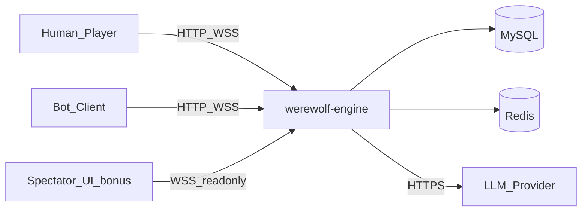
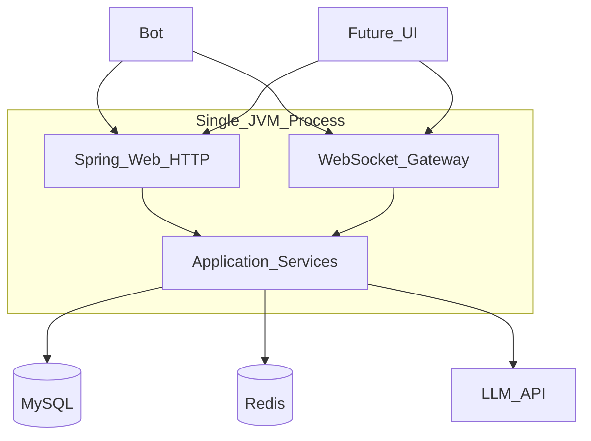
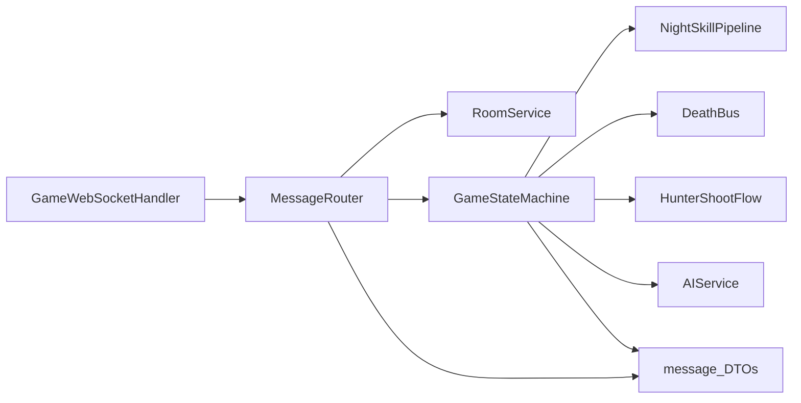
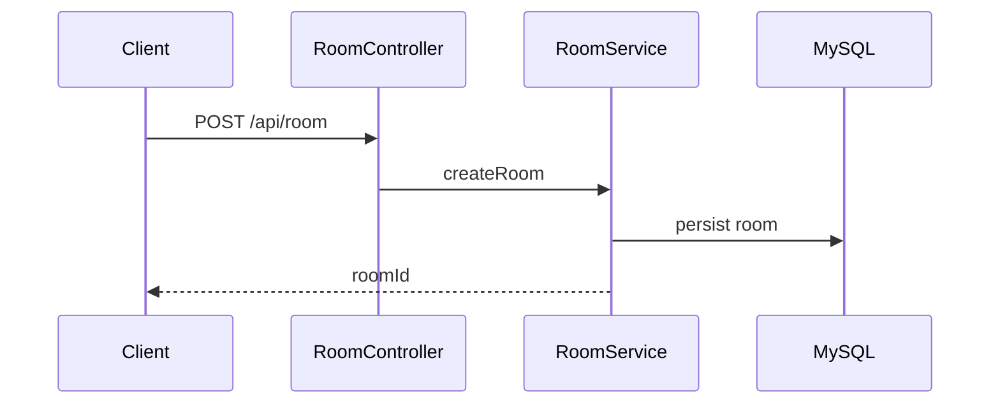
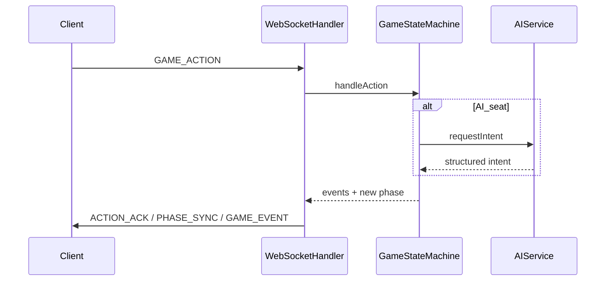
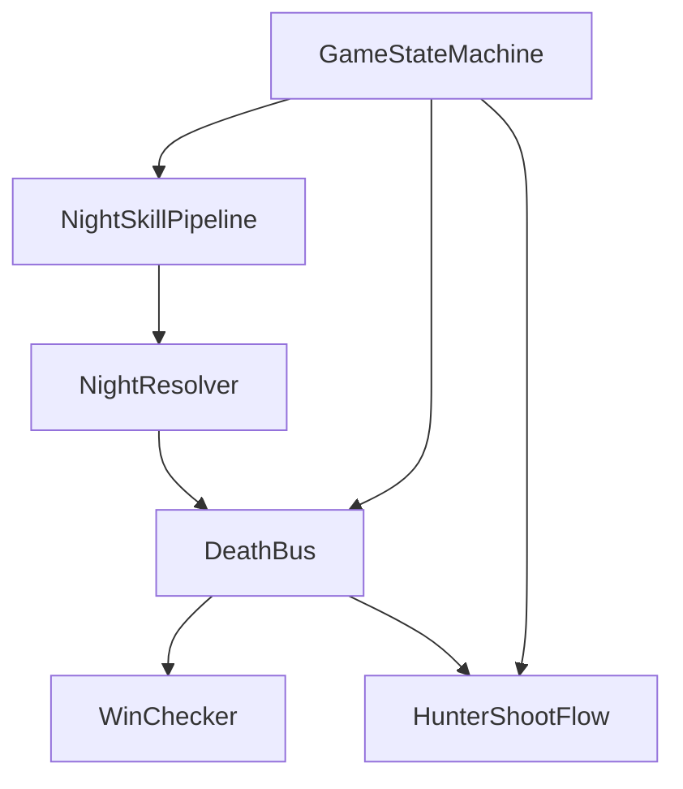
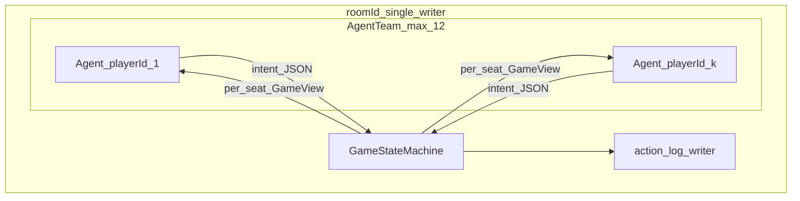
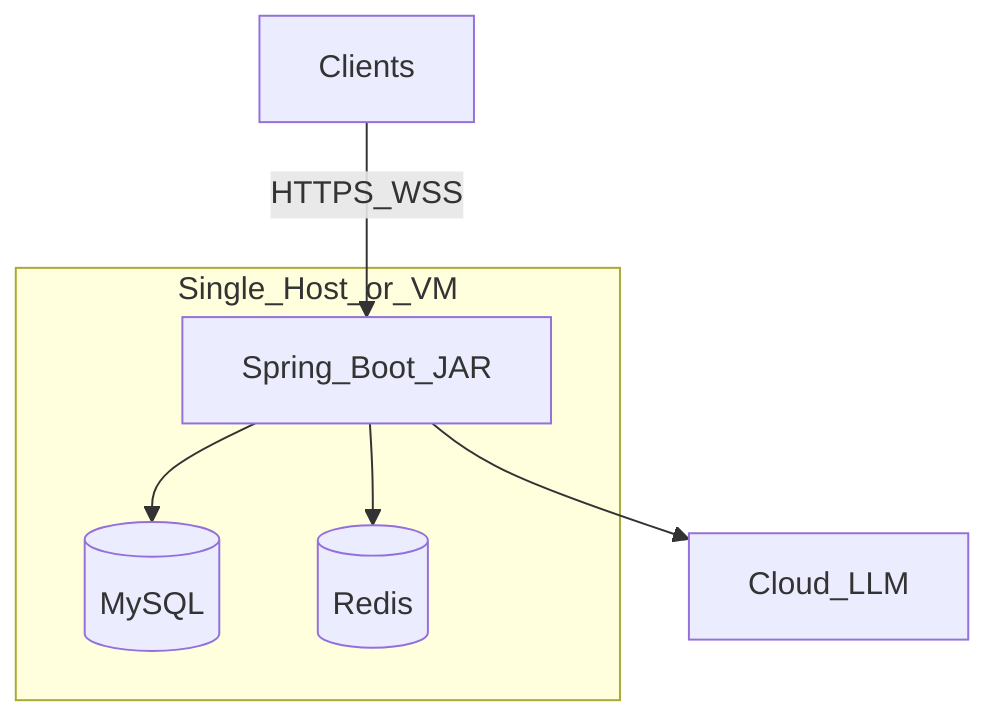

# werewolf-engine 架构设计说明书

| 属性 | 值 |
|------|-----|
| 版本 | v1.4 |
| 日期 | 2026-05-16 |
| 状态 | 与 [PRD v1.0.11](../progress/requirements-mvp-v0.1.md)（§4.3.8 引擎窄版）及 [技术选型 v0.1.5](tech-selection-feasibility.md) **对齐** |
| 适用范围 | MVP 后端（12 人局、单实例、无消息队列） |
| 课题 | **AI 狼人杀 — Agent Team 实战**（多智能体协作/对抗 + 对局引擎 + 可观测） |

---

## 1. 文档目的与读者

### 1.1 目的

在 PRD 已冻结功能与协议的前提下，本文给出 **系统级架构决策**：逻辑分层、运行时边界、数据与一致性、实时通道、AI 子系统接入方式、部署与演进。供实现、评审与后续扩容时对照。

### 1.2 读者

| 角色 | 使用方式 |
|------|----------|
| 开发（A/B/C） | 实现时遵守第 3～9 章边界与依赖方向 |
| 评审 / 新人 | 先读本文再读 PRD 第 4、6、7 章细节 |
| 运维 | 第 10 章部署与第 11 章非功能 |

### 1.3 追溯文档

| 文档 | 关系 |
|------|------|
| [README.md](../README.md) | 文档总索引 |
| [requirements-mvp-v0.1.md](../progress/requirements-mvp-v0.1.md) | **需求与协议真源**；§4.3.8 引擎窄版实现契约 |
| [adr/001](../adr/001-night-skill-pipeline.md) · [adr/002](../adr/002-death-bus-and-hunter-flow.md) | 夜内管道、`DeathBus`、`HunterShootFlow` |
| [adr/003](../adr/003-ai-integration.md) · [adr/004](../adr/004-ai-seat-memory.md) | AI 接入、Memory、`GameView` |
| [tech-selection-feasibility.md](tech-selection-feasibility.md) | **技术栈与可行性**；本文落实为组件与部署视图 |

---

## 2. 架构目标与约束

### 2.1 目标

- **服务端权威**：游戏状态仅由 `GameStateMachine` 演进；客户端与 AI 只提交**意图**。
- **可联调、可压测**：HTTP 建房 + WS 对局；`bot/` 可 12 路并发验证协议与状态机。
- **可演进**：单实例 MVP 明确边界，多实例 / MQ / 向量库等为后序扩展，不污染首版路径。
- **课题对齐**：**Agent Team**（每座位独立 Agent + 信息隔离）运行于 **权威状态机** 之上；**结构化日志**贯穿局内操作；观战 UI 为加分项，消费既有推送通道。

### 2.2 硬约束（来自 PRD 冻结项）

| 约束 | 架构含义 |
|------|----------|
| 单实例 MVP | 无跨节点状态同步；Redis 作连接映射与可选缓存，非集群强一致 |
| 无消息队列 | 阶段推进用进程内调度器 + 同步/虚拟线程阻塞 I/O；不引入 Kafka/RabbitMQ |
| WebSocket **原生 WebSocketHandler** | 不使用 STOMP MVP；自管 Session 与路由表 |
| Java **21** + 虚拟线程 | 阻塞 I/O（LLM、JDBC）不挤爆平台线程池；**禁止**用忙等轮询推进阶段 |
| MySQL + Redis | 关系数据与热数据分离；详见第 6 章 |

### 2.3 课题能力分层（架构视角）

| 分层 | 架构落点 | 说明 |
|------|----------|------|
| **MVP** | `game` + `ai` + `gateway` + `action_log` | 对局引擎与多 Agent 同进程；见 §8、§9 |
| **加分** | `Future_UI` / 观战客户端 | 只读 WS；脱敏 `PHASE_SYNC` 策略 P2 与 B 对齐 |
| **进阶①** | `ai` 配置外置（Agent 描述文件） | SM 接口不变 |
| **进阶②** | 评测服务 + 存储（可新模块 `eval`） | 读 `game_record`，不写局内热路径 |
| **进阶③** | 离线 `optimizer` Job | 写回 Prompt/权重，不绕过 SM |

---

## 3. 架构原则

1. **单向依赖**：`gateway` → `room` / `game`；`game` → `ai`；`ai` 不依赖 `gateway`（与 PRD §7.2 一致）。
2. **薄网关**：Gateway 只做鉴权、解析信封、路由到 SM、把结果推回 WS；**不**含胜负与技能规则。
3. **单写者**：同一 `roomId` 下对游戏状态的写操作 **串行化**（单队列或房间级锁），避免夜晚并发写冲突。
4. **AI 与状态隔离**：`AIService` 产出结构化意图；**仅** `GameStateMachine` 在校验后修改权威状态。
5. **协议稳定**：对外 WS/HTTP 契约以 PRD 第 6 章为准；架构变更若影响契约须升 PRD 子版本。

---

## 4. C4 视图（精简）

### 4.1 系统上下文（Context）



- **外部系统**：LLM（**DeepSeek 官方** OpenAI 兼容 API，`deepseek-v4-flash` / 可选 `deepseek-v4-pro`）、MySQL、Redis。

### 4.2 容器（Container）



MVP 下 **所有容器合一**：一个 Spring Boot 进程内嵌 HTTP + WebSocket + 业务服务。

### 4.3 组件（Component）

与 PRD §4.1、§7.1 对齐的组件划分：

| 组件 | 包路径（建议） | 职责摘要 |
|------|----------------|----------|
| WebSocket Gateway | `gateway` | `WebSocketHandler`、连接表、`MessageRouter`、按 `roomId`/`playerId` 推送 |
| Connection Manager | `gateway` | Session 生命周期、心跳、与 Redis 映射 |
| Room Service | `room` | 房间 CRUD、座位、准备、开始；**触发**开局，不驱动阶段循环 |
| Game State Machine | `game` | 编排、`GamePhase`、房间锁；委托 night/death/hunter 子模块 |
| Night skill pipeline | `game.night` | `NightSkillPipeline`、`RoleSkillHandler`（狼/预/女） |
| Death bus | `game.death` | `DeathBus`、`DeathRecord`、R23/猎人 pending 订阅者 |
| Hunter shoot flow | `game.hunter` | 公布后 `HUNTER_SHOOT` 与放逐线（R7/R9） |
| Night / win resolution | `game` | `NightResolver`、`WinChecker`；`ExileResolver`（投票/愚者） |
| AI Service | `ai` | LangChain4j、Prompt、Tools、Mock；被 SM 按座位调用 |
| Message DTOs | `message` | PRD 定义之 `type` / `payload` 序列化结构 |



---

## 5. 关键运行时路径

### 5.1 建房与开局（HTTP）



### 5.2 对局内操作（WebSocket）



### 5.3 定向推送（逻辑）

- **房间隔离**：任何推送键必须包含 `roomId`，禁止跨房间广播。
- **角色隔离**：`NIGHT_WOLF` / `NIGHT_WITCH` / `NIGHT_SEER` 等阶段按 PRD §4.6.5 过滤接收者集合。
- **实现提示**：`ConnectionManager` 维护 `(roomId, playerId) → WebSocketSession`；Router 查 SM 当前阶段与可见性后调用 `session.sendMessage`。

---

## 6. 数据架构

### 6.1 MySQL（权威持久化）

- **实体**：用户、房间、`room_player`、对局记录、操作日志（字段级定义见 PRD §4.7.1）。
- **事务边界**：房间元数据与开局角色分配宜短事务；**局内高频操作**可「先写内存状态机 + 异步批量刷盘」`[实现策略]`，MVP 亦可简化为关键节点写库（以性能测试为准）。

### 6.2 Redis（进程辅助）

用途与 Key 前缀遵循 PRD §4.7.2，例如：

- `werewolf:ws:conn:{roomId}:{playerId}`：会话绑定，支持断线重连。
- `werewolf:game:{roomId}:phase`：可选缓存当前阶段（**真源仍在 SM 内存或单写路径**，避免双写不一致）。

**已冻结**：MVP **不**实现「无 Redis 内存降级」双路径；开发环境使用本机 Docker Redis（见技术选型文档）。

### 6.3 与 LangChain4j 相关的数据

- **Agent Memory（已选型，[ADR-004](../adr/004-ai-seat-memory.md)）**：不以 LangChain4j `ChatMemoryStore` 为主存储。Episodic Memory 由 **`action_log` 按座投影**（`SeatMemoryProjector`），decide 时拼入 Prompt；可选进程内 `roomId:playerId` 投影缓存。多实例时 Redis **非 MVP**。
- **向量 / RAG**：非 MVP 必选项；若后续引入，独立评估 `EmbeddingStore`，不反向污染核心状态机表结构。

---

## 7. 实时通信架构

### 7.1 协议与帧

- **传输**：开发期 `ws://`；生产 **WSS**（PRD 非功能已冻结）。
- **信封**：`type` + `payload` + `timestamp` + 可选 `requestId`（PRD §4.6.2）。
- **鉴权**：连接 query `token`；与 HTTP `Authorization` 同源 opaque token（PRD §4.2.4）。

### 7.2 WebSocket 实现选型

- **原生 `WebSocketHandler` + 注册 `WebSocketConfigurer`**（已冻结）。
- **背压**：单房间 12 连接；出站以服务端推送为主；入站消息短小 JSON；一般无需复杂流控。

### 7.3 心跳与断线

- 应用层 **Ping/Pong** 或定时 `PHASE_SYNC` 刷新；超时关闭 Session 并清理 Redis 映射。
- 断线重连：30s 窗口内同一 `token` 恢复 `playerId`（PRD 规则）；超时走托管 / 默认操作。

---

## 8. 游戏状态机与并发

### 8.0 引擎窄版内部分层（PRD §4.3.8）

对外 **唯一** 阶段真源仍为 `GamePhase`（`PHASE_SYNC.currentPhase`）。对内：



| 模块 | 依赖方向 | 说明 |
|------|----------|------|
| `game.night.*` | → `game.model`，← SM | 不直接改 WS |
| `game.death.*` | → `WinChecker`，← `NightResolver` / 放逐/猎人 | 同步订阅链 |
| `game.hunter.*` | → `game.death`（可选）、`WinChecker`，← SM | 不进夜内 pipeline |
| `GameStateMachine` | 聚合上述；**禁止** gateway 直调 handler | 保持单写者 |

迁移顺序（与 PRD M1～M3）：`HunterShootFlow` → `DeathBus` → `NightSkillPipeline`。

### 8.1 单写者与串行队列

- **规则**：同一 `roomId` 所有 mutating 事件进入 **单线程执行器** 或 **可重入锁**（二选一实现，对外行为一致）。
- **狼人阶段**：收集多狼 `KILL` 投票，阶段结束或超时后 **一次结算**（PRD R10）。

### 8.2 定时与超时

- 使用 `ScheduledExecutorService` / `@Scheduled` / 单次 `schedule` 回调推进倒计时；**禁止** `while+sleep` 占满虚拟线程。
- 超时策略与 PRD 各 `Phase` 表一致；超时后 SM 主动推进并广播 `PHASE_SYNC`。

### 8.3 与 AI 的边界

```text
SM 需要某 AI 座位行动
  -> 调用 AIService（带只读 GameView / Context）
  -> AIService 调 LLM（阻塞，可走虚拟线程）
  -> 返回结构化 JSON（含 content/reason 等，见 PRD §4.5.3）
  -> SM 校验 action/target 合法后提交状态变更
```

**禁止**：AI 直接持有 `WebSocketSession` 或写数据库绕过 SM。

### 8.4 Agent Team 拓扑（课题核心）

一局 12 座位中，AI 座位在架构上视为 **并行 Agent 实例**，由 **单房间 SM** 串行接纳意图：



- **信息隔离**：`GameView` 构造器按当前 `phase` 与 `playerId` 裁剪字段，与 Gateway 定向推送规则同源。
- **协作/对抗**：狼人刀口在 `NIGHT_WOLF` 阶段内收集；胜负经 `DeathBus` 订阅者调用 `WinChecker`（及公布前 `tryEndGame`）输出。
- **商议门闩（R17a）**：SM 维护 `wolfChatInPhase`；`KILL` 指向存活狼人前须本阶段已有 `WOLF_CHAT` / `scope=WEREWOLF` 消息，否则 `WOLF_CHAT_REQUIRED`（见 PRD §4.3.6）。

---

## 9. AI 子系统架构

### 9.1 LangChain4j 与 Spring Boot 4

- 官方要求：**Spring Boot 4.x** 使用 artifact 后缀 **`-spring-boot4-starter`**（如 `langchain4j-open-ai-spring-boot4-starter`）；与 Boot 3 的 `*-spring-boot-starter` **不可混用**。
- **Java**：17+；本项目 **21**。
- **版本号**：实现阶段在 `pom.xml` 中锁定与 Boot 4 兼容的 LangChain4j 发行线；以 [LangChain4j Spring 集成文档](https://github.com/langchain4j/langchain4j/blob/main/docs/docs/tutorials/spring-boot-integration.md) 为准。

### 9.2 模块职责

| 构件 | 职责 |
|------|------|
| `PromptBuilder` | Base + Persona + Context 拼装 |
| `GameTools` | 只读查询局况；若需写状态须回调 SM（推荐：**Tools 只读**，写走 SM API） |
| `AIService` | 超时、重试策略（PRD：JSON 失败重试 0 次）、fallback 与日志 |
| `MockAIPlayer` | Week1 无 LLM 跑通闭环 |

### 9.3 与课题进阶方向的架构预留

| 方向 | 预留方式 | MVP 是否实现 |
|------|----------|----------------|
| ① 通用 Agent | `ai` 包内 Prompt/Tools 读配置目录 | 否 |
| ② 评测+复盘 | `game_record.action_log` + 可选 `eval` 模块 | 仅日志字段 |
| ③ 自进化 | 离线任务写配置；运行时只读 | 否 |

---

## 10. 部署架构（MVP）

### 10.1 逻辑部署



### 10.2 配置分层

| 环境 | 说明 |
|------|------|
| dev | 本地 MySQL/Redis（`docker compose`）；LLM 与 prod 同 DeepSeek 端点；`spring.profiles.active=dev` |
| prod | WSS、密钥来自环境变量；LLM `DEEPSEEK_API_KEY` + `https://api.deepseek.com/v1` |

### 10.3 可用性声明（MVP）

- 进程重启：**允许丢失进行中局**（PRD 非功能）；玩家需重开房。
- **无**多活、无 K8s 为硬性前提。

---

## 11. 非功能与横切关注

| 维度 | MVP 设计要点 |
|------|----------------|
| 延迟 | 阶段切换不含 LLM 目标 &lt; 500ms（PRD）；LLM P95 &lt; 3s + fallback |
| 安全 | token 不落日志明文；HTTPS/WSS；最小权限 DB 账号 |
| 观测 | **课题必达**：`action_log` 全序列 + 结构化日志（`roomId`、`playerId`、`requestId`、`phase`）；`thinking` 仅日志通道 |
| 测试 | `gateway`/`game` 单元测试 + `bot/` 集成压测（PRD 第 8 章）；S2 纯 AI 局日志可还原 |
| 信息隔离 | 定向推送 + `GameView` 裁剪；评审用例覆盖狼/预/女私密字段 |

---

## 12. 明确非目标（Out of Scope）

| 项 | 说明 |
|----|------|
| 消息队列 | 不引入；削峰延后 |
| 多实例房间 | 单 JVM 内完成一局；后续若水平扩展需 **sticky session** 或 **房间级状态外置** 专项设计 |
| 警长完整规则链 | PRD 已排除 MVP |
| 观战 UI 实现细节 | **加分项**；本文仅定义只读消费推送，UI 技术栈不在范围 |
| 进阶①③ 在线自改 Agent | MVP 不做；须离线审计后发布配置 |
| Leaderboard 服务 | **进阶②**；MVP 仅预留 `action_log` / `modelId` 字段 |

---

## 13. 需求—架构追溯表

| PRD 章节 | 本文章节 |
|----------|------------|
| §1.0 / §1.5 课题与进阶 | §2.3、§8.4、§9.3、§12 |
| §4.1 系统架构 | §4.3、§5 |
| §4.2～4.7 功能模块 | §4.3、§6～9 |
| §4.5.8 Agent Team | §8.4、§9 |
| §4.7.3 可观测 | §6、§11 |
| §5 非功能 | §2.2、§10.3、§11 |
| §6 接口 | §5、§7 |
| §7 包与依赖 | §3、§4.3 |

---

## 14. 变更记录

| 版本 | 日期 | 变更 |
|------|------|------|
| v1.0 | 2026-05-15 | 初稿：MVP 架构设计说明书，与 PRD v1.0.0 及技术选型文档对齐 |
| v1.1 | 2026-05-15 | **课题对齐**：§2.3 能力分层、§8.4 Agent Team 拓扑、观战上下文图、§9.3 进阶预留、可观测与非目标更新 |
| v1.2 | 2026-05-15 | **R17a**：§8.4 狼队商议门闩与 PRD v1.0.3 对齐 |
| v1.3 | 2026-05-16 | LLM 改为 DeepSeek 官方 API；§4.1、§10.2 与 PRD v1.0.4 对齐（后续 PRD 子版本见 requirements-mvp 变更记录） |

---

*文档结束*
