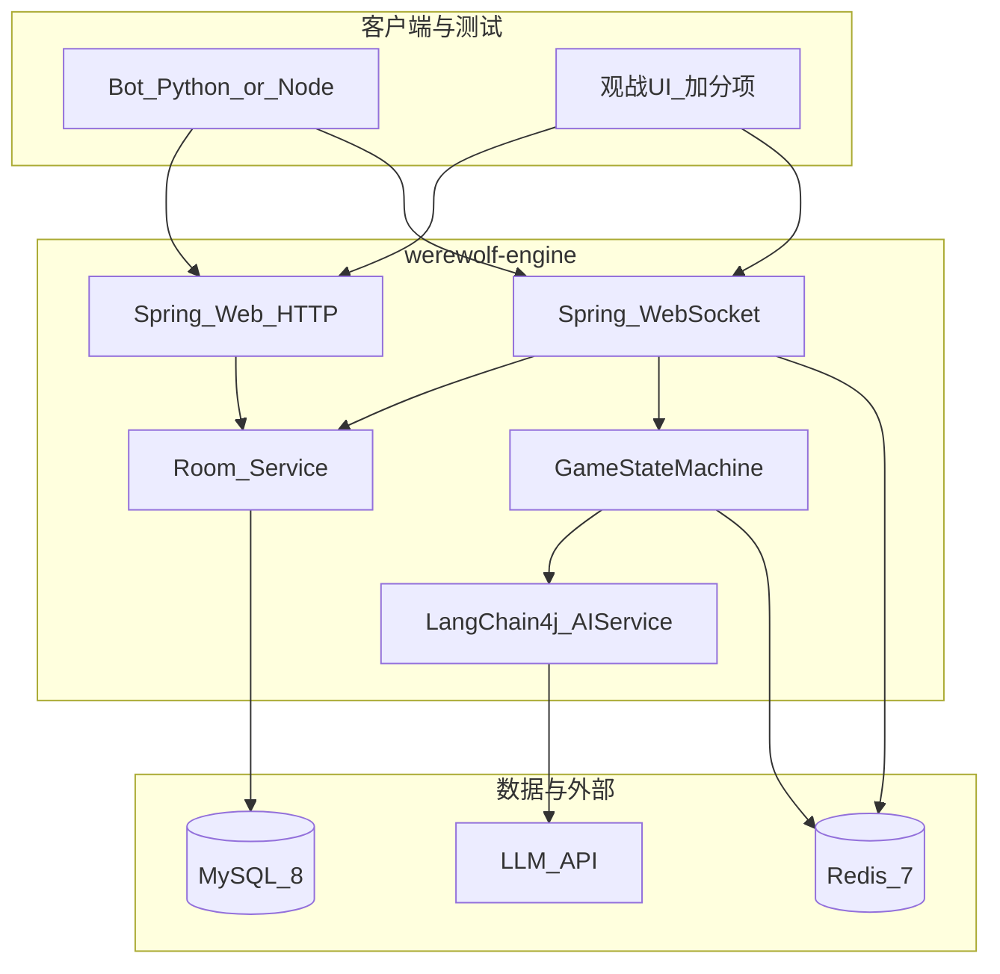

# werewolf-engine：技术选型与可行性分析

| 属性 | 值 |
|------|-----|
| 版本 | v0.1.5 |
| 日期 | 2026-05-15 |
| 关联文档 | [PRD](../progress/requirements-mvp-v0.1.md)（**v1.0.5**，含 §4.3.7、R17a / DeepSeek）、[architecture-design-spec.md](./architecture-design-spec.md)、[developer-local-setup.md](../developer-local-setup.md) |
| 项目 | werewolf-engine（**Agent Team 实战** — 12 人预女猎愚 + 愚者，人机混排 MVP） |

---

## 1. 文档目的与结论摘要

### 1.1 目的

在 [PRD](../progress/requirements-mvp-v0.1.md) 已定义功能边界的前提下，说明 **为何选用当前技术栈**、**各选项取舍**、**在三人团队与 MVP 周期内是否可落地**，以及 **主要风险与前置条件**。

### 1.2 结论摘要（可直接给决策方）

| 维度 | 结论 |
|------|------|
| **总体可行性** | **可行**。核心难点在服务端状态机与夜晚并发仲裁，而非语言选型；12 人 + WS + 单实例在工程上成熟。 |
| **推荐主栈** | **Java 21** + Spring Boot 4.x + Spring WebSocket + MySQL + Redis + LangChain4j + **DeepSeek 官方 API**（OpenAI 兼容，`deepseek-v4-flash`）；**Spring 虚拟线程**处理阻塞 I/O。 |
| **不推荐首版** | 多厂商 LLM 混用、多实例集群、语音、警长全量规则与前端并行首周开发。 |
| **关键路径** | Week1 用 **Mock AI** 跑通整局；协议 Day7 冻结后再扩 LLM 与前端。 |
| **课题对齐** | 对局引擎 + 多 Agent + 信息隔离 + 结构化日志 = **MVP 主交付**；观战 UI = **加分**；进阶三选一 = **MVP 后** |

---

## 2. 约束与目标（来自 PRD 的硬边界）

以下约束直接影响选型与可行性判断：

| 约束 | 对技术的影响 |
|------|----------------|
| 12 人、多阶段、定向推送 | 必须 **服务端推送**（WebSocket）；HTTP 轮询不满足体验与负载。 |
| 服务端权威状态机 | 业务逻辑集中在 Java 进程内；WS 层薄、**不做规则裁决**。 |
| 夜晚多角色并发输入 | 同房间 **串行化** 写状态机 + 阶段内收集再结算（已在 PRD 约定）。 |
| AI：Agent + 记忆 + 工具 | Java 侧适合 **LangChain4j**；不建议首版自研 HTTP 轮询式 Agent。 |
| MVP 单实例、可丢进行中局 | **无需**首周上 K8s、分片、强一致跨节点；Redis 可作缓存与连接映射，非强依赖集群。 |
| 测试 Bot 独立进程 | Python/Node 均可，与后端语言解耦。 |
| **课题：信息隔离** | 定向 WS + 每座位独立 Agent Context；`thinking` 仅日志，不经广播 |
| **课题：可观测** | MySQL `action_log` + 结构化应用日志；支撑压测与进阶②复盘 |
| **课题：观战 UI（加分）** | 复用现有 WS 推送；首版不为此引入新中间件 |
| **课题：进阶三选一** | ① Agent 描述外置 ② 评测表 + Leaderboard ③ 离线优化闭环；均可在当前栈上演进，**不必** MVP 换语言 |

---

## 3. 总体架构与技术映射

---

## 4. 技术选型（分项决策）

### 4.1 语言与运行时：Java 21 与虚拟线程

| 选项 | 优点 | 缺点 | 结论 |
|------|------|------|------|
| **Java 21（已采用）** | 正式版 **虚拟线程**（Project Loom）；对大量 **阻塞式** 等待（HTTP 调 LLM、JDBC、下游网络）可用极轻载体承载，减少平台线程池膨胀与「一连接一线程」压力 | CI/本机需统一 JDK 21+ | **采用**（见 `pom.xml` `java.version=21`） |
| Java 17 | LTS、兼容面广 | 无虚拟线程 | 已放弃作为本仓库目标 |
| Node.js / Go | 异步或并发模型不同 | 与当前 Java 栈不一致 | 不作为主服务首版 |

#### 4.1.1 虚拟线程：解决什么、不解决什么

| 适用 | 不适用 |
|------|--------|
| 阻塞 I/O：对外 LLM、MySQL、Redis、同步 HTTP 客户端 | **CPU 密集**循环或 `while(true)` **忙等**轮询阶段推进 |
| 大量并发任务：多房间、多 Bot 同时阻塞在 I/O | 替代 **事件驱动** 的倒计时与状态机调度 |

**工程约定**（与 PRD 一致）：

- 启用 Spring Boot **`spring.threads.virtual.enabled=true`**（见仓库 `application.properties`），在引入 **Web/WebSocket** 后由容器为请求处理使用虚拟线程载体（具体行为以 Spring Boot 4 文档为准）。
- **游戏阶段倒计时、超时推进**仍使用 `ScheduledExecutorService`、`@Scheduled`、或「单次 `schedule` 回调」等 **非忙等** 模型；禁止用 `while` + `sleep` 空转占满载体。

**可行性**：高。虚拟线程降低「阻塞式 AI + 多连接」下的线程成本；状态机正确性仍取决于业务代码，与是否虚拟线程无关。

---

### 4.2 应用框架：Spring Boot 4.0.x（当前父 POM）

| 选项 | 优点 | 缺点 | 结论 |
|------|------|------|------|
| **Spring Boot 4.0.6** | 与当前 `pom.xml` 一致；统一依赖管理 | 资料与社区问答仍部分面向 3.x，需对照官方文档 | **采用**（或团队决议后统一降 3.2.x，见 6.2） |
| Spring Boot 3.2.x | 教程与示例多 | 需改 parent 与依赖坐标，与现状不一致 | 备选 |

**可行性**：高。注意 **Web / WebSocket / JPA / Redis** 等 starter 需在实现阶段补全（当前仓库仍为最小 `spring-boot-starter`）。

---

### 4.3 实时通信：Spring WebSocket

| 选项 | 优点 | 缺点 | 结论 |
|------|------|------|------|
| **Spring WebSocket（原生 WebSocketHandler）** | 与 Spring 一体化；与 [PRD 0.5](../progress/requirements-mvp-v0.1.md) **已冻结**一致 | MVP 不用 STOMP | **采用** |
| 裸 Netty | 性能上限高、控制细 | 重复造会话与路由；与 Spring 集成成本高 | MVP 不推荐 |
| SSE + HTTP | 实现简单 | **单向**；狼人私聊与多路向推送别扭 | 不推荐 |

**可行性**：高。12 连接 × 10 房量级远低于单机 WS 上限；瓶颈更可能在 LLM 而非 WS。

---

### 4.4 数据层：MySQL 8 + Redis 7

| 组件 | 用途 | 结论 |
|------|------|------|
| **MySQL 8** | 用户、房间、对局记录、操作日志 | **采用**；MVP 可用 JPA `ddl-auto` 或 Flyway 后续引入 |
| **Redis 7** | WS 会话映射、房间集合、可选状态快照 | **采用**；开发推荐本机 Docker Redis；**已冻结**：MVP 不实现「无 Redis 内存降级」开关，减少双路径测试面 |

**可行性**：高。对局写频率远低于电商；瓶颈在逻辑正确性而非数据库 QPS。

---

### 4.5 AI 集成：LangChain4j vs Spring AI

| 维度 | LangChain4j | Spring AI |
|------|-------------|-----------|
| Agent / Memory / Tools | 模式成熟，与「AI 玩家 + 工具」匹配 | 偏模型调用与 Spring 抽象，Agent 能力相对薄 |
| 多模型切换 | OpenAI 兼容端点切换成本低 | 亦可，但 Agent 拼装常需自研 |
| 团队学习成本 | 需理解 AiServices、Tool、Memory | 若只做「一次一答」则低 | 

**结论**：首版 **LangChain4j 0.31.x**（与 PRD 一致），便于统一 JSON 输出、超时 fallback 与按角色装配。

**可行性**：中高。风险在 **输出格式稳定性** 与 **延迟**（见第 5 章），而非「能否接入」。

---

### 4.6 大模型：DeepSeek 官方 API（dev / prod 统一）

| 项 | 选型 |
|------|------|
| 接入方式 | **直连** [DeepSeek API](https://api.deepseek.com)（OpenAI 兼容）；**不经过** 千问 / 阿里云百炼等中转 |
| 默认模型 | `deepseek-v4-flash`（对局多轮调用，延迟与成本更优） |
| 可选升级 | `deepseek-v4-pro`（更强推理；同局仍须单模型） |
| 配置 | `application-dev.properties`：`base-url=https://api.deepseek.com/v1`，密钥 `DEEPSEEK_API_KEY` |

**结论**：禁止 **同局内** 多厂商混用（格式与延迟方差大）；角色差异用 **Prompt + temperature**，不用多模型硬切。千问平台上架的 DeepSeek 与官方 API **模型 ID、计费、延迟可能不同**，MVP 统一官方端点，避免 dev/prod 双路径。

**可行性**：中高。成本按局数估算即可（MVP 日活低时费用可忽略）；需 **3s 调用超时 + 规则 fallback**（PRD 已要求）。

---

### 4.7 测试客户端：Python Bot（推荐）

| 选项 | 说明 |
|------|------|
| **Python 3.11 + websocket-client** | C 上手快；与 Java 解耦；专测协议与压测 |
| Node.js | 若团队全栈偏前可选 |
| JUnit + 模拟 WS | 适合单测，不适合 12 路并发与长时间压测脚本 |

**可行性**：高。

---

## 5. 可行性分析（分维度）

### 5.1 技术可行性

| 能力点 | 难度 | 说明 |
|--------|------|------|
| 房间 + HTTP + JWT/Token 占位 | 低 | 标准 Spring Web |
| WS 广播与按角色定向推 | 中 | 需设计 `roomId` 与 `playerId` 到 Session 的映射；无理论障碍 |
| 完整状态机 + 愚者翻牌 + 屠边 | 中～高 | **最大开发量**在 A；[PRD v1.0.0](../progress/requirements-mvp-v0.1.md) 规则已冻结，按章实现即可 |
| 狼人自刀战术（队友指刀 + 商议门闩 R17a）+ 女巫结算 | 中 | PRD **v1.0.3**：刀狼前须本阶段 `WOLF_CHAT`；否则 `WOLF_CHAT_REQUIRED`；按 R10 决议 |
| LangChain4j 驱动 AI 座位 | 中 | 与状态机通过「意图 → 校验 → 提交」边界清晰即可 |
| 10 房 × 12 人并发 | 低（单实例） | 非功能指标在 PRD 已列；单机足够 |

**结论**：无「做不到」的硬技术墙；成败取决于 **状态机正确性** 与 **协议冻结纪律**。

---

### 5.2 进度与人力可行性（三人）

| 角色 | 假设技能 | 并行度 |
|------|----------|--------|
| A | Java、业务建模、（可选）LLM Prompt | 可独立起状态机单测 |
| B | Java、网络、DB | 可独立起 WS + 房间骨架 |
| C | Python 或脚本 | 不阻塞 A/B，协议初稿后即可写 Bot |

**结论**：在 **Week1 Mock 闭环、Week2 接 LLM** 的节奏下，**12～20 人日**量级与此前估算一致，三人并行 **可达成 MVP 后端**；前提是 **Day4 联调、Day7 冻结** 执行到位。

---

### 5.3 成本与运维可行性（MVP）

| 项目 | MVP 假设 |
|------|----------|
| 云主机 | 1 台 2C4G～4C8G 即可承载单服务 + MySQL/Redis 小实例或同机 Docker |
| LLM | 按调用计费；全 AI 压测时短时费用略升，可控 |
| 监控 | 日志 + 健康检查即可；无需完整 APM |

**结论**：成本与运维对学生/小团队友好。

---

### 5.4 合规与安全（简）

| 项 | MVP 建议 |
|------|----------|
| 用户数据 | 最小化收集；token 勿写日志明文 |
| LLM | **已冻结**：不落真实身份敏感字段进 Prompt；对局日志脱敏（不写完整 Prompt/PII 明文） |
| 传输 | **已冻结**：生产环境 **WSS / HTTPS** |

---

## 6. 风险与缓解（技术视角）

| 风险 | 影响 | 缓解 |
|------|------|------|
| 需求变更未走版本与评审 | 返工、联调延期 | 变更须 bump [PRD](../progress/requirements-mvp-v0.1.md) 子版本并经三人确认（见 PRD 0.1 / 0.3） |
| LLM JSON 不稳定 | 阶段卡住 | Schema 约束 + 解析失败走 fallback + 缩短单次调用链 |
| Spring Boot 3 / 4 混用文档 | 配置踩坑 | 团队统一版本并写一页「启动检查表」 |
| 状态机与 WS 耦合 | 难测 | Gateway 只转发；状态机纯 Java 单测覆盖边界 |
| 虚拟线程误用（忙等、可重入锁混用） | 吞吐差或卡死 | 代码评审：阶段推进只用调度器；共享状态仍用单房间队列/锁 |
| 愚者 / 自刀 / 时间锚发言 | 规则细节多 | 每条规则对应单测用例名 |

## 7. 已关闭决策（与 PRD v1.0.0 一致）

以下与 [PRD 0.5 节](../progress/requirements-mvp-v0.1.md#05-技术栈约定) 对齐，**不再开放二选一**：

| ID | 议题 | 结论（与 PRD v1.0.0 对齐） |
|----|------|---------------------------|
| T1 | Spring Boot 版本 | **已冻结**：维持 **4.0.6** |
| T2 | JDK | **已采用 Java 21**（虚拟线程见 4.1.1） |
| T3 | WebSocket 风格 | **已冻结**：**原生 WebSocketHandler** |
| T4 | Redis 缺失时的开发模式 | **已冻结**：本地 Docker Redis；无内存降级开关（见 4.4） |
| T5 | Bot 仓库位置 | **已冻结**：本仓库 **`bot/`** |

---

## 8. 与 PRD 的追溯关系

| PRD 章节 | 本文对应 |
|----------|----------|
| §1.0 / §1.5 课题与进阶 | 第 10 章 |
| 0.5 技术栈约定 | 第 4 章展开 |
| 4.1 架构 | 第 3 章一致 |
| 4.5.8 / 4.7.3 Agent Team 与可观测 | §2 约束、第 10 章 |
| 5 非功能 | 5.1、5.3 |
| 8 里程碑 | 5.2 人力节奏 |
| 9 风险 | 第 6 章对齐并补充 |

---

## 9. 变更记录

| 版本 | 日期 | 变更 |
|------|------|------|
| v0.1 | 2026-05-15 | 初稿：技术选型与可行性分析 |
| v0.1.1 | 2026-05-15 | 采用 **Java 21** + Spring **虚拟线程**说明与风险；T2 关闭 |
| v0.1.2 | 2026-05-15 | 与 **PRD v1.0.0** 冻结对齐：WebSocket/Redis/Bot/开放决策收口；去除文档内 `[TBD]`；风险表改写 |
| v0.1.3 | 2026-05-15 | **课题对齐**：结论摘要、§2 约束、架构图观战 UI；与 PRD v1.0.1 §1.0/§1.5 一致 |
| v0.1.4 | 2026-05-15 | **R17a** 服务端门闩可行性；与 PRD v1.0.3 同步 |
| v0.1.5 | 2026-05-16 | LLM 改为 **DeepSeek 官方 API**（`deepseek-v4-flash`）；移除 Ollama / 百炼 dev-prod 分叉 |

---

## 10. 课题能力分层与进阶可行性（摘要）

与 [PRD §1.0 / §1.5](../progress/requirements-mvp-v0.1.md#10-课题定位与能力分层) 一致：

| 分层 | 内容 | 技术可行性 |
|------|------|------------|
| **MVP 必做** | 状态机、LangChain4j 多座位 Agent、定向推送、`action_log` | **高** — 当前栈已覆盖 |
| **加分** | 观战 UI（纯 AI / 人机混战） | **高** — 只读 WS 客户端；后端 P2 可补观战 token 策略 |
| **进阶① 通用 Agent** | Prompt/Tools 外置与版本化 | **中** — 不需换框架；注意沙箱与审计 |
| **进阶② 评测+复盘** | 指标表、归因、Leaderboard | **高** — 依赖 `action_log` + Bot 批跑；可选 ClickHouse/ES 后置 |
| **进阶③ 自进化** | 对局→分析→优化→再对局 | **中** — 离线 Job + 人工审核 Prompt 变更；禁止在线直改 SM 状态 |

*文档结束*
