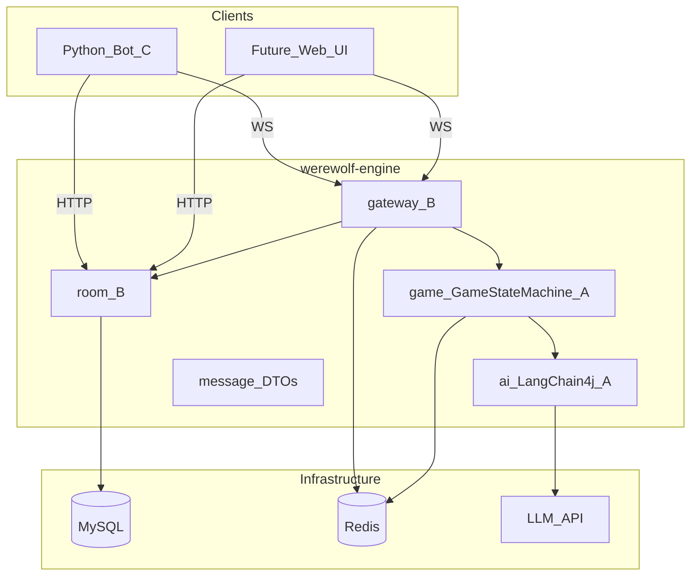
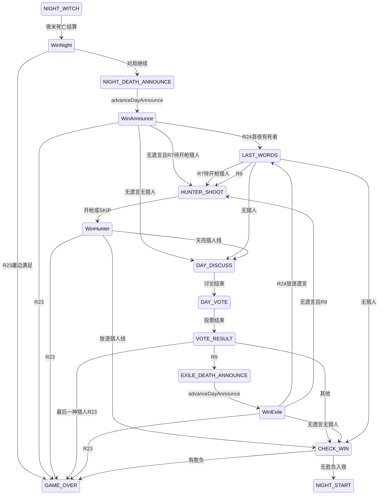
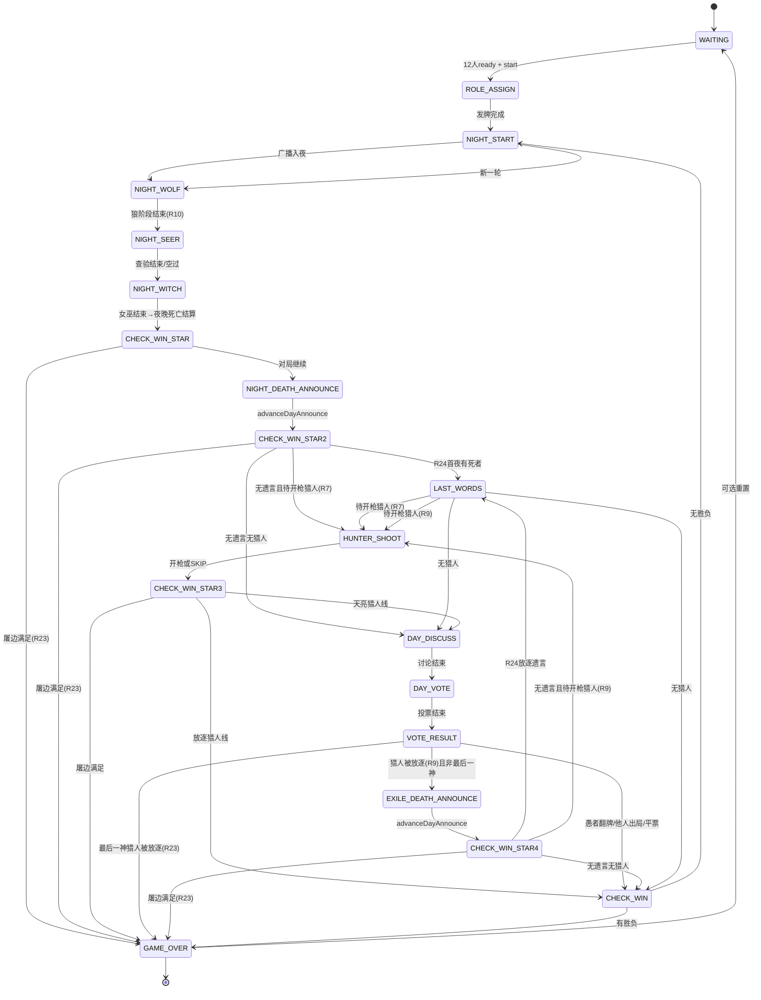
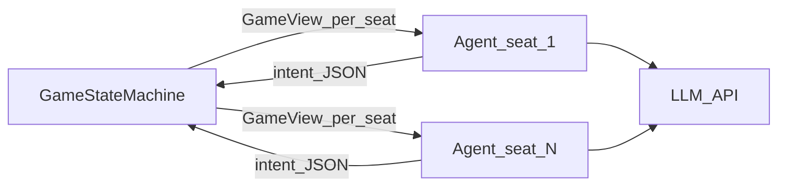
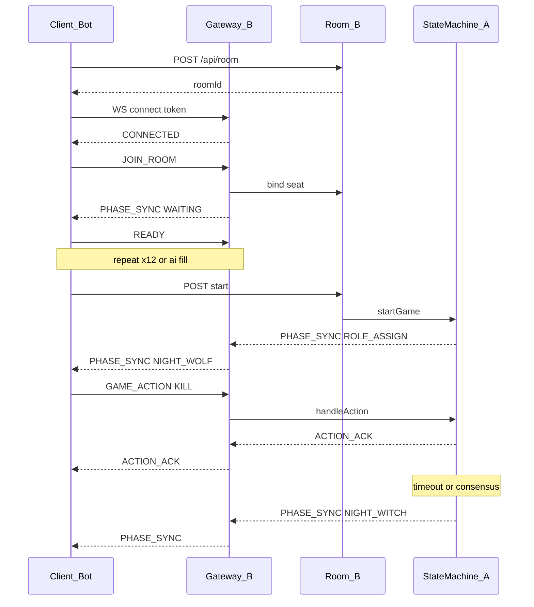

# 狼人杀后端系统需求文档（MVP v1.0.14）

| 属性 | 值 |
|------|-----|
| 版本 | v1.0.14（在 v1.0.13 基础上：**文档索引** [README](../README.md)；目录 `architecture/`、`progress/`、`reference/`；**不改变** 规则与 WS 冻结项） |
| 日期 | 2026-05-16 |
| 范围 | 后端核心系统；**观战 UI 为课题加分项**，规格见 §1.5 |
| 项目名 | werewolf-engine |
| 课题 | **AI 狼人杀 — 多智能体协作与博弈的 Agent Team 实战** |
| 包名 | `com.werewolfengine`（子包见第 7 章） |
| 冻结目标日 | **已完成**（v1.0.0 与本文同步冻结） |

---

## 目录

0. [文档说明](#0-文档说明)  
1. [业务需求](#1-业务需求)（含 [1.0 课题定位](#10-课题定位与能力分层)）  
2. [用户需求与场景](#2-用户需求与场景)  
3. [游戏规则](#3-游戏规则)  
4. [功能需求](#4-功能需求)（含 §4.3.7 阶段位/死亡与 AI）  
5. [非功能需求](#5-非功能需求)  
6. [接口规范](#6-接口规范)  
7. [三人分工与模块结构](#7-三人分工与模块结构)  
8. [开发里程碑与验收](#8-开发里程碑与验收)  
9. [风险与应对](#9-风险与应对)  
10. [附录](#10-附录)  
11. [评审清单](#11-评审清单)  

---

## 0. 文档说明

### 0.1 目的

本文档为三人团队并行开发的**唯一后端需求基线**。开发、联调、验收均以本文为准。**v1.0.0 起规则与技术项已全部冻结**（无 `[TBD]`）；若需变更须走变更记录、升文档子版本号，并经三人确认。

### 0.2 读者与认领章节

| 角色 | 负责人 | 重点章节 |
|------|--------|----------|
| 状态机 + AI Agent | A（你） | 3、4.3、4.4、4.5、8 |
| WebSocket + 房间 + 持久化 | B | 4.2、4.6、4.7、6.1、6.2 |
| 测试 Bot + 压测 | C | 2、6.3、8.2、11.3 |

### 0.3 冻结标准（Week1 Day7）

**v1.0.0 已冻结**；下列范围**未经三人同意不得变更**：

- WebSocket / HTTP 消息 `type` 与 `payload` 字段
- `GamePhase` 枚举全集
- 角色技能结算顺序与第 3 章规则表（已确认项；**R17/R17a** 以 **v1.0.3** 为准）
- `PHASE_SYNC` 在 **v1.0.3** 新增 `wolfChatInPhase`（仅 `NIGHT_WOLF`）；其余字段仍以 v1.0.0 为准
- AI 输出 JSON Schema（第 4.5 节）

### 0.4 术语表

| 术语 | 含义 |
|------|------|
| `roomId` | 房间唯一标识，如 `r_abc123` |
| `playerId` | 房间内座位号，整数 **1～12** |
| `userId` | 用户账号 ID（真人）；AI 座位 `userId` 为空 |
| `phase` / `GamePhase` | 游戏阶段枚举，服务端权威 |
| `action` | 玩家在本阶段的操作类型，如 `KILL`、`VOTE` |
| `scope` | 聊天可见范围：`ALL`、`WEREWOLF` |
| 屠边 | 狼人阵营 vs 好人阵营；**神职**（预、女、猎、**愚者**）或 **平民**（`VILLAGER`×4）任一阵营全灭则狼赢 |
| Mock AI | 不调用 LLM，按规则随机/固定策略行动 |
| Agent Team | 一局内多座位 AI 的集合；每座位独立目标与上下文，由 SM 统一调度 |
| `action_log` | 对局结构化操作序列，用于可观测、复盘与评测（§4.7.3） |

### 0.6 相关文档

| 文档 | 用途 |
|------|------|
| [README.md](../README.md) | **文档总索引** |
| [architecture-design-spec.md](../architecture/architecture-design-spec.md) | 系统架构、Agent Team 拓扑、可观测与演进 |
| [adr/003-ai-integration.md](../adr/003-ai-integration.md) · [adr/004-ai-seat-memory.md](../adr/004-ai-seat-memory.md) | AI 接入、座位记忆 |
| [adr/001-night-skill-pipeline.md](../adr/001-night-skill-pipeline.md) · [adr/002-death-bus-and-hunter-flow.md](../adr/002-death-bus-and-hunter-flow.md) | 夜内管道、死亡总线、猎人 |
| [gateway-integration.md](../reference/gateway-integration.md) | Gateway / Bot 联调 |
| [reference/code-modules.md](../reference/code-modules.md) | 包结构速查 |
| [tech-selection-feasibility.md](../architecture/tech-selection-feasibility.md) | 技术选型、课题能力可行性、进阶方向评估 |

### 0.5 技术栈约定

| 层级 | 选型 | 备注 |
|------|------|------|
| 语言 | **Java 21** | 与 [pom.xml](../../pom.xml) `java.version` 一致；启用 **虚拟线程**（见下） |
| 并发模型 | 虚拟线程 + 事件驱动定时 | `spring.threads.virtual.enabled=true`（[application.properties](../../src/main/resources/application.properties)）；阻塞 I/O（LLM/DB/外呼）优先不占用平台线程池。**阶段倒计时与状态推进**须用调度器 / 延迟任务 / 非忙等循环，禁止 `while` 空转轮询 |
| 框架 | Spring Boot 4.0.6 | **已冻结**：维持 4.0.x，不降级 3.2 |
| 构建 | Maven | |
| WebSocket | Spring WebSocket（**原生 WebSocketHandler**） | **已冻结**（不使用 STOMP MVP） |
| AI | LangChain4j 0.31.x | A 负责 |
| DB | MySQL 8.0 | |
| 缓存 | Redis 7.x | |
| LLM（dev / prod） | **DeepSeek 官方 API**（OpenAI 兼容） | 默认 `deepseek-v4-flash`；可选 `deepseek-v4-pro`；**不经千问/百炼** |
| LLM 密钥 | 环境变量 `DEEPSEEK_API_KEY` | 申请：https://platform.deepseek.com/api_keys；本地步骤见 [developer-local-setup.md](../developer-local-setup.md) |

---

## 1. 业务需求

### 1.0 课题定位与能力分层

**课题名称**：AI 狼人杀 — 多智能体协作与博弈的 Agent Team 实战。

**核心问题**：在**严格信息隔离**下，让多个 Agent 按角色（狼人、预言家、女巫等）拥有**独立目标、策略与行动空间**，完成推理、发言与决策；由**对局引擎**驱动回合流转与胜负裁决，并输出**结构化日志**实现全程可观测。

与本仓库实现的对应关系：

| 课题要求 | 本系统落点（模块） | 交付阶段 |
|----------|-------------------|----------|
| 完整对局引擎 | `GameStateMachine` + `NightResolver` / `DayResolver` / `WinChecker` | **MVP P0**（已冻结） |
| 多角色 Agent Team | 每座位 `AIService` + `Persona` + `GameTools`；由 SM 按阶段调度 | **MVP P0～P1**（Week1 Mock → Week2 LLM） |
| 信息隔离 | `PHASE_SYNC` 定向字段 + 狼频道 `scope=WEREWOLF`；AI `thinking` 仅日志 | **MVP P0** |
| 协作 / 对抗 | 狼人阶段共识刀、白天投票与发言轮次；阵营胜负由 `WinChecker` 裁决 | **MVP P0** |
| 结构化可观测 | `action_log` + 应用日志（`roomId` / `playerId` / `requestId`） | **MVP P0** |
| 纯 AI / 人机混战 | 场景 S2 / S1（§2.1） | **MVP P0～P1** |
| **加分项**：观战 UI | 订阅 `PHASE_SYNC` / `GAME_EVENT` / `CHAT_BROADCAST` 的只读前端 | **课题加分**（后端协议已支持推送，UI 不在本文范围） |
| **进阶（三选一）** | 见 §1.5 | **MVP 后迭代** |

### 1.5 课题进阶方向（MVP 后，团队择一）

以下**不纳入 v1.0.0 冻结范围**；立项后单独升 PRD 子版本并评审。

| 方向 | 目标摘要 | 与本仓库衔接建议 |
|------|----------|------------------|
| **① 通用 Agent** | 「读懂自己 → 修改自己 → 运行自己」的自演化；从通用 Agent 演化为狼人杀多角色 Agent | 将 `Persona` / Prompt / Tools 配置外置为可版本化 **Agent 描述文件**；SM 接口不变 |
| **② 评测 + 复盘** | 结果/过程多维评测、复盘归因、多版本/多模型 **Leaderboard** | 基于 `game_record.action_log` 与指标表；Bot 压测流水线输出榜单 |
| **③ 自进化 Agent** | 「对局 → 分析 → 优化 → 再对局」闭环，提升各角色胜率 | 离线分析 Job 写回 Prompt/策略权重；**禁止** Agent 绕过 SM 直改局内状态 |

### 1.1 背景与差异化

构建支持**人机混战**与**纯 AI 多 Agent 对局**的狼人杀后端（课题 Agent Team 的 runtime 底座）。核心差异化：

- **12 人标准预女猎愚 + 愚者局**（非多数开源项目的 6 人简化局）
- **服务端权威状态机**（非纯 AI 协商推进；Agent 只提交意图）
- **真人缺人时 AI 自动补位**；同时支持 **12 Agent 全自动**压测与演示（场景 S2）

### 1.2 业务目标

| 优先级 | 目标 | 验收标准 |
|--------|------|----------|
| **P0** | 12 人标准局完整流程 | 从发牌到胜负判定，Mock AI 无人干预可跑通一整局 |
| **P0** | 实时阶段同步 | 存活玩家均能收到 `PHASE_SYNC`，倒计时误差 ≤ 1s |
| **P0** | 操作可校验 | 非法阶段/角色/目标的操作返回 `ERROR`，不污染状态 |
| **P1** | 真人 + AI 混合房间 | 真人经 WS/Bot 与 AI 同局 |
| **P1** | AI 输出可解析 | JSON 连续 50 次解析成功率 > 95%，超时 3s 有 fallback |
| **P2** | 房间生命周期完善 | 解散、**复盘查询 API**、操作日志导出 |
| **P2** | 用户体系 | JWT 登录、昵称、历史对局 |
| **加分** | 观战 UI（课题） | 只读展示多 Agent 实时博弈；消费现有 WS 推送，**不要求**后端改规则 |

### 1.3 业务边界（MVP 不做）

- 语音 / 视频
- 多板子（守卫、骑士等；**本 MVP 固定单板**：预女猎愚 + 愚者）
- **警长**（上警、退水、警徽流）；**含：警长决定白天发言顺/逆时针**（见 R13；MVP 为**随机方向** + **时间锚点**首发言位）
- **后端观战席位 / 观战专用协议**（加分项由**前端只读订阅**同一房间 WS 实现，不单独开 MVP 后端模式）
- 排行榜 / 积分 / 好友（**进阶方向②** 可单独建设 Leaderboard，非 MVP）
- **自演化 / 通用 Agent 运行时**（**进阶方向①③**，非 MVP）
- 移动端原生 App
- 集群多实例部署（MVP 单实例）

### 1.4 用户角色

| 角色 | 需求摘要 | 后端能力 |
|------|----------|----------|
| 真人玩家 | 知悉当前阶段、操作有反馈 | `PHASE_SYNC`、`ACTION_ACK`、WS 定向推送 |
| AI 玩家 | 推理、记忆、伪装、按格式行动；**出局后**仍收合法 `PHASE_SYNC`、不产出可改局技能（见 §4.3.7） | LangChain4j + Tools + Memory + Persona |
| 系统法官 | 自动推进、超时、公布结果 | `GameStateMachine` + 定时器 + `GAME_EVENT` 广播 |
| **观战者（加分）** | 观看多 Agent 实时博弈、不解密未授权信息 | 前端只读客户端；服务端仍按角色过滤 `PHASE_SYNC`（观战账号策略 **P2 定义**） |

---

## 2. 用户需求与场景

### 2.1 用户场景

**场景 S1：真人开房 + AI 补位**

1. 房主 HTTP 创建房间，设置 `aiCount=11`
2. 真人 WS 连接并 `JOIN_ROOM`，占 1 个座位
3. 房主 `start` 后系统分配角色，AI 自动填满其余座位
4. 真人通过 Bot 或未来前端完成夜晚/白天操作，AI 由服务端驱动

**场景 S2：全 AI 自动对局（开发/压测 / 课题演示）**

1. 创建房间，`aiCount=12`
2. 12 个 Bot 或 12 路服务端 AI 座位响应 `PHASE_SYNC`
3. 跑满 N 局，统计胜率、时长、异常率；**结构化 `action_log` 可回放关键节点**

**场景 S2b：纯 AI + 观战 UI（课题加分）**

1. 同 S2 开局
2. 观战前端以**只读**身份订阅同一 `roomId` 的公开事件流（`PHASE_SYNC` 脱敏版或 `GAME_EVENT` + 公开聊天，**实现期与 B 对齐字段**）
3. UI 展示阶段、存活、发言与投票结果，**不展示**未授权角色私密字段

**场景 S3：全真人**

1. `aiCount=0`，12 人真人 WS 接入
2. 系统仅作法官，不调用 LLM

### 2.2 痛点与后端方案

| 痛点 | 后端方案 |
|------|----------|
| 不知道现在该做什么 | 每阶段切换强制推送 `PHASE_SYNC`（含 `canAct`、`countdown`、`yourRole`） |
| 操作后没反馈 | `ACTION_ACK` + 必要时 `GAME_EVENT` |
| 夜晚信息泄露 | 定向推送：狼人/女巫/预言家仅收本角色可见消息 |
| AI 发言/行动不像人 | Prompt + Persona + 统一 JSON 格式 + fallback |
| 有人掉线 | 30s 重连窗口；超时由系统默认操作或 AI 托管（**已冻结**） |
| 外挂改状态 | 客户端只提交意图；死亡、技能结果均由服务端计算 |

### 2.3 MVP 策略：断线 / 作弊 / 延迟

| 问题 | MVP 策略 |
|------|----------|
| 断线 | Redis 保留 `playerId ↔ sessionId`；重连后恢复 `roomId`+`playerId`；游戏中掉线 30s 内可重连（**已冻结**） |
| 作弊 | 校验 `phase`、角色、`target` 合法性；拒绝死人操作 |
| LLM 延迟 | 单 AI 调用 3s 超时 → fallback；阶段总时长由阶段超时兜底（30s 等） |

---

## 3. 游戏规则

> **评审说明（A + 全员）**：规则表已于 **v1.0.0** 全部冻结；与实现对齐时以「状态」列 **已冻结** 为准。

### 3.1 板子配置（12 人）

| 角色 | 数量 | 阵营 |
|------|------|------|
| 狼人 | 4 | 狼人阵营 |
| 平民 | 4 | 好人阵营（村民，`role=VILLAGER`） |
| 愚者 | 1 | 好人阵营神职（「白」占神坑，与预女猎并列；见 R19～R21） |
| 预言家 | 1 | 好人阵营（神职） |
| 女巫 | 1 | 好人阵营（神职） |
| 猎人 | 1 | 好人阵营（神职） |

**合计 12 人**：4 狼 + 4 民 + 1 愚者 + 预 + 女 + 猎。**不含**：守卫、警长。

### 3.2 规则冻结表

| # | 规则点 | 建议默认值 | 状态 |
|---|--------|------------|------|
| R1 | 胜负条件 | **屠边**：狼人全灭 → 好人赢；**神职**（`SEER`,`WITCH`,`HUNTER`,`IDIOT`）全灭 **或** 4 名 **`VILLAGER` 全灭** → 狼赢（见 R21） | 已冻结 |
| R2 | 最后一狼与最后一民同夜同死 | **狼赢** | 已冻结 |
| R3 | 女巫首夜自救 | **允许**（仅当仍有解药） | 已冻结 |
| R4 | 女巫同夜救 + 毒 | **不允许** | 已冻结 |
| R5 | 女巫是否看到刀口 | **是**；进入 `NIGHT_WITCH` 时 payload 含 `wolfKillTarget`（若狼刀生效前） | 已冻结 |
| R6 | 解药 / 毒药数量 | 各 **1** 瓶，全程 | 已冻结 |
| R7 | 猎人被狼刀死 | **可开枪** | 已冻结 |
| R8 | 猎人被毒死 | **不能开枪** | 已冻结 |
| R9 | 猎人被投票放逐 | **可开枪**（**例外**见 R23）：先 `VOTE_RESULT`，再 `EXILE_DEATH_ANNOUNCE`，再 `HUNTER_SHOOT`（超时默认 `SKIP`） | 已冻结 |
| R10 | 狼人刀口不一致 | 30s 内收集各狼 `KILL`；**多数票**；平票取**最后提交**；仍平则**随机**存活非狼目标 | 已冻结 |
| R11 | 狼人私聊 | 仅 `NIGHT_WOLF` 阶段，scope=`WEREWOLF` | 已冻结 |
| R12 | 预言家查验结果 | 仅告知 **好人 / 狼人**（不暴露具体神职） | 已冻结 |
| R13 | 白天发言顺序 | **锚点座位**：进入 **每一轮** `DAY_DISCUSS` 时，取服务端 **Unix 秒时间戳** `T`（进入该阶段的时刻），`speakAnchorSeat = (T % 12) + 1`（取值 1～12）。若该座玩家**非存活**或**不参与本阶段发言**，则沿 `speakDirection` 找下一存活玩家为**本轮首位发言人**。**方向**：`speakDirection` 为 `CLOCKWISE` 或 `COUNTER_CLOCKWISE`；**MVP** 在开局 **随机** 二选一，**本局内不变**（直至 `GAME_OVER`）。**正式版**由警长决定顺/逆时针（警长功能待做，见 1.3）。每人最多 **60s**；可 `SKIP_SPEAK`。本轮内后续发言按 `speakDirection` 在存活玩家间轮转 | 已冻结 |
| R14 | 白天投票 | **`can_vote=true` 的存活玩家**可投任意存活玩家或弃票；**平票无人出局**，进入下一夜 | 已冻结 |
| R15 | 投票超时 | 视为 **弃票** | 已冻结 |
| R16 | 警长 | **不进 MVP** | 已冻结 |
| R17 | 狼人刀口目标（含自刀战术） | **`NIGHT_WOLF` 内**须先通过 `WOLF_CHAT`（R11）商议刀口策略。**允许**的 `KILL` 目标：① 任意**存活非狼**（**无需**先商议）；② **存活狼人**（含狼队友或**本人**，自刀战术）：**须满足 R17a**。最终刀口按 **R10** 票型决议。**禁止**：`target` 已死亡；非 `NIGHT_WOLF` 的 `KILL` | 已冻结 |
| R17a | 刀狼队友 / 自刀的门闩 | 当 `KILL` 的 `target` 为**存活狼人**时，**当前 `NIGHT_WOLF` 阶段实例**内须已有 ≥1 条合法狼队频道消息（`CHAT_MESSAGE` 且 `scope=WEREWOLF`，或 `GAME_ACTION` 且 `action=WOLF_CHAT`），由**任意存活狼人**发出；否则拒绝 `KILL`，返回 **`WOLF_CHAT_REQUIRED`**。进入新的 `NIGHT_WOLF` 时重置门闩（见 §4.3.6） | 已冻结 |
| R18 | 死人发言 / 投票 | **拒绝**（`is_alive=false`）；已翻牌愚者见 R19，仍可发言、不可投票。**例外**：`LAST_WORDS` 阶段见 R24 | 已冻结 |
| R19 | 愚者被白天投票出局 | **翻牌公布身份**，不离场；`is_alive=true`；`can_vote=false`；**仍可发言**；广播 `GAME_EVENT`=`IDIOT_REVEALED` | 已冻结 |
| R20 | 愚者被狼刀 / 女巫毒 | **正常死亡**，`is_alive=false`；猎人毒杀同 R8 | 已冻结 |
| R21 | 屠边计数 | **平民**：仅 `role=VILLAGER`，共 4 人，**4 人全灭**（`is_alive=false`）则狼赢。**神职**：`SEER`,`WITCH`,`HUNTER`,`IDIOT` 共 4 人；**4 神全灭**则狼赢。愚者翻牌后仍 `is_alive=true` 时**仍占神坑**；愚者死亡（刀/毒）则神坑减员 | 已冻结 |
| R22 | 愚者翻牌后投票 | `DAY_VOTE` 阶段若 `can_vote=false`，拒绝 `VOTE`，返回 `INVALID_ACTION` | 已冻结 |
| R23 | 屠边即时判胜 | 在 **§3.4 第 4 步夜晚死亡结算后**、**离开 `NIGHT_DEATH_ANNOUNCE` / `EXILE_DEATH_ANNOUNCE` 前**、**`VOTE_RESULT` 放逐结算后**、**`HUNTER_SHOOT` 结束后**，均须执行屠边判定（R1/R21）。若已满足狼赢/好人赢，**立即** `GAME_OVER`，**不得**再进入无意义的 `HUNTER_SHOOT` / `DAY_DISCUSS` / 下一夜。**特例**：若被放逐的猎人是**场上唯一存活神职**（另 3 神已 `is_alive=false`），视为神职全灭，**不**进入 `EXILE_DEATH_ANNOUNCE` / `HUNTER_SHOOT`，直接狼赢 | 已冻结 |
| R24 | 遗言 | **首夜**（`round=1`）昨夜死亡玩家：离开 `NIGHT_DEATH_ANNOUNCE` 后进入 `LAST_WORDS`，按座位号升序依次 `SPEAK`/`SKIP_SPEAK`（每人 30s，超时 `SKIP_SPEAK`）。**投票放逐**：离开 `EXILE_DEATH_ANNOUNCE` 后进入 `LAST_WORDS`，仅**被放逐座位**发表遗言（愚者翻牌 R19 **无**遗言阶段）。**第 2 夜及以后**昨夜死亡：**无**遗言，离开 `NIGHT_DEATH_ANNOUNCE` 后直接进入 R7 猎人或 `DAY_DISCUSS`。遗言在对应 `HUNTER_SHOOT` **之前** | 已冻结 |

#### 3.2.1 R23 实现注意（胜负优先于子阶段）

> **原则**：任何时刻只要屠边条件（R1/R21）已满足，**立即** `GAME_OVER`；不得再进入猎人开枪、白天讨论、公布死讯或下一夜。

| 顺序 | 说明 |
|------|------|
| **错误（禁止）** | 夜晚死亡结算 → 直接进入 `HUNTER_SHOOT` → 猎人开枪 → 再 `CHECK_WIN` → 发现神职全灭 → 狼赢。会导致**最后一神猎人昨夜死亡后仍能开枪**等违反 R23 的行为。 |
| **正确** | 夜晚死亡结算 → **先**屠边判定（R23）→ 已胜则 `GAME_OVER`；**未胜**且 R7/R9 成立 → 先经 `NIGHT_DEATH_ANNOUNCE` / `EXILE_DEATH_ANNOUNCE` → 离开公布前**再** R23 → 再 `HUNTER_SHOOT`。 |
| **典型边界** | 最后一神猎人**昨夜**被刀：夜末结算后神职存活数已为 0 → **不进** `NIGHT_DEATH_ANNOUNCE` / `HUNTER_SHOOT`。最后一神猎人**被票放逐**：`VOTE_RESULT` 结算时即判神职全灭 → **不进** `EXILE_DEATH_ANNOUNCE` / `HUNTER_SHOOT`。 |

当前 `GameStateMachine` 在夜末、`advanceDayAnnounce` 入口、放逐猎人分支、`afterHunterResolved` 等处调用 `tryEndGame`（等价于 R23 检测点）；详见 §4.3.2 读者简图与 §4.3.7。

### 3.3 角色技能摘要

| 角色 | 技能 | 阶段 | 说明 |
|------|------|------|------|
| 狼人 | 刀人 | `NIGHT_WOLF` | 见 R10、**R17/R17a**（刀非狼直接投；刀狼须本阶段先 `WOLF_CHAT`） |
| 女巫 | 解药 | `NIGHT_WITCH` | 救当晚刀口；已用则不可再救 |
| 女巫 | 毒药 | `NIGHT_WITCH` | 毒任意存活玩家；与解药同夜不可并用（R4） |
| 预言家 | 查验 | `NIGHT_SEER` | 每晚必查 1 人，结果仅预言家可见 |
| 猎人 | 开枪 | **`HUNTER_SHOOT`** | 见 R7～R9；**仅**在 `NIGHT_DEATH_ANNOUNCE` 或 `EXILE_DEATH_ANNOUNCE` 之后进入，见 §3.4、§4.3.2 |
| 愚者 | 翻牌免疫放逐 | `DAY_VOTE` / `VOTE_RESULT` | 见 R19～R22；夜晚无主动技能；屠边计 **神职** |
| 平民 | — | 白天发言、投票 | — |

### 3.4 夜晚结算顺序（权威）

```
1. 收集狼人刀口（NIGHT_WOLF 结束）
2. 预言家查验（NIGHT_SEER 结束，仅记录）
3. 女巫决策：救 / 毒 / 跳过（NIGHT_WITCH 结束）
4. **夜晚死亡结算**：应用狼刀（考虑解药）、毒药，产生/更新死亡名单
5. **屠边判定（R23）**：若四神全灭或四民全灭或狼全灭 → **`GAME_OVER`**，本夜流程终止
6. `NIGHT_DEATH_ANNOUNCE` 公布昨夜死讯（仅当步骤 5 未结束对局）：全场仅公布**死亡名单**，不向好人侧区分死因类型；复盘在 `GAME_OVER` 中披露
7. **离开 `NIGHT_DEATH_ANNOUNCE` 时再次屠边判定（R23）**
8. **遗言（R24）**：若为首夜且有昨夜死亡 → `LAST_WORDS`（昨夜死者依次发言）；第 2 夜及以后昨夜死亡 → **跳过**
9. **猎人开枪（条件触发，R7）**：若昨夜死亡含合格猎人且 R23 未已判胜，在步骤 6～8 之后进入 `HUNTER_SHOOT`（超时 `SKIP`）；否则跳过 → `DAY_DISCUSS`
10. 白天放逐线：`VOTE_RESULT` 后若 R9 成立 → `EXILE_DEATH_ANNOUNCE` → 离开前 R23 → **遗言（R24，被放逐者）** → 可选 `HUNTER_SHOOT` → `CHECK_WIN`
```

---

## 4. 功能需求

### 4.1 系统架构



**职责边界**

| 模块 | 可做 | 不可做 |
|------|------|--------|
| Gateway (B) | 连接管理、鉴权、消息路由、广播/定向推 | 判断技能是否合法、改血量 |
| Room (B) | 房间 CRUD、座位、准备、开始触发 | 阶段推进 |
| GameStateMachine (A) | 阶段流转、技能结算、胜负、超时 | 直接操作 WS Session |
| AI (A) | 生成 action 意图，调用 Tools | 绕过 SM 直接改状态 |

**调用链（游戏内操作）**

```
Client --GAME_ACTION--> Gateway --> GameStateMachine.handleAction()
                                              |
                                              v
                                    ACTION_ACK / PHASE_SYNC / GAME_EVENT
                                              ^
Gateway <-------------------------------------+
```

### 4.2 房间管理模块（B）

#### 4.2.1 功能列表

| 功能 | 描述 | 优先级 |
|------|------|--------|
| 创建房间 | 生成 `roomId`，`maxPlayers=12`，记录 `hostId`、`aiCount` | P0 |
| 加入房间 | 分配 `playerId`（1～12），支持 AI 预占位 | P0 |
| 准备 / 取消准备 | 更新 `room_player.is_ready` | P0 |
| 开始游戏 | 校验满 12 人且全员 ready；触发 `ROLE_ASSIGN` | P0 |
| 离开房间 | 未开局：释放座位；已开局：标记掉线，**已冻结**：30s 内可重连；超时由系统默认操作或 AI 托管 | P1 |
| 解散房间 | 仅房主、且 `status=WAITING` | P2 |

#### 4.2.2 房间状态

| status | 含义 |
|--------|------|
| `WAITING` | 等待玩家 |
| `PLAYING` | 对局进行中 |
| `ENDED` | 已结束 |

#### 4.2.3 AI 座位

- 创建房间时 `aiCount` ∈ [0, 12]
- `start` 时若真人不足 12，由服务端创建 AI 玩家占位（`user_id = NULL`）
- AI 行为由 A 的 `AIService` 或 Mock 驱动，对 B 透明

#### 4.2.4 鉴权（已冻结）

| 方案 | 说明 |
|------|------|
| **MVP 已采用** | `ws://host/ws/game?token={opaque}`；HTTP `Authorization: Bearer {opaque}`；token 映射 `userId`，存储于内存或 Redis |
| P1 | JWT + 注册登录 |

### 4.3 游戏状态机模块（A）

> **引擎窄版重构（v1.0.11）**：对外仍按 §4.3.1 `GamePhase` 与 §4.3.2.2 协议图；对内拆为夜内管道、同步死亡总线、猎人流程协调器，见 **§4.3.8**、[ADR-001](../adr/001-night-skill-pipeline.md)、[ADR-002](../adr/002-death-bus-and-hunter-flow.md)。

#### 4.3.1 GamePhase 枚举

```text
WAITING
ROLE_ASSIGN
NIGHT_START
NIGHT_WOLF
NIGHT_SEER
NIGHT_WITCH
HUNTER_SHOOT          // 独立 GamePhase：仅于死讯公布后（R7、R9），见 §4.3.2；**不**列入 NIGHT_* 顺序链
NIGHT_DEATH_ANNOUNCE  // 天亮公布昨夜死讯（R7）
LAST_WORDS            // 遗言（R24）：首夜昨夜死者 / 放逐者
EXILE_DEATH_ANNOUNCE  // 放逐后公布出局（R9）
DAY_DISCUSS
DAY_VOTE
VOTE_RESULT
CHECK_WIN
GAME_OVER
```

#### 4.3.2 状态流转

> **v1.0.9 要点**：死讯公布拆为 **`NIGHT_DEATH_ANNOUNCE`**（天亮，R7）与 **`EXILE_DEATH_ANNOUNCE`**（放逐，R9）。`HUNTER_SHOOT` **仅**在二者之一经 `advanceDayAnnounce` 离开后（且 R23 未已判胜）。夜内顺序为 `NIGHT_WOLF` → `NIGHT_SEER` → `NIGHT_WITCH` → 死亡结算。**屠边即时判胜（R23）** 见 §3.2.1；实现上可在检测点直接 `GAME_OVER`（不必单独暴露 `CHECK_WIN` 给客户端）。

##### 4.3.2.1 读者简图（R23 检测点，非 GamePhase 枚举）

下列图中 **`WinNight`、`WinAnnounce`、`WinHunter`、`WinExile` 为文档伪节点**，表示调用 `WinChecker` / `tryEndGame` 的屠边判定点，**不是** `GamePhase` 枚举值，**不会**出现在 `PHASE_SYNC.currentPhase` 中。完整协议阶段见 §4.3.1 与 §4.3.2.2。



> 读者简图省略 `WAITING` / `ROLE_ASSIGN` / `NIGHT_WOLF` / `NIGHT_SEER` 等入夜前细节；**禁止**将 `VOTE_RESULT` 直连 `HUNTER_SHOOT`（须先 `EXILE_DEATH_ANNOUNCE`，见 R9）。

##### 4.3.2.2 协议完整图（GamePhase 一一对应）



> 图中 `CHECK_WIN*` 表示 **R23 屠边检测点**（与 `CHECK_WIN` 阶段逻辑等价）；当前 `GameStateMachine` 在这些节点调用 `WinChecker.evaluate`，满足则 **直接** `GAME_OVER`。放逐猎人线在 `HUNTER_SHOOT` 结束后由 `hunterShootAfterExile` 进入 `CHECK_WIN`，天亮猎人线进入 `DAY_DISCUSS`。

| 检测点 | 触发时机 | 典型结果 |
|--------|----------|----------|
| 夜末 | `NIGHT_WITCH` 后应用 §3.4 第 4 步 | 最后一神/最后一民昨夜死亡 → 狼赢，**不进** `NIGHT_DEATH_ANNOUNCE` |
| 天亮公布前 | `advanceDayAnnounce` 且 phase=`NIGHT_DEATH_ANNOUNCE` | 状态已满足屠边 → 狼赢/好人赢 |
| 放逐公布前 | `advanceDayAnnounce` 且 phase=`EXILE_DEATH_ANNOUNCE` | 状态已满足屠边 → 狼赢/好人赢 |
| 放逐后 | `VOTE_RESULT` 结算 | 最后一神猎人被票 → **不进** `EXILE_DEATH_ANNOUNCE` / `HUNTER_SHOOT`，直接狼赢 |
| 常规 | `CHECK_WIN` / 猎人阶段结束 | 开枪后死亡纳入屠边再判 |

**白天线（R9）**：猎人被投票放逐且**非**「场上唯一存活神职」时，`VOTE_RESULT` → `EXILE_DEATH_ANNOUNCE` → `HUNTER_SHOOT` → `CHECK_WIN`。

#### 4.3.3 各状态明细

| Phase | 谁能行动 | 允许 action | 推送范围 | 超时(s) | 超时兜底 |
|-------|----------|-------------|----------|---------|----------|
| `WAITING` | 房主 start | — | 全员 | — | — |
| `ROLE_ASSIGN` | 系统 | — | 全员（仅己角色私密字段） | 5 | 随机分配 4狼4民1愚者1预1女1猎 |
| `NIGHT_WOLF` | 存活狼人 | `KILL`, `WOLF_CHAT` | 狼人频道 + 各狼 `canAct` | 30 | 无有效票型时随机刀**存活非狼**；自刀战术须狼队主动投票（见 R17、R10） |
| `NIGHT_WITCH` | **存活且角色为女巫的座位**可操作（见 §4.3.7：阶段枚举**仍进入面试**，主角已死时无人可点技能） | `SAVE`, `POISON`, `SKIP` | 仅女巫（存活可操作时）；**全员仍收本阶段 `PHASE_SYNC` 的合法字段**（`canAct` 对死者/非女巫为 `false`） | 30 | **阶段位不跳过**：倒计时须走完；若本夜**无可操作女巫**，由系统在阶段末执行等价 `SKIP`（与超时兜底一致，不得因「无人」而压缩或省略该 `GamePhase`） |
| `NIGHT_SEER` | **存活且角色为预言家的座位**可操作 | `CHECK` | 仅预言家（存活可操作时）；**全员仍收本阶段合法 `PHASE_SYNC`** | 20 | **阶段位不跳过**：倒计时须走完；若**无可操作预言家**，由系统在阶段末执行等价「本夜无查验」/随机查验（与既有 Fallback 表一致，见 §4.5.4），**不得**因无人而省略 `NIGHT_SEER` 枚举阶段 |
| `HUNTER_SHOOT` | **须开枪的猎人座位**（R7、R9；**仅**死讯公布后，见 §4.3.2） | `SHOOT`, `SKIP` | 仅猎人 | 20 | `SKIP`（默认不开枪） |
| `NIGHT_DEATH_ANNOUNCE` | 系统（B 定时或 `advanceDayAnnounce`） | — | 存活全员 | 5 | 先 R23 判胜；否则 `LAST_WORDS`（R24 首夜有死者）或 `HUNTER_SHOOT`（R7）或 `DAY_DISCUSS` |
| `LAST_WORDS` | 当前遗言座位（R24） | `SPEAK`, `SKIP_SPEAK` | 存活全员 + 遗言者（`canAct` 仅当前遗言座位；死者亦可发） | 30/人 | `SKIP_SPEAK` |
| `EXILE_DEATH_ANNOUNCE` | 系统（B 定时或 `advanceDayAnnounce`） | — | 存活全员 | 5 | 先 R23 判胜；否则 `LAST_WORDS`（R24 被放逐者）或 `HUNTER_SHOOT`（R9）或 `CHECK_WIN` |
| `DAY_DISCUSS` | 当前发言者 | `SPEAK`, `SKIP_SPEAK` | 存活全员（**含已翻牌愚者**） | 60/人 | 跳过发言；`PHASE_SYNC` 须含 `speakAnchorSeat`、`speakDirection`、`currentSpeakerId`（见 R13） |
| `DAY_VOTE` | `can_vote=true` 的存活玩家 | `VOTE`, `SKIP_VOTE` | 存活全员 | 30 | 弃票 |
| `VOTE_RESULT` | 系统 | — | 全员 | 5 | 自动 |
| `CHECK_WIN` | 系统 | — | — | 1 | 自动 |
| `GAME_OVER` | — | — | 全员 | — | — |

#### 4.3.4 阶段内并发

- 同一 `roomId` + 同一 `phase` 内，对 `GameStateMachine` 的写操作 **串行化**（单线程队列或房间锁）
- 狼人 `KILL`：先收集，阶段结束或超时后一次性结算（R10）

#### 4.3.6 狼队商议门闩（R17a 实现）

| 项 | 说明 |
|----|------|
| 状态字段 | 房间局内维护 `wolfChatInPhase`（boolean），建议置于 SM 内存；可选镜像 Redis `werewolf:game:{roomId}:wolf_chat_in_phase` |
| 置 `true` | 本阶段内收到合法狼队消息：`CHAT_MESSAGE` + `scope=WEREWOLF`，或 `GAME_ACTION` + `action=WOLF_CHAT`（发送者须为存活狼人） |
| 重置 `false` | 每次**进入** `NIGHT_WOLF`（含每一夜）时 |
| 校验时机 | `handleAction` 处理 `KILL` 且 `target` 角色为狼人时，若 `wolfChatInPhase==false` → `WOLF_CHAT_REQUIRED` |
| `PHASE_SYNC` | `NIGHT_WOLF` 可选字段 `wolfChatInPhase`（boolean），便于 Bot/UI 提示「须先商议」 |

**自刀战术示例（服务端强制顺序）**

```text
1. 狼 A：WOLF_CHAT「今晚刀我骗药」     → wolfChatInPhase=true
2. 狼 B：KILL target=A                 → ACTION_ACK success（记录票，待 R10 结算）
3. 若跳过步骤 1 直接步骤 2           → WOLF_CHAT_REQUIRED
```

#### 4.3.5 handleAction 校验顺序

1. `room.status == PLAYING`
2. `payload.phase` 与服务器当前 `phase` 一致（**已冻结**：**以服务端 `phase` 为准**；客户端传入 `phase` 仅作校验辅助，不一致则 `INVALID_PHASE`）
3. 发送者 `playerId` 须为本 `action` 的合法主体：**默认**已死亡座位**不得**发起 `GAME_ACTION`（服务端拒绝，`INVALID_ACTION` 或等价错误码）。**例外**：`HUNTER_SHOOT`（R7～R9）仅猎人可 `SHOOT`/`SKIP`；`LAST_WORDS`（R24）仅**当前遗言座位**可 `SPEAK`/`SKIP_SPEAK`（含已死亡的首夜死者；放逐猎人遗言时仍可 `is_alive=true`）。**存活**且角色与阶段匹配仍由 SM 校验。
4. `target` 在合法集合内（例：`NIGHT_WOLF` + `KILL` 时，`target` 须为**存活玩家**；已死亡则 `INVALID_TARGET`）
5. **R17a**：`NIGHT_WOLF` + `KILL` 且 `target` 为**存活狼人**时，须 `wolfChatInPhase==true`，否则 `WOLF_CHAT_REQUIRED`
6. 执行并返回 `ACTION_ACK`；必要时触发 `PHASE_SYNC` / `GAME_EVENT`；合法狼队聊天置 `wolfChatInPhase=true`

#### 4.3.7 阶段位保留、死亡座位与 AI（可见不可动）

> **目的**：与「课题可观测 + 多 Agent」一致——死亡或本阶段无权的座位**仍可接收**局况更新，但**不能**再通过 `GAME_ACTION` 改状态；**夜晚顺序位**（`NIGHT_WITCH`、`NIGHT_SEER`）在流程上**不得被引擎省略**，须保留与 PRD 表一致的**阶段时长**（倒计时），无存活可操作者时由**系统在阶段末**执行与「超时兜底」等价的默认行为（等价玩家 `SKIP` / Fallback），而非在协议语义上「跳过」该 `GamePhase`。

| 项 | 要求 |
|----|------|
| **阶段枚举** | 每一夜仍按 §4.3.2 进入 `NIGHT_SEER` → `NIGHT_WITCH`（再死亡结算、`NIGHT_DEATH_ANNOUNCE`）。**不因**女巫/预言家已死亡而合并或省略上述阶段名；实现上 B 仍应按阶段推送 `PHASE_SYNC`（可配合 `countdown` 跑满）。 |
| **死亡座位** | `is_alive=false` 的座位：`PHASE_SYNC` 中 `canAct=false`；**仍接收**与本座位可见性一致的广播/定向消息（含阶段切换、死讯、公开票型等），便于 Agent **持续建模**与日志对齐。**禁止**死亡座位发起非规则允许的 `GAME_ACTION`。 |
| **AI 座位** | 与真人同规则：存活时可由 `AIService`/Mock 生成意图 → SM；**死亡后**与上条相同——**可收不可动**（不调用 LLM 产出 `GAME_ACTION`，或调用结果仅记日志且 SM **一律拒绝**）。 |
| **`HUNTER_SHOOT`** | **仅**在 `NIGHT_DEATH_ANNOUNCE` 或 `EXILE_DEATH_ANNOUNCE` 经 `advanceDayAnnounce` 离开、且 **R24 遗言（若有）结束后**、R7 或 R9 成立且 **R23 未已判胜** 时出现；**不属于**夜内顺位。最后一神猎人被放逐时 **R23 优先**，**不**进入本阶段。 |
| **`LAST_WORDS`** | R24：首夜昨夜死者按座位升序；放逐线仅被放逐座位。`PHASE_SYNC` 须含 `currentSpeakerId`（同 R13 字段复用）。结束后进入 `HUNTER_SHOOT` 或 `DAY_DISCUSS` / `CHECK_WIN`。 |
| **屠边（R23）** | 夜末结算后、离开两类死讯公布前、放逐结算后、猎人阶段后均须判定；已胜则 `GAME_OVER`，禁止进入无意义后续阶段。 |
| **R23 顺序（反模式）** | **禁止**「先 `HUNTER_SHOOT` 再判胜」：见 §3.2.1。**禁止** `VOTE_RESULT` 跳过 `EXILE_DEATH_ANNOUNCE` 直连 `HUNTER_SHOOT`。 |
| **与 §1.2 对齐** | 表列「存活玩家均能收到 `PHASE_SYNC`」仍指**对局信息权**；**死亡座位**对**允许其知晓**的字段仍须收到同步（否则 AI/真人复盘链断裂）。具体定向规则仍以 §4.6 / `PHASE_SYNC` 字段为准。 |

> **实现阶段说明（非放宽产品语义）**：在**房间级定时器 / 网关**未接入前，`GameStateMachine` 可先在单事务内完成与「阶段末空过」**等价**的状态迁移，便于 Week1 联调；**对外协议与 B 侧推送**仍应按 `currentPhase` 与 `countdown` **分阶段**向各连接发 `PHASE_SYNC`，不得合并为「无女巫阶段」等省略语义的对外表述。

#### 4.3.8 引擎内部结构（窄版重构，**不改变**对外协议）

> **范围**：实现层解耦与可测试性；**不**合并 `GamePhase` 为宏观 `NIGHT`/`DAY`；**不**变更 §4.6 消息 type/payload。读者简图（§4.3.2.1）仍为产品叙事；本节为 **A 模块（`game` 包）** 实现契约。

##### 4.3.8.1 目标与非目标

| 目标 | 非目标（本窄版不做） |
|------|----------------------|
| 降低 `GameStateMachine` 与角色/死亡规则的耦合 | 守卫/骑士技能与延迟伤害队列 |
| 统一「真实死亡」入口，R23 与猎人 pending 收口 | 异步/MQ 死亡总线 |
| 夜内狼/预/女可插拔顺序（预女猎愚板固定） | 愚者 `IDIOT` 独立 Handler（仍走投票分支 R19） |
| 为 P1 `GameView` / `GameTools` 预留与 handler 共用校验 | 修改 PRD 规则表 R1～R23 |

##### 4.3.8.2 组件划分

```text
GameStateMachine          # 编排：phase 推进、handleAction 路由、PHASE_SYNC、房间锁
├── NightSkillPipeline    # 夜内：Wolf → Seer → Witch（见 ADR-001）
│     └── RoleSkillHandler × 3
├── NightResolver         # 夜末批量结算（狼刀/救/毒）→ 产出 DeathRecord 列表
├── DeathBus              # 同步应用死亡 + 订阅者（见 ADR-002）
│     ├── WinCheckSubscriber      # R23 → GAME_OVER
│     └── HunterPendingSubscriber # R7/R8：pendingHunterAfterAnnounce
├── HunterShootFlow       # 公布后开枪、放逐猎人、HUNTER_SHOOT、afterResolved 路由
├── ExileResolver         # 投票出局（含愚者翻牌、最后一神猎人 R23）
└── WinChecker            # 屠边判定（不变）
```

**愚者**：无 `IdiotHandler`；`ExileResolver` / `advanceAfterVote` 内处理 R19～R22。

**平民**：无夜间 handler；白天投票由 SM + `ExileResolver` 处理。

##### 4.3.8.3 死亡总线（窄版）

| 项 | 要求 |
|----|------|
| **入口** | `DeathBus.apply(room, List<DeathRecord>)`：同一房间、**同步**、在房间锁内调用 |
| **DeathRecord** | 至少 `seat`（int）、`cause`（枚举，见下） |
| **cause 枚举（MVP）** | `WOLF_KILL`、`POISON`、`VOTE_EXILE`、`HUNTER_SHOOT`；同一夜狼刀致死且非毒杀同座时用于 R7 |
| **应用顺序** | ① 将所有 `seat` 置 `is_alive=false`（已死者跳过）② 按注册顺序调用订阅者 |
| **订阅者** | **WinCheckSubscriber**：`WinChecker.evaluate`；若已胜则 `GAME_OVER` 并清理猎人待办。**HunterPendingSubscriber**：按 R7/R8 更新 `pendingHunterAfterAnnounce`（**不**进入 `HUNTER_SHOOT`） |
| **调用点（MVP）** | 夜末：`NightResolver` 结算后一次 `apply`；投票致死：非愚者、非「仅待公布猎人」路径；猎人 `SHOOT` 命中；猎人 `SKIP` 导致猎人自身死亡（与现实现一致） |
| **不走总线** | 愚者翻牌（`is_alive` 仍为 true）；仅设置 `pendingHunterAfterAnnounce` 而尚未死亡；`GAME_EVENT` 广播 |

**R23**：每次 `DeathBus.apply` 结束后，WinCheckSubscriber 必须执行；若已 `GAME_OVER`，不得再进入 `NIGHT_DEATH_ANNOUNCE` / `HUNTER_SHOOT` / `DAY_DISCUSS`（与 §3.2.1 一致）。

##### 4.3.8.4 夜内技能管道（窄版）

| 项 | 要求 |
|----|------|
| **Handler 列表** | 固定顺序：`WolfNightHandler` → `SeerNightHandler` → `WitchNightHandler` |
| **Phase 映射** | 各 handler 仅处理 `NIGHT_WOLF` / `NIGHT_SEER` / `NIGHT_WITCH`；阶段名与 §4.3.3 超时表不变 |
| **阶段结束** | 女巫阶段结束后：调用现有 `NightResolver` → `DeathBus.apply` → SM 根据胜负进入 `GAME_OVER` 或 `NIGHT_DEATH_ANNOUNCE` |
| **空过** | 预言家/女巫已死亡或无人可操作：阶段位仍保留；阶段末系统等价 `SKIP`（§4.3.7） |
| **狼人** | R10、R17、R17a 逻辑保留在 `WolfNightHandler` 或委托现有校验 |

##### 4.3.8.5 猎人流程协调器（窄版）

| 项 | 要求 |
|----|------|
| **职责** | 集中 R7/R9 与 `hunterShootAfterExile`：待开枪标记、进入/离开 `HUNTER_SHOOT`、`afterHunterResolved` 去 `DAY_DISCUSS` 或 `CHECK_WIN` |
| **非职责** | 不替代 `DeathBus` 应用致死；不替代 `WinChecker` 屠边公式 |
| **天亮线** | `advanceDayAnnounce` 且 `phase=NIGHT_DEATH_ANNOUNCE`：先 R23（`tryEndGame`），再清 pending → `HUNTER_SHOOT` 或 `DAY_DISCUSS` |
| **放逐线** | `VOTE_RESULT` 后：最后一神猎人 → 直接 R23，**不进** `EXILE_DEATH_ANNOUNCE`；否则 `EXILE_DEATH_ANNOUNCE` → `advanceDayAnnounce` → 可选 `HUNTER_SHOOT` |
| **开枪** | `HUNTER_SHOOT` 仅 `SHOOT`/`SKIP`；结束后再次 R23，再按 `hunterShootAfterExile` 分支 |

##### 4.3.8.6 迁移与验收

| 里程碑 | 交付 | 验收 |
|--------|------|------|
| M1 | `HunterShootFlow` + SM 委托 | 现有 `GameStateMachineTest` 猎人/R23 用例全绿 |
| M2 | `DeathBus` + 上述调用点迁入 | 夜末/投票/猎人开枪后 R23 行为与 v1.0.10 一致 |
| M3 | `NightSkillPipeline` + 三夜 handler | 夜序、R10、R17a、空过与 v1.0.10 一致 |
| M4（可选） | `GameView` / `legalActions` 与 handler 共用 | AI Mock 可覆盖预/女 |

**回归**：`mvnw.cmd test`；`PHASE_SYNC.currentPhase` 序列与 §4.3.2.2 一致。

### 4.4 角色技能结算模块（A）

#### 4.4.1 NightResolver 输入（逻辑结构）

> **v1.0.11**：夜末结算输出转为 `List<DeathRecord>` 后由 `DeathBus.apply` 统一应用（§4.3.8.3）；`NightResolver` 不再直接承担 R23 与 `pendingHunterAfterAnnounce` 的最终写入（改由订阅者）。

```json
{
  "round": 1,
  "wolfKillVotes": { "3": 8, "5": 8, "9": 7 },
  "wolfKillTarget": 8,
  "witchSave": true,
  "witchPoisonTarget": null,
  "seerCheckTarget": 2,
  "witchHasAntidote": true,
  "witchHasPoison": true
}
```

#### 4.4.2 NightResolver 输出

```json
{
  "deaths": [8],
  "savedTarget": 8,
  "poisonedTarget": null,
  "seerResult": { "target": 2, "alignment": "GOOD" },
  "hunterMustShoot": false
}
```

#### 4.4.3 DayResolver（投票）

- 输入：各存活且 `can_vote=true` 的玩家 `VOTE` / 弃票
- 输出：`exiledPlayerId` 或 `null`（平票）
- 若最高票为 **愚者**（R19）：不死亡；设置 `idiotRevealed=true`、`can_vote=false`；广播 `IDIOT_REVEALED`；**不**进入 `HUNTER_SHOOT`
- 若放逐猎人 → 进入 `HUNTER_SHOOT`

#### 4.4.4 WinChecker

神职集合：`{ SEER, WITCH, HUNTER, IDIOT }`（均按 `is_alive` 计数；愚者翻牌不离场仍算存活神职）。

| 条件 | 结果 |
|------|------|
| 狼人数量 = 0 | `VILLAGER` 赢 |
| 神职集合中存活数 = 0 | `WEREWOLF` 赢（屠神，见 R21） |
| `role=VILLAGER` 存活数 = 0 | `WEREWOLF` 赢（屠民，4 民全灭） |
| 否则 | 继续 |

### 4.5 AI Agent 模块（A）

#### 4.5.1 技术组件

| 组件 | 用途 |
|------|------|
| `ChatLanguageModel` | 调用 DeepSeek（`deepseek-v4-flash` / `deepseek-v4-pro`） |
| `ChatMemory` | **实现（ADR-004）**：`action_log` → 按座投影的 **Episodic Memory**（`SeatMemoryProjector`），拼入 User Prompt；**非** LangChain4j `MessageWindowChatMemory` 主路径。可选薄层保留最近 1～2 轮 Assistant JSON。窗口语义：默认最近 **30** 条事件、约 **2000** 字符，超出截断 |
| `SystemMessageProvider` | Base + Persona + Context 动态拼接 |
| `@Tool` / `GameTools` | 查状态、提交意图（不直接改 SM） |
| `Persona` | 性格枚举，影响 Prompt |

#### 4.5.2 Persona 枚举（建议）

| 值 | 标签 | 行为倾向（写入 Prompt） |
|----|------|-------------------------|
| `AGGRESSIVE` | 激进型 | 主动带节奏、优先抗推位 |
| `CONSERVATIVE` | 保守型 | 谨慎站边、不轻易点人 |
| `SARCASTIC` | 阴阳型 | 反问、暗示，少直接点狼 |
| `LOGICIAN` | 逻辑型 | 逐条拆发言 |
| `EMOTIONAL` | 情感型 | 主观表述、感情牌 |

#### 4.5.3 统一输出 JSON Schema

```json
{
  "thinking": "string, max 100 chars, 仅日志/调优, 不广播给其他玩家",
  "action": "KILL | SAVE | POISON | CHECK | SPEAK | VOTE | SHOOT | SKIP | SKIP_SPEAK | SKIP_VOTE | WOLF_CHAT",
  "target": 3,
  "reason": "string, max 30 chars, 短摘要/操作理由",
  "content": "string, optional, SPEAK/WOLF_CHAT 时承载长文本正文"
}
```

- `target`：无目标时省略或 `null`
- `SPEAK` / `WOLF_CHAT`（AI JSON）：**已冻结**——长文本正文使用 **`content`** 字段；`reason` 仅保留不超过 30 字的短摘要（可与 `CHAT_MESSAGE.content` 对齐展示）

#### 4.5.4 超时与 Fallback

| 条件 | 行为 |
|------|------|
| LLM 3s 无响应 | 使用 fallback |
| JSON 解析失败 | **已冻结**：重试 **0** 次，直接 fallback |
| action 非法 | fallback |

| 角色 | Fallback |
|------|----------|
| 狼人 | 随机 `KILL` 存活非狼 |
| 女巫 | 首夜若有刀口且有毒药储备则 `SAVE`，否则 `SKIP` |
| 预言家 | 随机查验未查验过的存活玩家 |
| 白天投票 | 随机投存活非己 |
| 猎人 | `SKIP` |

#### 4.5.5 MVP 分阶段交付（已冻结）

| 阶段 | 内容 | 时间建议 |
|------|------|----------|
| P0 | 全 Mock AI（随机/规则） | Week1 |
| P0.5 | 仅狼人接 LangChain4j | Week2 前半 |
| P1 | 全角色 AI | Week2 后半 |

#### 4.5.6 LLM 配置

- **单局单厂商单模型**；禁止同局混用 Claude/GPT/通义/百炼等
- **dev / prod 统一**：DeepSeek 官方 `https://api.deepseek.com/v1`
- 默认模型：`deepseek-v4-flash`；更强推理可配置 `deepseek-v4-pro`（仍须单局单模型）
- LangChain4j：`langchain4j-open-ai-spring-boot4-starter` + `base-url` / `api-key` 指向 DeepSeek（见 [application-dev.properties](../../src/main/resources/application-dev.properties)）
- **不必使用千问平台**：千问侧 DeepSeek 为托管路由，模型 ID 与计费可能与官方不一致；MVP 直连官方 API

#### 4.5.7 Prompt 分层（不写进 System Prompt 的）

- 完整规则书 → 可选 RAG / `@Tool("查询规则")`，MVP 可硬编码在 Base 摘要
- 性格 → `Persona` 层
- 局内变化 → `Context`（存活列表、昨夜死讯、发言摘要）

#### 4.5.8 Agent Team 与信息隔离（课题对齐）

| 原则 | 实现要求 |
|------|----------|
| **一座位一 Agent 实例** | 逻辑上每个 `playerId`（AI 座位）独立 `AIService` 调用上下文，禁止多座位共享同一局内 Memory |
| **可见即所得** | Agent 的 `Context` / Tools **仅注入**该座位在当阶段合法可见的信息（与 `PHASE_SYNC` 定向规则一致） |
| **对抗与协作** | 狼人：`WOLF_CHAT` 商议 + `KILL` 投票（R11、R10、R17，含自刀战术队友指刀）；好人：独立推理；**阵营胜负不由 Agent 协商，由 SM 裁决** |
| **行动出口唯一** | Agent 输出 JSON 意图 → SM `handleAction` 校验 → 状态变更；禁止 Agent 直写 DB/WS |
| **可观测** | `thinking` 写入 `action_log` 或调试日志，**禁止**经 `CHAT_BROADCAST` / `PHASE_SYNC` 泄露给其他玩家 |
| **死后仍观测** | 死亡座位（含 AI）仍接收 §4.3.7 允许的 `PHASE_SYNC`/公开事件；**不得**再提交技能类 `GAME_ACTION`（`HUNTER_SHOOT` 等规则例外除外） |



### 4.6 消息通信模块（B）

#### 4.6.1 WebSocket 连接

```text
ws://{host}:{port}/ws/game?token={token}
```

连接成功首包（S→C）：

```json
{
  "type": "CONNECTED",
  "payload": {
    "playerId": null,
    "roomId": null,
    "userId": 10001
  }
}
```

`JOIN_ROOM` 成功后 `playerId`、`roomId` 非空。

#### 4.6.2 消息信封格式

```json
{
  "type": "MESSAGE_TYPE",
  "payload": { },
  "timestamp": 1715760000000,
  "requestId": "optional-uuid"
}
```

#### 4.6.3 客户端 → 服务端

| type | 说明 | payload 必填字段 |
|------|------|------------------|
| `JOIN_ROOM` | 加入房间 | `roomId` |
| `READY` | 准备 | `ready`: boolean |
| `GAME_ACTION` | 游戏操作 | `action`, `phase`（建议传）, `target?`, `reason?` |
| `CHAT_MESSAGE` | 聊天 | `scope`, `content` |

`GAME_ACTION` 示例：

```json
{
  "type": "GAME_ACTION",
  "payload": {
    "phase": "NIGHT_WOLF",
    "action": "KILL",
    "target": 8,
    "reason": "8号划水"
  }
}
```

#### 4.6.4 服务端 → 客户端

| type | 说明 |
|------|------|
| `CONNECTED` | 连接确认 |
| `PHASE_SYNC` | 阶段同步（核心） |
| `ACTION_ACK` | 操作确认/拒绝 |
| `GAME_EVENT` | 死亡、放逐等事件 |
| `CHAT_BROADCAST` | 聊天广播 |
| `GAME_OVER` | 结束 |
| `ERROR` | 错误 |

`PHASE_SYNC` 示例：

```json
{
  "type": "PHASE_SYNC",
  "payload": {
    "currentPhase": "NIGHT_WOLF",
    "round": 1,
    "countdown": 25,
    "alivePlayers": [1, 2, 3, 5, 6, 8, 9, 10, 11, 12],
    "yourRole": "WEREWOLF",
    "yourTeammates": [5, 9],
    "canAct": true,
    "canVote": true,
    "idiotRevealed": false,
    "witchAntidoteLeft": null,
    "wolfKillTarget": null,
    "wolfChatInPhase": false
  }
}
```

- 私密字段按角色填充，非本角色为 `null` 或省略
- `wolfChatInPhase`：仅 `currentPhase==NIGHT_WOLF` 时出现；见 R17a、§4.3.6
- `canVote`：愚者翻牌后为 `false`，其余存活玩家默认 `true`
- `idiotRevealed`：仅愚者本人为 `true` 时可知己身份已公开；其他玩家通过 `GAME_EVENT` 获知
- **白天讨论**（`currentPhase == DAY_DISCUSS`）额外字段（见 R13）：
  - `speakAnchorSeat`：1～12，由进入本阶段时的服务端 Unix 秒 `T` 计算 `(T % 12) + 1`
  - `speakDirection`：`CLOCKWISE` | `COUNTER_CLOCKWISE`（MVP 每局随机；未来由警长设定）
  - `currentSpeakerId`：当前轮到发言的 `playerId`

`PHASE_SYNC` 示例（`DAY_DISCUSS`）：

```json
{
  "type": "PHASE_SYNC",
  "payload": {
    "currentPhase": "DAY_DISCUSS",
    "round": 1,
    "countdown": 60,
    "alivePlayers": [1, 2, 3, 5, 6, 8, 9, 10, 11, 12],
    "yourRole": "VILLAGER",
    "canAct": true,
    "canVote": true,
    "speakAnchorSeat": 7,
    "speakDirection": "CLOCKWISE",
    "currentSpeakerId": 8
  }
}
```

`ACTION_ACK` 示例：

```json
{
  "type": "ACTION_ACK",
  "payload": {
    "success": true,
    "message": "刀人目标已记录",
    "playerSubState": "WAITING_WOLF_CONSENSUS",
    "serverPhase": "NIGHT_WOLF"
  }
}
```

`playerSubState`：狼人阶段「等待队友」等 UI 提示用，**不改变** `serverPhase`。

`ACTION_ACK` 失败示例（R17a，未先狼队商议即刀狼队友）：

```json
{
  "type": "ACTION_ACK",
  "payload": {
    "success": false,
    "code": "WOLF_CHAT_REQUIRED",
    "message": "刀狼队友或自刀前，须在本夜晚狼人阶段先进行狼队频道商议",
    "serverPhase": "NIGHT_WOLF"
  }
}
```

`GAME_EVENT` 示例（愚者翻牌）：

```json
{
  "type": "GAME_EVENT",
  "payload": {
    "eventType": "IDIOT_REVEALED",
    "data": {
      "playerId": 7,
      "role": "IDIOT",
      "canVote": false,
      "message": "7号玩家被投票出局，翻牌为愚者，不离场，失去投票权"
    }
  }
}
```

#### 4.6.5 定向推送规则

| Phase | 消息 | 接收者 |
|-------|------|--------|
| `NIGHT_WOLF` | `PHASE_SYNC`, `WOLF_CHAT`, `ACTION_ACK` | 存活狼人 |
| `NIGHT_WITCH` | `PHASE_SYNC`（含刀口） | 女巫 |
| `NIGHT_SEER` | `PHASE_SYNC`, 查验结果 | 预言家 |
| `HUNTER_SHOOT` | `PHASE_SYNC` | 猎人 |
| `DAY_*` | 广播 | **已冻结**：**仅存活玩家**接收 `DAY_DISCUSS` / `DAY_VOTE` 等阶段推送；死亡玩家不跟局内阶段流，仅在 `GAME_OVER` 与已约定的公开死讯事件中收必要信息 |
| `GAME_OVER` | 全员含身份复盘 | 本局所有连接 |

#### 4.6.6 错误码

| code | 含义 |
|------|------|
| `INVALID_PHASE` | 阶段不匹配 |
| `INVALID_ACTION` | action 不允许 |
| `INVALID_TARGET` | 目标非法 |
| `WOLF_CHAT_REQUIRED` | `NIGHT_WOLF` 刀存活狼人（含自刀）前，本阶段尚未有狼队频道商议（R17a） |
| `NOT_YOUR_TURN` | 非当前发言/行动者 |
| `NOT_IN_ROOM` | 未加入房间 |
| `ROOM_FULL` | 房间已满 |
| `UNAUTHORIZED` | token 无效 |

### 4.7 数据持久化模块（B）

#### 4.7.1 MySQL 表结构

**user**

| 字段 | 类型 | 说明 |
|------|------|------|
| id | BIGINT PK AI | userId |
| username | VARCHAR(32) UNIQUE | |
| password_hash | VARCHAR(64) NULL | MVP 可空 |
| created_at | TIMESTAMP | |

**room**

| 字段 | 类型 | 说明 |
|------|------|------|
| id | VARCHAR(32) PK | roomId |
| status | ENUM | WAITING/PLAYING/ENDED |
| max_players | INT | 12 |
| ai_count | INT | |
| host_id | BIGINT | |
| created_at | TIMESTAMP | |

**room_player**

| 字段 | 类型 | 说明 |
|------|------|------|
| room_id | VARCHAR(32) | PK 之一 |
| player_id | INT | 1-12, PK 之一 |
| user_id | BIGINT NULL | NULL=AI |
| role | ENUM NULL | `WEREWOLF`,`VILLAGER`,`IDIOT`,`SEER`,`WITCH`,`HUNTER` |
| is_alive | BOOLEAN | |
| is_ready | BOOLEAN | |
| can_vote | BOOLEAN DEFAULT TRUE | 愚者翻牌后为 FALSE |
| idiot_revealed | BOOLEAN DEFAULT FALSE | 仅 `role=IDIOT` 有意义 |
| persona | VARCHAR(32) NULL | AI 性格 |

**game_record**

| 字段 | 类型 | 说明 |
|------|------|------|
| id | BIGINT PK AI | |
| room_id | VARCHAR(32) | |
| winner | ENUM | WEREWOLF/VILLAGER |
| started_at | TIMESTAMP | |
| ended_at | TIMESTAMP | |
| action_log | JSON/TEXT | 操作序列 |

#### 4.7.2 Redis Key

| Key | 类型 | TTL | 说明 |
|-----|------|-----|------|
| `werewolf:ws:conn:{roomId}:{playerId}` | String | 对局结束 | sessionId |
| `werewolf:room:{roomId}:players` | Set | 对局结束 | playerId 集合 |
| `werewolf:room:{roomId}:alive` | Set | 对局结束 | 存活 playerId |
| `werewolf:game:{roomId}:phase` | String | 对局结束 | 当前 phase |
| `werewolf:game:{roomId}:state` | String | 对局结束 | 状态机 JSON 快照 |
| `werewolf:game:{roomId}:wolf_chat_in_phase` | String `0`/`1` | 当前 `NIGHT_WOLF` 结束 | 本阶段是否已有狼队商议（R17a）；进入 `NIGHT_WOLF` 时写 `0` |

#### 4.7.3 操作日志（action_log）与可观测性

**目标**：满足课题「**全程可观测**」——支持复盘、压测归因与（进阶②）评测输入。

每行建议结构：

```json
{
  "round": 1,
  "phase": "NIGHT_WOLF",
  "playerId": 3,
  "role": "WEREWOLF",
  "action": "KILL",
  "target": 8,
  "success": true,
  "timestamp": 1715760000000,
  "requestId": "optional-uuid",
  "thinking": "optional, debug only",
  "modelId": "optional, e.g. deepseek-v4-flash"
}
```

| 字段 | 说明 |
|------|------|
| `thinking` | 与 §4.5.3 一致，**仅落库/日志**，不对其他玩家广播 |
| `modelId` | 单局单模型时记录，供 Leaderboard（进阶②） |
| `requestId` | 与 WS 信封一致，便于联调排错 |

`GAME_OVER` 时 `game_record.action_log` 写入完整序列；应用日志同步输出 JSON 行（结构化），字段至少含 `roomId`、`phase`、`playerId`。

---

## 5. 非功能需求

| 指标 | 目标 | 测量方式 |
|------|------|----------|
| JDK 与线程模型 | **Java 21**；`spring.threads.virtual.enabled=true`；阻塞 I/O 用虚拟线程载体；**阶段推进禁止忙等**（须调度器 / 单次延迟任务） | 代码审查 + 配置检查 |
| 阶段切换延迟 | < 500ms（不含 LLM） | 日志打点 |
| AI 单次调用 | < 3s（云端 P95） | AIService 计时 |
| 消息投递 | 同房间不串房、不丢 `PHASE_SYNC` | 12 Bot 断言 |
| 状态一致性 | 同 phase 无并发写冲突 | 100 局无状态异常 |
| 可用性 | 单实例；重启可丢进行中局 | 文档约定 |
| 安全 | **已冻结**：生产环境 **HTTPS / WSS** | 部署时 |
| **可观测性** | 每局完整 `action_log`；关键阶段切换有日志打点；AI 决策可关联 `requestId` | 抽查一局日志可还原阶段与操作序列 |
| **信息隔离** | 非本角色不得从 WS 获得私密字段；`thinking` 不出现在广播通道 | 定向推送用例 + 安全评审 |

---

## 6. 接口规范

### 6.1 HTTP API

Base URL: `http://{host}:{port}/api`

| 方法 | 路径 | 说明 |
|------|------|------|
| POST | `/room` | 创建房间 |
| POST | `/room/{roomId}/join` | 加入 |
| POST | `/room/{roomId}/ready` | 准备 |
| POST | `/room/{roomId}/start` | 开始（房主） |
| DELETE | `/room/{roomId}` | 解散 |
| GET | `/room/{roomId}` | 查询房间状态（**已冻结**：**MVP 不做**，排期 P1） |

**POST /api/room**

请求：

```json
{
  "aiCount": 11
}
```

响应：

```json
{
  "roomId": "r_abc123",
  "maxPlayers": 12,
  "aiCount": 11,
  "status": "WAITING"
}
```

**POST /api/room/{roomId}/join**

响应：

```json
{
  "roomId": "r_abc123",
  "playerId": 3,
  "userId": 10001
}
```

**POST /api/room/{roomId}/start**

响应：

```json
{
  "started": true,
  "roomId": "r_abc123"
}
```

错误 HTTP 状态：

| 状态 | 场景 |
|------|------|
| 400 | 人数不足、未全员 ready |
| 403 | 非房主 start |
| 404 | room 不存在 |
| 409 | 已在游戏中 |

### 6.2 WebSocket 时序：首夜至 NIGHT_WOLF 结束



### 6.3 Bot 客户端规范（C）

- 语言：Python 3.11+（推荐）或 Node.js
- 依赖：`websocket-client`, `requests`
- 职责：模拟 1～12 玩家；**不实现**游戏规则，只按 `PHASE_SYNC` 发 `GAME_ACTION`
- 仓库位置：**已冻结**——本仓库 **`bot/`** 子目录

---

## 7. 三人分工与模块结构

### 7.1 包结构（建议）

```text
com.werewolfengine
├── WerewolfEngineApplication.java
├── gateway/          # B
│   ├── WebSocketConfig.java
│   ├── GameWebSocketHandler.java
│   ├── ConnectionManager.java
│   └── MessageRouter.java
├── room/             # B
│   ├── RoomController.java
│   ├── RoomService.java
│   └── entity/
├── game/             # A
│   ├── GameStateMachine.java
│   ├── NightResolver.java
│   ├── WinChecker.java
│   ├── night/              # NightSkillPipeline, Wolf/Seer/Witch handlers（§4.3.8.4）
│   ├── death/              # DeathBus, DeathRecord, subscribers（§4.3.8.3）
│   ├── hunter/             # HunterShootFlow（§4.3.8.5）
│   ├── exile/              # ExileResolver（投票/愚者/放逐猎人入口，可选与 SM 合并）
│   └── model/
├── ai/               # A
│   ├── AIService.java
│   ├── PromptBuilder.java
│   ├── GameTools.java
│   └── MockAIPlayer.java
├── message/          # 公共 DTO
│   ├── MessageType.java
│   └── payloads/
└── common/
    └── config/
```

### 7.2 依赖规则

- `gateway` → `room`, `game`, `message`
- `game` → `ai`, `message`（ai 仅被 game 调用）
- `room` → `message`（不依赖 `game` 实现细节）
- `ai` → `message`（不依赖 `gateway`）

### 7.3 负责人验收物

| 人 | 模块 | Week1 必须交付 |
|----|------|----------------|
| A | game + ai | Mock 跑通 12 人一局；状态机单测 |
| B | gateway + room | WS 连通；HTTP 建房；PHASE_SYNC 广播 |
| C | bot | 12 Bot 联调；压测报告 v0.1 |

---

## 8. 开发里程碑与验收

### 8.1 Week1

| 天 | A | B | C | 联调目标 |
|----|---|---|---|----------|
| D1-2 | SM 骨架前 3 状态 | WS CONNECTED + HTTP 建房 | Bot 连 WS 打印消息 | 协议字段对齐 |
| D3-4 | SM 至 NIGHT_WOLF | JOIN/READY/广播 | 12 Bot 同房 | **Day4 联调** |
| D5-6 | 完整 Mock 一局 | 定向推送 | 压测 20 局 | 跑通一整局 |
| D7 | 修 Bug | 修 Bug | 压测报告 | **冻结会** |

### 8.2 Day4 联调验收 Checklist（必须通过）

- [ ] C 的 Bot 能 WS 连接并收到 `CONNECTED`
- [ ] `JOIN_ROOM` 后收到 `PHASE_SYNC`，且 `playerId` 正确
- [ ] 房主 `start` 后阶段进入 `NIGHT_WOLF`（或经 `ROLE_ASSIGN`）
- [ ] Bot 发送 `GAME_ACTION` 收到 `ACTION_ACK`（success 或明确 ERROR）
- [ ] 12 Bot 同房间消息不串房

### 8.3 Week2

| 天 | 目标 |
|----|------|
| D1-3 | LangChain4j 接入 DeepSeek API，至少 1 种角色 AI |
| D4-5 | 全角色 AI + C 跑 100 局压测（同端点，无 dev/prod 切模型） |
| D6-7 | 真人 + Bot 混合；Bugfix |

### 8.4 Day7 冻结会签字项

| 项 | 确认人 |
|----|--------|
| 第 3 章规则表已全部冻结（v1.0.0） | 全员 |
| 第 6 章消息 type/payload | B 牵头，全员 |
| GamePhase 枚举 | A 牵头，全员 |
| AI JSON Schema | A 牵头，全员 |

---

## 9. 风险与应对

| 风险 | 影响 | 应对 | 负责人 |
|------|------|------|--------|
| AI JSON 不稳定 | 卡住阶段 | Prompt 约束 + fallback + 不广播 thinking | A |
| 狼人并发刀口冲突 | 状态错误 | 阶段内收集后一次结算（R10） | A |
| LLM 延迟 | 体验差 | 3s 超时；阶段总超时兜底 | A |
| WS 断线 | 缺人操作 | Redis 映射 + 重连 + 默认操作 | B |
| 协议中途变更 | 全员返工 | Day7 冻结 | 全员 |
| Spring Boot 版本不一致 | 依赖问题 | **已冻结**：父 POM **4.0.6** + Java **21**（见根 `pom.xml`） | 全员 |
| Bot 误报 Bug | 浪费时间 | 附日志 requestId 复现 | C |

---

## 10. 附录

### 附录 A：状态机 ASCII 总图

```text
                    +-------------+
                    |   WAITING   |
                    +------+------+
                           | start
                           v
                    +-------------+
                    | ROLE_ASSIGN |
                    +------+------+
                           v
                    +-------------+
         +----------| NIGHT_START |<------------------+
         |          +------+------+                   |
         |                 v                          |
         |          +-------------+                   |
         |          | NIGHT_WOLF  |                   |
         |          +------+------+                   |
         |                 v                          |
         |          +-------------+                   |
         |          | NIGHT_WITCH |                   |
         |          +------+------+                   |
         |                 v                          |
         |          +-------------+                   |
         |          | NIGHT_SEER  |                   |
         |          +------+------+                   |
         |                 v                          |
         |          (夜晚死亡结算)                     |
         |                 v                          |
         |     +--------+--------+                    |
         |     | 须猎人开枪? |                       |
         |     +--------+--------+                    |
         |   是 |              | 否                  |
         |      v              v                     |
         |  +--------+    +-------------+             |
         |  |HUNTER_ |    |NIGHT_DEATH_ |             |
         |  |SHOOT   |    |ANNOUNCE     |             |
         |  +---+----+    +-------------+             |
         |      v              |                      |
         |  (天亮公布死讯)     v                      |
         |  +-------------+                           |
         |  |NIGHT_DEATH_ |                           |
         |  |ANNOUNCE     |                           |
         |          +------+------+                   |
         |                 v                          |
         |          +-------------+                   |
         |          | DAY_DISCUSS |                   |
         |          +------+------+                   |
         |                 v                          |
         |          +-------------+                   |
         |          |  DAY_VOTE   |                   |
         |          +------+------+                   |
         |                 v                          |
         |          +-------------+                   |
         |          | VOTE_RESULT |                   |
         |          +------+------+                   |
         |                 v                          |
         |          +-------------+     no win        |
         |          |  CHECK_WIN  +------------------+
         |          +------+------+
         |                 | win
         |                 v
         |          +-------------+
         |          |  GAME_OVER  |
         |          +-------------+
         +---------- (loop)
```

### 附录 B：竞品分析摘要

| 观察 | 对本项目的启示 |
|------|----------------|
| 多数开源为 6 人、Python 脚本 | 12 人 + Java 工程化是差异点 |
| 常见全 AI、无真人混排 | 聚焦「缺人补位」 |
| 少权威状态机 | 状态机 + WS 是核心资产 |
| Prompt 堆规则书 | 用 Persona + Tools，规则摘要即可 |

**结论**：概念不新，但**可玩的 12 人真人+AI 低延迟产品**仍稀缺；勿 fork 竞品代码，可参考 Prompt 思路。

### 附录 C：变更记录

| 版本 | 日期 | 变更 |
|------|------|------|
| v0.1 | 2026-05-15 | 初稿：后端 MVP 全量需求 |
| v0.1.1 | 2026-05-15 | 12 人板纳入愚者；新增 R19～R22、DayResolver/WinChecker/PHASE_SYNC 字段 |
| v0.1.2 | 2026-05-15 | 平民改回 **4**；愚者明确占神坑；R1/R21/WinChecker 与 ROLE_ASSIGN 与 12 人计数对齐 |
| v0.1.3 | 2026-05-15 | R17 允许狼人**自刀**；仍禁止刀存活狼队友。R13 发言位由**服务端当前时间**定锚点、MVP **随机**顺/逆；`PHASE_SYNC` 增加发言字段；警长版顺逆待做 |
| v0.1.4 | 2026-05-15 | 运行时升级为 **Java 21**；开启 Spring **虚拟线程**；明确阶段推进不得忙等空转 |
| v1.0.0 | 2026-05-15 | **PRD 全面冻结**（无开放待定项）；评审清单与 0.5 技术栈、11.2 P6 对齐；签字表默认版本 v1.0.0 |
| v1.0.1 | 2026-05-15 | **课题对齐**：§1.0/§1.5 Agent Team 与能力分层、§4.5.8 信息隔离、§4.7.3 可观测、场景 S2b、加分观战 UI；**不改变** v1.0.0 已冻结协议/规则 |
| v1.0.2 | 2026-05-15 | **R17 修订**：自刀战术允许狼队 `WOLF_CHAT` 商议后，**其他狼人** `KILL` 可指向狼队友 A（不限于 A 自指）；校验与 §4.3.3/§3.3 同步 |
| v1.0.3 | 2026-05-15 | **R17a**：服务端强制「刀存活狼人前本 `NIGHT_WOLF` 须先有狼队频道消息」；§4.3.6、`WOLF_CHAT_REQUIRED`、`PHASE_SYNC.wolfChatInPhase`、Redis 门闩键 |
| v1.0.4 | 2026-05-16 | **LLM**：dev/prod 统一 **DeepSeek 官方 API**（`deepseek-v4-flash`）；移除 Ollama / 百炼 qwen-plus；§0.5、§4.5.6、§8.3 |
| v1.0.5 | 2026-05-16 | **阶段位与死亡/AI**：新增 §4.3.7（`NIGHT_WITCH`/`NIGHT_SEER` 不省略、倒计时跑满、死后可见不可动）；修订 §4.3.3 表、§4.3.5 第 3 条、§4.5.8、§2.1.4 行为表。**不改变** v1.0.0 已冻结的胜负规则与消息 type 全集 |
| v1.0.6 | 2026-05-16 | **`HUNTER_SHOOT` 语义**：明确为**死亡结算触发**，非 `NIGHT_*` 夜内线性下一环；修订 §3.4、§4.3.1～4.3.2、§4.3.3/§4.3.7、附录 A；**不改变** R7～R9 与 `GamePhase` 枚举名 |
| v1.0.7 | 2026-05-16 | **夜序** `NIGHT_SEER`→`NIGHT_WITCH`；**猎人**仅 `DAY_ANNOUNCE` 后开枪（R7/R9）；实现 `advanceDayAnnounce`、§3.4/§4.3.2 与代码对齐 |
| v1.0.8 | 2026-05-16 | **R23 屠边即时判胜**：夜末/公布前/最后一神猎人放逐跳过开枪；§3.4、§4.3.2 状态图、§4.3.7；与 `WinChecker`/`tryEndGame` 实现对齐 |
| v1.0.9 | 2026-05-16 | **死讯阶段拆分**：`NIGHT_DEATH_ANNOUNCE` + `EXILE_DEATH_ANNOUNCE` 取代 `DAY_ANNOUNCE`；`advanceDayAnnounce` 按 phase 路由；§3.4、§4.3.1～4.3.3、§4.3.7、附录 A；与 `GameStateMachine`/`hunterShootAfterExile` 对齐 |
| v1.0.10 | 2026-05-16 | **状态机文档**：§3.2.1 R23 胜负优先与反模式；§4.3.2.1 读者简图（`Win*` 伪节点）+ §4.3.2.2 协议完整图；§4.3.7 补充；[ADR-001](../adr/001-night-skill-pipeline.md) 夜内 handler 管道（P1 提议） |
| v1.0.11 | 2026-05-16 | **引擎窄版重构需求**：§4.3.8（DeathBus、夜内三 Handler、HunterShootFlow、迁移 M1～M4）；§7.1 包结构；[ADR-002](../adr/002-death-bus-and-hunter-flow.md)；ADR-001 与窄版对齐。**不改变**对外 `GamePhase`/规则冻结 |
| v1.0.12 | 2026-05-17 | **R24 遗言**：首夜昨夜死者、投票放逐者；第 2 夜起昨夜死亡无遗言；新增 `LAST_WORDS`；修订 R18 例外、§3.4、§4.3.1～4.3.3、§4.3.7 |
| v1.0.13 | 2026-05-18 | **§4.5.1 Memory**：SeatMemory 投影（[ADR-004](../adr/004-ai-seat-memory.md)）。**不改变** v1.0.0 协议/规则冻结 |
| v1.0.14 | 2026-05-18 | **文档**：`docs/README` 索引；子目录 `architecture/`、`progress/`、`reference/`。**不改变** 规则/协议冻结 |

---

## 11. 评审清单

> 下列清单用于**归档与审计**。**v1.0.0** 起第 3、6 章与 0.5 技术栈已冻结；签字即表示实现与验收以本文为准。

### 11.1 规则评审（全员 — prd-review-rules）

| # | 条目 | 确认 | 修改后值 |
|---|------|------|----------|
| R1 | 屠边胜负 | [ ] | |
| R2 | 同死狼赢 | [ ] | |
| R3-R5 | 女巫规则 | [ ] | |
| R8-R9 | 猎人开枪 | [ ] | |
| R10 | 狼刀协商 | [ ] | |
| R13 | 发言顺序/时间锚/随机方向 | [ ] | |
| R17 | 自刀战术 / 队友指刀 | [ ] | |
| R17a | 刀狼前狼队频道门闩 / `WOLF_CHAT_REQUIRED` | [ ] | |
| R14-R15 | 投票 / 平票 / 超时弃票 | [ ] | |
| R16 | 无警长 | [ ] | |
| R19-R22 | 愚者规则 | [ ] | |

### 11.2 协议评审（B — prd-review-protocol）

| # | 条目 | 确认 |
|---|------|------|
| P1 | WS URL 与 token 方案 | [ ] |
| P2 | 全部 C→S / S→C type 列表 | [ ] |
| P3 | PHASE_SYNC 字段集 | [ ] |
| P4 | 错误码全集 | [ ] |
| P5 | HTTP API 路径 | [ ] |
| P6 | WebSocket **原生 WebSocketHandler**（已冻结，与 PRD 0.5 一致；MVP 不使用 STOMP） | [ ] |

### 11.3 Bot 与压测评审（C — prd-review-acceptance）

| # | 条目 | 确认 |
|---|------|------|
| T1 | Bot 技术栈 Python 3.11 | [ ] |
| T2 | 12 并发连接方案 | [ ] |
| T3 | 压测成功定义：跑完一局且无死锁 | [ ] |
| T4 | 压测 100 局成功率 > 95% | [ ] |
| T5 | 非法操作 5 条用例 | [ ] |

### 11.4 冻结签字（Day7 — prd-freeze）

| 签字 | 日期 | 版本 |
|------|------|------|
| A | | v1.0.0 |
| B | | v1.0.0 |
| C | | v1.0.0 |

**冻结声明**：签字后，第 0.3 节所列范围变更须三人书面同意，并 bump 文档版本（自 **v1.0.0** 起）。

---

*文档结束*
