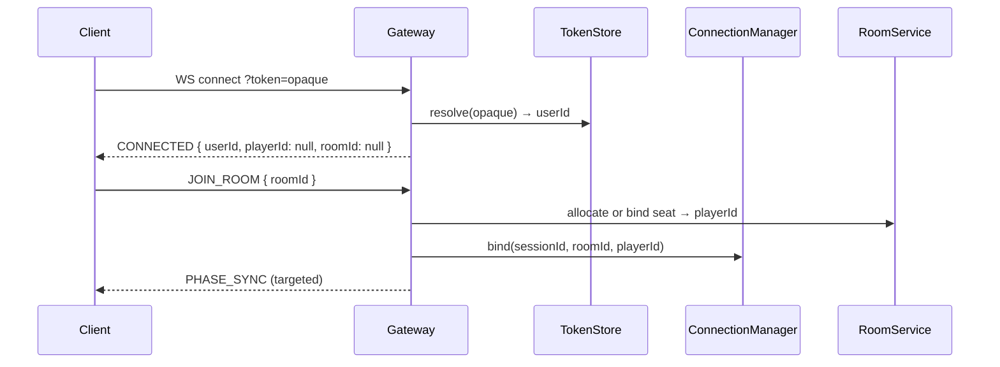

# 鉴权与会话绑定（MVP）

| 属性 | 值 |
|------|-----|
| 版本 | v0.1 |
| 日期 | 2026-05-18 |
| 需求真源 | [PRD §4.2.4](../progress/requirements-mvp-v0.1.md) |
| 实现状态 | **未实现**（token 未解析）；本文为目标态 + MVP 过渡 |

---

## 1. MVP 已冻结方案

| 通道 | 方式 |
|------|------|
| WebSocket | `ws://{host}/ws/game?token={opaque}` |
| HTTP | `Authorization: Bearer {opaque}` |
| Token 内容 | opaque 字符串；MVP 映射 `userId`（dev 可用 `userId` 字符串作 token，如 `"1001"`） |

**非 MVP**：JWT、注册登录（PRD P1）。

---

## 2. 解析与绑定流程

### 2.1 状态

| 阶段 | `playerId` | `roomId` |
|------|------------|----------|
| 刚连接 | `null` | `null` |
| `JOIN_ROOM` 后 | 1～12 | 已绑定 |
| 重连成功 | 恢复同座 | 恢复同房 |

### 2.2 权限校验

| 操作 | 校验 |
|------|------|
| `GAME_ACTION` | token 的 userId 须占该 `playerId`；或 AI 座由服务端驱动 |
| `start` | HTTP：房主 userId（待 `hostId` 字段） |
| 观战（加分） | 只读 token，禁止 `GAME_ACTION` |

---

## 3. 存储

| 环境 | Token → userId |
|------|----------------|
| MVP 单实例 | 内存 `ConcurrentHashMap` 或 dev「token=字符串 userId」 |
| 目标 | Redis：`werewolf:auth:token:{opaque}` → `userId` |

---

## 4. 断线重连（PRD 已冻结）

- 窗口：**30s**。
- 键：`werewolf:ws:conn:{roomId}:{playerId}` → `sessionId`（见 [persistence-rollout](persistence-rollout.md)）。
- 重连：同 token 恢复绑定；超时后座位标记掉线，由 `GamePhaseScheduler` / 默认操作处理。

---

## 5. 当前实现注记（2026-05-18）

| 项 | 状态 |
|----|------|
| WS query `token` | 未读取 |
| HTTP `Authorization` | 未校验 |
| `CONNECTED.userId` | 未返回（仅 `sessionId`） |
| 重连 | 未实现 |

联调过渡期：HTTP join 显式传 `userId`；WS `JOIN_ROOM` 用 `seatId` 绑定（见 [gateway-room-modules](gateway-room-modules.md) §2.2）。

---

## 变更记录

| 版本 | 日期 | 说明 |
|------|------|------|
| v0.1 | 2026-05-18 | 初稿 |
