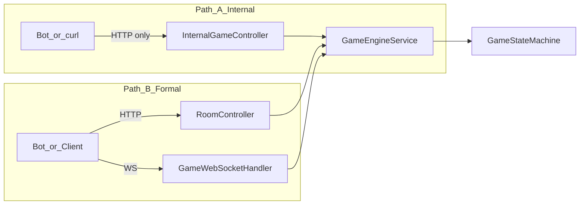

# Gateway / Bot 联调契约

| 属性 | 值 |
|------|-----|
| 版本 | v0.3 |
| 日期 | 2026-05-25 |
| 读者 | B、C、A |

本文描述 **如何驱动已实现的 `game` + `ai`**。对外 WS/HTTP 契约以 [PRD §4.6、§6](../progress/requirements-mvp-v0.1.md) 为准。

**架构**：[gateway-room-modules](gateway-room-modules.md) · **[ADR-005](../adr/005-gateway-formal-path.md)** · **进度** [status](../progress/status.md) · **Bot** [bot-load-test](bot-load-test.md)

---

## 0. 双路径（必读）



| | **路径 A — Internal** | **路径 B — Formal** |
|---|----------------------|---------------------|
| **Base** | `http://localhost:8080/internal/game` | `http://localhost:8080/api/room` + `ws://localhost:8080/ws/game` |
| **鉴权** | 无 | token（目标；见 [auth-session](auth-session.md)） |
| **推送** | 无（JSON 响应内带 sync） | WS 定向推送（[ADR-005](../adr/005-gateway-formal-path.md) P0 已实现） |
| **典型用途** | A 测 SM、Mock 整局、`phase-tick` | 产品联调、Day4 验收、未来前端 |
| **Week1 验收** | 可证明「引擎能跑完一局」 | 须证明「协议链路闭环」 |
| **C 脚本** | `auto_play_client.py`、`tick_play_client.py` | `scripts/formal/run_day4_formal.py`、`formal_path_smoke.py`、`formal_llm_smoke.py`（`scripts/lib/bot_player.py`） |

**规则**：压测报告、README 验收勾选须 **标明路径**；仅 A 通过不能勾选 PRD §8.2 Formal 项。

---

## 1. Internal HTTP（路径 A）

Base: `http://localhost:8080/internal/game`（无鉴权，仅 dev）

| 方法 | 路径 | 说明 |
|------|------|------|
| POST | `/rooms` | 建房并 12 人 ready |
| POST | `/rooms/{roomId}/start` | 开局 → `NIGHT_WOLF` |
| POST | `/rooms/{roomId}/actions` | 提交 `GAME_ACTION`（body 含 `content` 可选） |
| POST | `/rooms/{roomId}/advance-announce` | 离开死讯公布阶段 |
| POST | `/rooms/{roomId}/phase-tick` | **网关定时器应调用的单步推进**（见 §2） |
| POST | `/rooms/{roomId}/mock-auto-play` | 一次性跑满整局（压测/演示） |
| GET | `/rooms/{roomId}/action-log` | 本局内存 `action_log`（含 `thinking` 调试行） |
| GET | `/rooms/{roomId}` | 房间快照 |

`actions` 请求体示例：

```json
{
  "playerId": 3,
  "action": "KILL",
  "target": 8,
  "phase": "NIGHT_WOLF",
  "content": null
}
```

---

## 2. `GamePhaseScheduler.tick`（B 侧定时器）

每个房间、每个阶段超时或 Bot 轮询时调用 **`POST .../phase-tick`**（路径 A）或 Gateway 内等价调用 `GameEngineService.tickPhase(roomId)`（路径 B）。

| 当前 `GamePhase` | `tick` 行为 |
|------------------|-------------|
| `NIGHT_DEATH_ANNOUNCE` / `EXILE_DEATH_ANNOUNCE` | 调用 `advanceDayAnnounce` |
| `NIGHT_WOLF` / `NIGHT_SEER` / `NIGHT_WITCH` / `DAY_DISCUSS` / `DAY_VOTE` / `HUNTER_SHOOT` / `LAST_WORDS` | `AiTurnCoordinator` 选座 → `AIService` → **一步** `handleAction`（见 [ADR-003](../adr/003-ai-integration.md)） |
| `GAME_OVER` | 返回 `GAME_OVER` |
| 其他 | `NO_OP`（等待 `start` 或系统阶段） |

响应 `status`：`ADVANCED` | `AI_STEP` | `STUCK` | `NO_OP` | `GAME_OVER`。

**路径 B**：`start` / `submitAction` / `tick` 后推送 `PHASE_SYNC`（见 [ADR-005](../adr/005-gateway-formal-path.md)）；**P-05 `countdown` 已实现**（§6）；**P-06 `GAME_EVENT` / `CHAT_BROADCAST` / `GAME_OVER`** 经 `GameRoomState` outbound 队列 + `WsPushService.flushOutbound`；P1 待办：推送收窄（P-08）。

---

## 3. Formal HTTP + WS（路径 B 摘要）

详见 [gateway-room-modules](gateway-room-modules.md)。

| 方法 | 路径 | 说明 |
|------|------|------|
| POST | `/api/room` | 建房 |
| POST | `/api/room/{roomId}/join` | `{ seatId, userId }` |
| POST | `/api/room/{roomId}/ready` | `{ seatId, ready }` |
| POST | `/api/room/{roomId}/start` | 开局（触发推送 + 可选自动 tick） |
| POST | `/api/room/{roomId}/join` | 加入（`seatId` 可选自动分配） |
| POST | `/api/room/{roomId}/leave` | 离开（仅 `WAITING`） |
| DELETE | `/api/room/{roomId}` | 解散（房主，`WAITING`） |
| GET | `/api/room/{roomId}` | 房间快照（含 `seats[]`） |
| POST | `/api/room/{roomId}/phase-tick` | 单步推进（与 Internal 同源） |
| GET | `/api/room/{roomId}` | 快照 |
| WS | `/ws/game` | `JOIN_ROOM` / `READY` / `GAME_ACTION` / `PHASE_SYNC`；dev：`PHASE_TICK` |

---

## 4. 联调脚本（C）— `scripts/` 目录

见 [scripts/README.md](../../scripts/README.md) 与 [bot-load-test](bot-load-test.md)。

1. 建房 / 开局（路径 B）或 internal 建房（路径 A）
2. 路径 A：循环 `phase-tick`；路径 B：`phase-tick` 或收推送 `PHASE_SYNC` 后 `GAME_ACTION`
3. 断言 `action-log` / 终局 `GAME_OVER`

---

## 5. 与 PRD 的差距（联调时注意）

| 项 | 状态 |
|----|------|
| `PHASE_SYNC` 主动推送 | **已实现**（MVP 推全连接座） |
| `POST /api/room/.../phase-tick` | **已实现** |
| `PHASE_SYNC.countdown`（P-05） | **已实现**（见 §6） |
| Redis session | 未实现 → [ADR-007](../adr/007-persistence-redis-mysql.md)、[auth-session](auth-session.md) |
| `action_log` MySQL | 仅内存 |
| `GAME_EVENT` | ✅ `PerceptionLogEvents` 入队，`flushOutbound` 按可见性推送 |
| `CHAT_MESSAGE` → `CHAT_BROADCAST` | ✅ `ChatMessageService` + `GAME_ACTION` 带 `content` |
| `GAME_OVER` | ✅ 独立 WS，含全员身份复盘 |
| `aiCount` / 自动分座 / 离开 / 解散 | **已实现**（见 [gateway-room-modules §4](gateway-room-modules.md)） |

执行勾选：[gateway-room-ws](../checklists/gateway-room-ws.md)

---

## 6. `PHASE_SYNC.countdown`（P-05，实现注记）

> 产品语义仍以 PRD §4.3.3 / §4.6 为准；本节描述**当前代码行为**与联调注意点。

### 6.1 机制

| 项 | 说明 |
|----|------|
| 权威字段 | `GameRoomState.phaseDeadlineEpochMs`；进入阶段或发言轮转时由 `PhaseCountdown.onPhaseOrTurnEntered` 重置 |
| 下发 | `PhaseSyncBuilder` → `remainingSeconds(room)`；无计时阶段为 `null` |
| 阶段推进 | `GamePhaseScheduler`：未到期 → `TickResult(COUNTDOWN)`；到期 → `PhaseTimeoutHandler` 兜底后必要时 `AiTurnCoordinator` |
| WS 推送 | `start` 后 `RoomPhaseTickScheduler` 约每 1.5s tick；`COUNTDOWN` 时仍推送，客户端可见递减 |
| 配置 | `werewolf.game.phase-countdown-enabled=true`（默认）；`werewolf.gateway.phase-tick-enabled=true` |

### 6.2 正式使用（路径 B）

- **不影响**正常对局：玩家/Bot 收 WS、按 `canAct` 出招即可；墙钟由服务端调度，无需客户端狂点 `phase-tick`。
- **不要**仅用「无间隔 HTTP `phase-tick`」判断阶段是否推进；未到期时响应为 `{"status":"COUNTDOWN",...}` 属正常。
- **部署**：须运行含 P-05 的构建；旧进程可能仍下发静态 `countdown`（如始终 30、不递减）。

### 6.3 验收脚本

| 脚本 | 用途 |
|------|------|
| `scripts/formal/countdown_observe.py` | 建房 + WS 订阅约 35s，打印 `phase` / `countdown` 样本；**推荐验收 P-05** |
| `scripts/formal/formal_path_smoke.py` | Formal 全链路；在 countdown 开启时可能 **7/8**（末项 `phase-tick → GAME_OVER` 因短时不等待墙钟），**不表示**正式环境故障，见 [ADR-005 §14.1](../adr/005-gateway-formal-path.md) |

```bash
# 示例（服务已启动且为最新构建）
python scripts/formal/countdown_observe.py
# 可选：WERWOLF_BASE_URL / WERWOLF_WS_URL
```

---

## 变更记录

| 版本 | 日期 | 说明 |
|------|------|------|
| v0.1 | 2026-05-17 | Internal + phase-tick |
| v0.2 | 2026-05-18 | 双路径、Formal 摘要、链到新 reference/ADR |
| v0.3 | 2026-05-25 | Formal phase-tick、推送已实现；链 ADR-005 合并篇与 status |
| v0.4 | 2026-05-25 | §6 P-05 countdown 实现、正式使用与 smoke 注记 |
| v0.5 | 2026-05-27 | Formal 脚本已对齐 `bot_player`；checklist 迁至 checklists/ |
