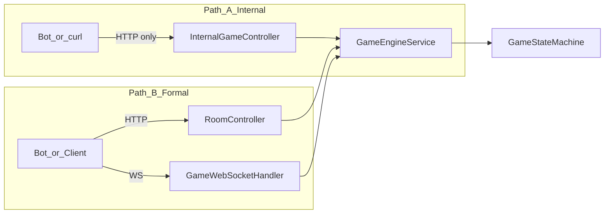

# Gateway / Bot 联调契约

| 属性 | 值 |
|------|-----|
| 版本 | v0.2 |
| 日期 | 2026-05-18 |
| 读者 | B、C、A |

本文描述 **如何驱动已实现的 `game` + `ai`**。对外 WS/HTTP 契约以 [PRD §4.6、§6](../progress/requirements-mvp-v0.1.md) 为准。

**架构细节**：[gateway-room-modules](gateway-room-modules.md) · **推送决策**：[ADR-005](../adr/005-gateway-push-and-phase-timer.md) · **Bot 压测**：[bot-load-test](bot-load-test.md)

---

## 0. 双路径（必读）



| | **路径 A — Internal** | **路径 B — Formal** |
|---|----------------------|---------------------|
| **Base** | `http://localhost:8080/internal/game` | `http://localhost:8080/api/room` + `ws://localhost:8080/ws/game` |
| **鉴权** | 无 | token（目标；见 [auth-session](auth-session.md)） |
| **推送** | 无（JSON 响应内带 sync） | WS 推送（目标，[ADR-005](../adr/005-gateway-push-and-phase-timer.md)） |
| **典型用途** | A 测 SM、Mock 整局、`phase-tick` | 产品联调、Day4 验收、未来前端 |
| **Week1 验收** | 可证明「引擎能跑完一局」 | 须证明「协议链路闭环」 |
| **C 脚本** | `auto_play_client.py`、`tick_play_client.py` | `bot_player.py`（待对齐 §2 [bot-load-test](bot-load-test.md)） |

**规则**：压测报告、README 验收勾选须 **标明路径**；仅 A 通过不能勾选 PRD §8.2 Formal 项。

---

## 1. Internal HTTP（路径 A）

Base: `http://localhost:8080/internal/game`（无鉴权，仅 dev）

| 方法 | 路径 | 说明 |
|------|------|------|
| POST | `/rooms` | 建房并 12 人 ready |
| POST | `/rooms/{roomId}/start` | 开局 → `NIGHT_WOLF` |
| POST | `/rooms/{roomId}/actions` | 提交 `GAME_ACTION`（body 含 `content` 可选） |
| POST | `/rooms/{roomId}/advance-announce` | 离开死讯公布阶段 |
| POST | `/rooms/{roomId}/phase-tick` | **网关定时器应调用的单步推进**（见 §2） |
| POST | `/rooms/{roomId}/mock-auto-play` | 一次性跑满整局（压测/演示） |
| GET | `/rooms/{roomId}/action-log` | 本局内存 `action_log`（含 `thinking` 调试行） |
| GET | `/rooms/{roomId}` | 房间快照 |

`actions` 请求体示例：

```json
{
  "playerId": 3,
  "action": "KILL",
  "target": 8,
  "phase": "NIGHT_WOLF",
  "content": null
}
```

---

## 2. `GamePhaseScheduler.tick`（B 侧定时器）

每个房间、每个阶段超时或 Bot 轮询时调用 **`POST .../phase-tick`**（路径 A）或 Gateway 内等价调用 `GameEngineService.tickPhase(roomId)`（路径 B）。

| 当前 `GamePhase` | `tick` 行为 |
|------------------|-------------|
| `NIGHT_DEATH_ANNOUNCE` / `EXILE_DEATH_ANNOUNCE` | 调用 `advanceDayAnnounce` |
| `NIGHT_WOLF` / `NIGHT_SEER` / `NIGHT_WITCH` / `DAY_DISCUSS` / `DAY_VOTE` / `HUNTER_SHOOT` / `LAST_WORDS` | `AiTurnCoordinator` 选座 → `AIService` → **一步** `handleAction`（见 [ADR-003](../adr/003-ai-integration.md)） |
| `GAME_OVER` | 返回 `GAME_OVER` |
| 其他 | `NO_OP`（等待 `start` 或系统阶段） |

响应 `status`：`ADVANCED` | `AI_STEP` | `STUCK` | `NO_OP` | `GAME_OVER`。

**路径 B 缺口**：tick / `submitAction` / `start` 后须按 [ADR-005](../adr/005-gateway-push-and-phase-timer.md) 向已连接座位 **推送** `PHASE_SYNC`（当前仅请求-响应）。

---

## 3. Formal HTTP + WS（路径 B 摘要）

详见 [gateway-room-modules](gateway-room-modules.md)。

| 方法 | 路径 | 说明 |
|------|------|------|
| POST | `/api/room` | 建房 |
| POST | `/api/room/{roomId}/join` | `{ seatId, userId }` |
| POST | `/api/room/{roomId}/ready` | `{ seatId, ready }` |
| POST | `/api/room/{roomId}/start` | 开局 |
| GET | `/api/room/{roomId}` | 快照 |
| WS | `/ws/game?token=` | `JOIN_ROOM` / `READY` / `GAME_ACTION` / `PHASE_SYNC`（拉取） |

---

## 4. Bot（C）— `bot/` 目录

见 [bot/README.md](../../bot/README.md) 与 [bot-load-test](bot-load-test.md)。

1. 建房 / 开局（路径 B）或 internal 建房（路径 A）
2. 路径 A：循环 `phase-tick`；路径 B：订阅/拉取 `PHASE_SYNC` 后 `GAME_ACTION`
3. 断言 `action-log` / 终局 `GAME_OVER`

---

## 5. 与 PRD 的差距（联调时注意）

| 项 | 状态 |
|----|------|
| `PHASE_SYNC` 主动推送 | 未实现 → [ADR-005](../adr/005-gateway-push-and-phase-timer.md) |
| `countdown` | 未实现 |
| Redis session | 未实现 → [auth-session](auth-session.md)、[persistence-rollout](persistence-rollout.md) |
| `action_log` MySQL | 仅内存 |
| `GAME_EVENT` | 未从 SM 发出 |
| `aiCount` / 自动分座 | 未实现 |

执行勾选：[gateway-room-ws-checklist](../gateway-room-ws-checklist.md)

---

## 变更记录

| 版本 | 日期 | 说明 |
|------|------|------|
| v0.1 | 2026-05-17 | Internal + phase-tick |
| v0.2 | 2026-05-18 | 双路径、Formal 摘要、链到新 reference/ADR |
