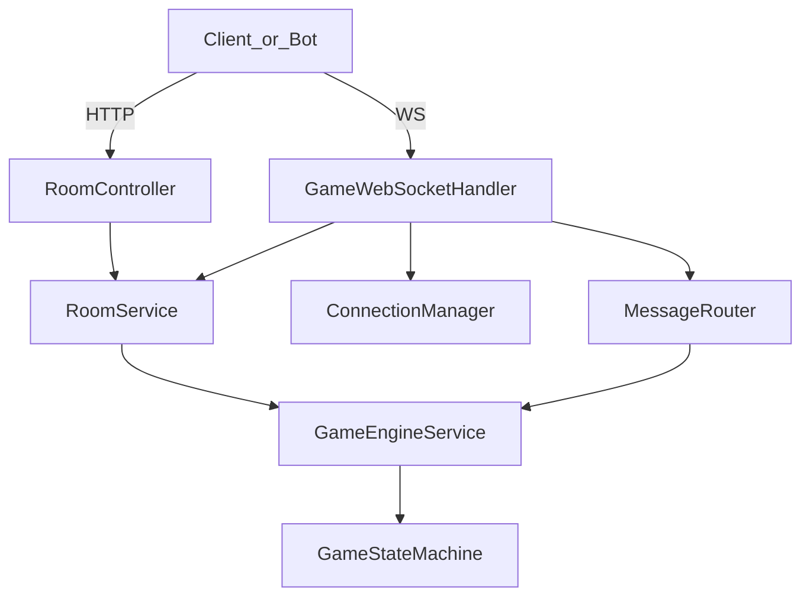

# Gateway / Room 模块参考（B 侧）

| 属性 | 值 |
|------|-----|
| 版本 | v0.2 |
| 日期 | 2026-05-25 |
| 读者 | B（gateway/room）、C（Bot）、A（对接 SM） |
| 需求真源 | [PRD §4.2、§4.6、§6](../progress/requirements-mvp-v0.1.md) |
| 决策与实现 | [ADR-005](../adr/005-gateway-formal-path.md) |
| 执行清单 | [gateway-room-ws-checklist](../gateway-room-ws-checklist.md) |

本文描述 **实现架构** 与 **PRD 差异注记**；对外字段冻结以 PRD 为准，不得在未走变更流程时把本文当新契约。

---

## 1. 组件与依赖



| 类 | 包 | 职责 |
|----|-----|------|
| `RoomController` | `room` | HTTP：`/api/room` 建房 / join / ready / start / snapshot |
| `RoomService` | `room` | 房间元操作；**不**驱动阶段循环 |
| `WebSocketConfig` | `gateway` | 注册 `/ws/game` |
| `GameWebSocketHandler` | `gateway` | 连接生命周期、`JOIN_ROOM`/`READY` 本地处理 |
| `ConnectionManager` | `gateway` | `sessionId` ↔ `(roomId, seatId)` 内存映射 |
| `MessageRouter` | `gateway` | `GAME_ACTION`、`PHASE_SYNC`（拉取）→ `GameEngineService` |
| `GameEngineService` | `game.engine` | B 的唯一游戏门面（与 A 的 SM 边界） |
| `MessageType` / `*Payload` | `message` | WS 信封与 DTO，与 PRD type 对齐 |

**依赖方向**（与 PRD §7.2 一致）：`gateway` → `room`、`game`；`room` → `game`；`game` → `ai`；`ai` ↛ `gateway`。

---

## 2. 连接生命周期

```text
TCP 连接建立
  → S→C: CONNECTED
  → C→S: JOIN_ROOM（绑定 roomId + seatId）
  → S→C: JOIN_ROOM 确认（当前实现） / 目标：PHASE_SYNC（PRD）
  → 对局内：GAME_ACTION / READY / PHASE_SYNC（拉取）
  → 断开：ConnectionManager.remove
```

### 2.1 `CONNECTED`（实现注记）

| 字段 | PRD §4.6.1 | 当前实现 | 目标 |
|------|------------|----------|------|
| `playerId` | 连接时为 `null` | 未返回 | 保持 PRD |
| `roomId` | 连接时为 `null` | 未返回 | 保持 PRD |
| `userId` | 从 token 解析 | 未实现 | P1 鉴权 |
| `sessionId` | 未定义 | **已返回** | 可保留为调试字段，不替代 `userId` |

### 2.2 建房 `hostUserId`（Web UI）

- `POST /api/room` body 建议带 **`hostUserId`**（真人房主账号）与 **`aiCount`**（如 11 = 1 人 + 11 AI）。
- 服务端在 `hostUserId != null` 时 **自动 `joinRoom` 占 #1 座**，减少仅依赖 WS `JOIN_ROOM` 的竞态。
- `POST /api/room/{id}/start` 须传 **`userId`**（body 或 `X-User-Id` header）与建房时 `hostUserId` 一致，否则 403。

### 2.3 `JOIN_ROOM`

**PRD**：payload 必填 `roomId`；服务端分配或确认 `playerId`。

**当前实现**：

- WS payload **必填** `roomId` + `seatId`（1～12）。
- 可选 `userId`：若房间 `WAITING`，同时调用 `RoomService.joinRoom` 占座。
- 响应 type 为 `JOIN_ROOM`（含 `seatId`），**不**自动推送 `PHASE_SYNC`。

**开局后**：仅 `roomId` + `seatId` 绑定 WS，勿再带 `userId` 调 join（`RoomService` 会拒绝）。

### 2.4 `READY`

- WS：payload 需 `roomId`、`seatId`、`ready`（当前 handler 已校验）。
- HTTP：`POST /api/room/{roomId}/ready`，body `{ "seatId", "ready" }`。

### 2.5 `GAME_ACTION`

经 `MessageRouter` → `GameEngineService.submitAction`：

```json
{
  "roomId": "r_xxx",
  "playerId": 3,
  "action": "KILL",
  "phase": "NIGHT_WOLF",
  "target": 8,
  "content": "可选，狼队频道"
}
```

响应：`ACTION_ACK`，payload 含 `ack`、`actorSeatId`、`actorPhaseSync`（操作者视角）。

---

## 3. 推送模型（ADR-005，P0 已实现）

### 3.1 两类出站

| 模式 | 用途 | 现状 |
|------|------|------|
| **拉取** | 客户端发 `PHASE_SYNC` + `seatId` | ✅ 已实现 |
| **推送** | 阶段切换、他人动作后刷新 | ✅ P0（见 [ADR-005](../adr/005-gateway-formal-path.md) §11；MVP 推全连接座） |

### 3.2 必须推送的时机（目标）

1. `JOIN_ROOM` 成功 → 该座 `PHASE_SYNC`
2. `POST .../start` 成功 → 房内各座各一份（裁剪后）
3. `GAME_ACTION` 导致阶段或公开局面变化 → 受影响座位集合
4. `GamePhaseScheduler.tick` 推进后 → 同 3
5. `GAME_EVENT` / `GAME_OVER` → 按 PRD 可见性广播

### 3.3 `TargetedPhaseSync`（定向同步）

**禁止**直接把 `ActionResult.phaseSyncs` 列表广播给全房：列表项**未**标注接收者 seat，会导致私密字段串座（狼队、预言家、女巫）。

**约定结构**（实现时冻结到 `message` 包）：

```json
{
  "type": "PHASE_SYNC",
  "payload": {
    "seatId": 3,
    "phaseSync": { "currentPhase": "NIGHT_WOLF", "...": "..." }
  }
}
```

构建方式：`gameEngine.buildPhaseSync(roomId, seatId)`（与拉取路径同源，保证与 `GameViews` 一致）。

推送时：`ConnectionManager.findBySeat(roomId, seatId)` → `session.sendMessage`。

---

## 4. Room 与 GamePhase

| 概念 | 枚举 / 字段 | 说明 |
|------|-------------|------|
| 房间生命周期 | `RoomStatus`：`WAITING` / `PLAYING` / `ENDED` | `RoomService` + `GameRoomState` |
| 对局阶段 | `GamePhase` | `PHASE_SYNC.currentPhase` |
| 座位 | `playerId` = 1～12 | HTTP 当前返回字段名 `seatId`，语义同 `playerId` |

### 4.1 HTTP 建房（2026-05-25）

| 字段 | 说明 |
|------|------|
| `roomId` | 可选；省略则服务端生成 |
| `aiCount` | 0～12；预留末 `aiCount` 个座位给 AI（座位 `12-aiCount+1`～`12`） |
| `hostUserId` | 可选；仅 `start` / `DELETE` 鉴权用（MVP 无 JWT，可配合 `X-User-Id`） |
| 响应 | `maxPlayers`、`aiCount`、`hostUserId`、`seats[]`、`readyCount`、`humanCount` |

### 4.2 入座 / 离开

| 接口 | 行为 |
|------|------|
| `POST .../join` | `seatId` **可选**（省略则自动分配首个可入座）；`userId` 必填；响应含 `playerId`（= `seatId`） |
| `POST .../leave` | 仅 `WAITING`；释放座位并解绑 WS |
| `DELETE ...` | 仅 `WAITING` + 房主；停止 tick、清理连接与内存房间 |

### 4.3 开始

- `POST /api/room/{roomId}/start` → `GameEngineService.startGame`。
- 成功：`success: true`、`phase`、`phaseSyncs`（HTTP 响应内，**未**经 WS 推送）。
- 同时：`RoomPhaseTickScheduler.start` + 首包 WS `PHASE_SYNC`（若已连接）。

### 4.4 `PHASE_SYNC.countdown`（P-05，2026-05-25）

| 项 | 说明 |
|----|------|
| 实现类 | `PhaseCountdown`、`PhaseTimeoutHandler`、`GamePhaseScheduler`、`PhaseSyncBuilder` |
| 行为 | 进入 `GamePhase` 或讨论/遗言下一发言人时重置 deadline；`remainingSeconds` 写入 `countdown` |
| `phase-tick` 响应 | 未到期：`status=COUNTDOWN`；到期：超时兜底或 `AI_STEP` / `ADVANCED` / `GAME_OVER` |
| 正式使用 | 依赖自动调度 + WS；**不**要求客户端高频 HTTP tick |
| 联调 | `scripts/formal/countdown_observe.py`；`formal_path_smoke` 末项在 countdown 下可能失败，见 [gateway-integration §6](gateway-integration.md) |

---

## 5. 错误与稳定性

| 场景 | 行为 |
|------|------|
| 业务校验失败 | WS 返回 `ERROR`（`payload.message`），**不断开**连接 |
| 协议字段缺失 | `ERROR`，如 `seatId required` |
| 未支持 type | `ERROR`：`unsupported message` |
| 房间不存在 | `IllegalArgumentException` → 捕获为 `ERROR` |

避免业务异常冒泡为 WebSocket `1011` 断线（见 checklist N-01）。

---

## 6. 与 Internal HTTP 的边界

| 能力 | Formal（本模块） | Internal（`game.api`） |
|------|------------------|------------------------|
| Base | `/api/room` + `/ws/game` | `/internal/game` |
| 鉴权 | token（目标） | 无 |
| 推送 | WS（目标） | 无，仅 JSON 响应 |
| 用途 | 产品 / Day4 联调 | A 测 SM、C 压测整局 |

详见 [gateway-integration.md](gateway-integration.md) §0。

---

## 7. 相关文件

| 路径 | 说明 |
|------|------|
| `gateway/GameWebSocketHandler.java` | WS 入口 |
| `gateway/MessageRouter.java` | 游戏消息路由 |
| `gateway/ConnectionManager.java` | 连接表 |
| `room/RoomController.java` | HTTP API |
| `room/RoomService.java` | 房间服务 |
| `game/engine/GameEngineService.java` | 游戏门面 |

---

## 变更记录

| 版本 | 日期 | 说明 |
|------|------|------|
| v0.1 | 2026-05-18 | 初稿：组件、生命周期、推送目标态、PRD 实现注记 |
| v0.2 | 2026-05-25 | 推送 P0 已实现；链 ADR-005 合并篇与 status |
| v0.3 | 2026-05-25 | §4.4 P-05 countdown 实现注记 |
| v0.4 | 2026-05-25 | §4.1～4.2：`aiCount`、自动分座、快照、`leave`、`DELETE` 解散 |
