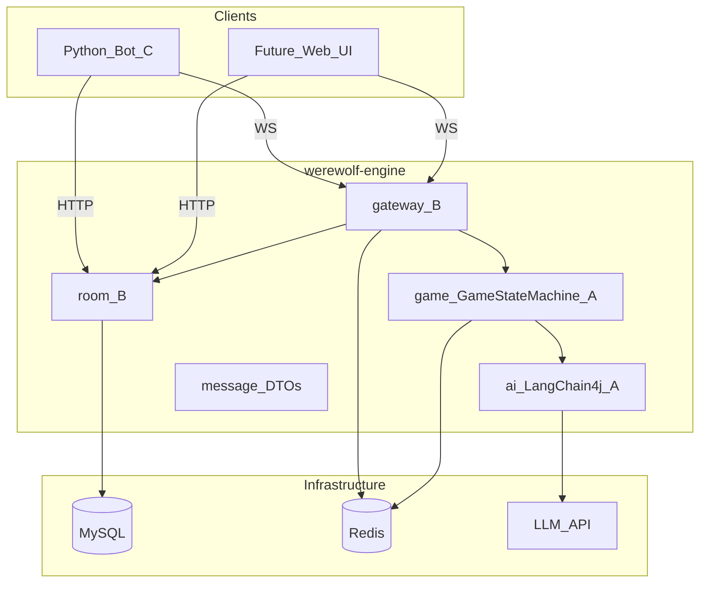
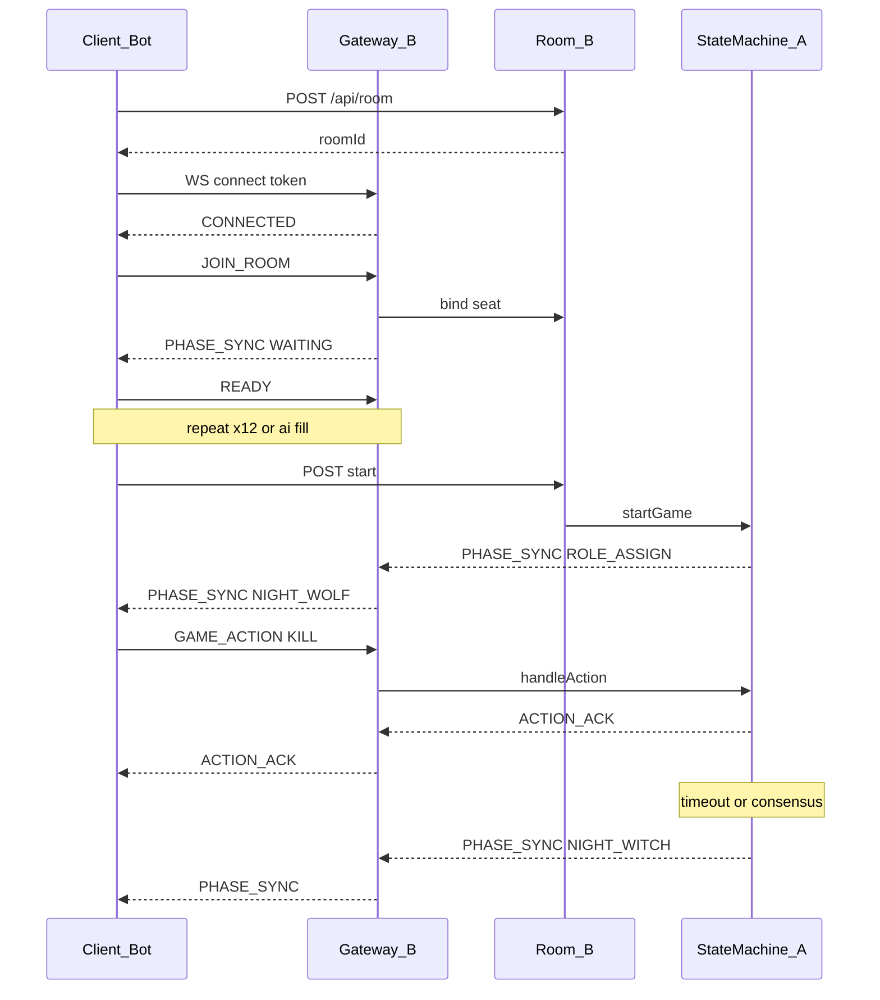

# 狼人杀后端系统需求文档（MVP v0.1.4）

| 属性 | 值 |
|------|-----|
| 版本 | v0.1.4 |
| 日期 | 2026-05-15 |
| 范围 | 后端核心系统，**不含前端界面规格** |
| 项目名 | werewolf-engine |
| 包名 | `com.werewolfengine`（子包见第 7 章） |
| 冻结目标日 | Week1 Day7（三人会议签字） |

---

## 目录

0. [文档说明](#0-文档说明)  
1. [业务需求](#1-业务需求)  
2. [用户需求与场景](#2-用户需求与场景)  
3. [游戏规则](#3-游戏规则)  
4. [功能需求](#4-功能需求)  
5. [非功能需求](#5-非功能需求)  
6. [接口规范](#6-接口规范)  
7. [三人分工与模块结构](#7-三人分工与模块结构)  
8. [开发里程碑与验收](#8-开发里程碑与验收)  
9. [风险与应对](#9-风险与应对)  
10. [附录](#10-附录)  
11. [评审清单](#11-评审清单)  

---

## 0. 文档说明

### 0.1 目的

本文档为三人团队并行开发的**唯一后端需求基线**。开发、联调、验收均以本文为准；标注 `[TBD]` 的条目须在 Week1 Day7 前冻结或修改。

### 0.2 读者与认领章节

| 角色 | 负责人 | 重点章节 |
|------|--------|----------|
| 状态机 + AI Agent | A（你） | 3、4.3、4.4、4.5、8 |
| WebSocket + 房间 + 持久化 | B | 4.2、4.6、4.7、6.1、6.2 |
| 测试 Bot + 压测 | C | 2、6.3、8.2、11.3 |

### 0.3 冻结标准（Week1 Day7）

冻结后**未经三人同意不得变更**：

- WebSocket / HTTP 消息 `type` 与 `payload` 字段
- `GamePhase` 枚举全集
- 角色技能结算顺序与第 3 章规则表（已确认项）
- AI 输出 JSON Schema（第 4.5 节）

### 0.4 术语表

| 术语 | 含义 |
|------|------|
| `roomId` | 房间唯一标识，如 `r_abc123` |
| `playerId` | 房间内座位号，整数 **1～12** |
| `userId` | 用户账号 ID（真人）；AI 座位 `userId` 为空 |
| `phase` / `GamePhase` | 游戏阶段枚举，服务端权威 |
| `action` | 玩家在本阶段的操作类型，如 `KILL`、`VOTE` |
| `scope` | 聊天可见范围：`ALL`、`WEREWOLF` |
| 屠边 | 狼人阵营 vs 好人阵营；**神职**（预、女、猎、**白痴**）或 **平民**（`VILLAGER`×4）任一阵营全灭则狼赢 |
| Mock AI | 不调用 LLM，按规则随机/固定策略行动 |

### 0.5 技术栈约定

| 层级 | 选型 | 备注 |
|------|------|------|
| 语言 | **Java 21** | 与 [pom.xml](../pom.xml) `java.version` 一致；启用 **虚拟线程**（见下） |
| 并发模型 | 虚拟线程 + 事件驱动定时 | `spring.threads.virtual.enabled=true`（[application.properties](../src/main/resources/application.properties)）；阻塞 I/O（LLM/DB/外呼）优先不占用平台线程池。**阶段倒计时与状态推进**须用调度器 / 延迟任务 / 非忙等循环，禁止 `while` 空转轮询 |
| 框架 | Spring Boot 4.0.6 | 与当前仓库一致 `[TBD]` 是否降 3.2.x |
| 构建 | Maven | |
| WebSocket | Spring WebSocket（原生 Handler 或 STOMP） | B 选型 `[TBD]` |
| AI | LangChain4j 0.31.x | A 负责 |
| DB | MySQL 8.0 | |
| 缓存 | Redis 7.x | |
| LLM 开发 | Ollama + qwen2.5:7b | |
| LLM 上线 | 阿里云百炼 qwen-plus（OpenAI 兼容 API） | 单局单厂商单模型 |

---

## 1. 业务需求

### 1.1 背景与差异化

构建支持**人机混战**的狼人杀后端。核心差异化：

- **12 人标准预女猎白 + 白痴局**（非多数开源项目的 6 人简化局）
- **服务端权威状态机**（非纯 AI 协商推进）
- **真人缺人时 AI 自动补位**，而非仅「AI 斗蛐蛐」演示

### 1.2 业务目标

| 优先级 | 目标 | 验收标准 |
|--------|------|----------|
| **P0** | 12 人标准局完整流程 | 从发牌到胜负判定，Mock AI 无人干预可跑通一整局 |
| **P0** | 实时阶段同步 | 存活玩家均能收到 `PHASE_SYNC`，倒计时误差 ≤ 1s |
| **P0** | 操作可校验 | 非法阶段/角色/目标的操作返回 `ERROR`，不污染状态 |
| **P1** | 真人 + AI 混合房间 | 真人经 WS/Bot 与 AI 同局 |
| **P1** | AI 输出可解析 | JSON 连续 50 次解析成功率 > 95%，超时 3s 有 fallback |
| **P2** | 房间生命周期完善 | 解散、观战、复盘查询 |
| **P2** | 用户体系 | JWT 登录、昵称、历史对局 |

### 1.3 业务边界（MVP 不做）

- 语音 / 视频
- 多板子（守卫、骑士等；**本 MVP 固定单板**：预女猎白 + 白痴）
- **警长**（上警、退水、警徽流）；**含：警长决定白天发言顺/逆时针**（见 R13；MVP 为**随机方向** + **时间锚点**首发言位）
- 观战模式
- 排行榜 / 积分 / 好友
- 移动端原生 App
- 集群多实例部署（MVP 单实例）

### 1.4 用户角色

| 角色 | 需求摘要 | 后端能力 |
|------|----------|----------|
| 真人玩家 | 知悉当前阶段、操作有反馈 | `PHASE_SYNC`、`ACTION_ACK`、WS 定向推送 |
| AI 玩家 | 推理、记忆、伪装、按格式行动 | LangChain4j + Tools + Memory + Persona |
| 系统法官 | 自动推进、超时、公布结果 | `GameStateMachine` + 定时器 + `GAME_EVENT` 广播 |

---

## 2. 用户需求与场景

### 2.1 用户场景

**场景 S1：真人开房 + AI 补位**

1. 房主 HTTP 创建房间，设置 `aiCount=11`
2. 真人 WS 连接并 `JOIN_ROOM`，占 1 个座位
3. 房主 `start` 后系统分配角色，AI 自动填满其余座位
4. 真人通过 Bot 或未来前端完成夜晚/白天操作，AI 由服务端驱动

**场景 S2：全 AI 自动对局（开发/压测）**

1. 创建房间，`aiCount=12`
2. 12 个 Bot 连接并自动响应 `PHASE_SYNC`
3. 跑满 N 局，统计胜率、时长、异常率

**场景 S3：全真人**

1. `aiCount=0`，12 人真人 WS 接入
2. 系统仅作法官，不调用 LLM

### 2.2 痛点与后端方案

| 痛点 | 后端方案 |
|------|----------|
| 不知道现在该做什么 | 每阶段切换强制推送 `PHASE_SYNC`（含 `canAct`、`countdown`、`yourRole`） |
| 操作后没反馈 | `ACTION_ACK` + 必要时 `GAME_EVENT` |
| 夜晚信息泄露 | 定向推送：狼人/女巫/预言家仅收本角色可见消息 |
| AI 发言/行动不像人 | Prompt + Persona + 统一 JSON 格式 + fallback |
| 有人掉线 | 30s 重连窗口；超时由系统默认操作或 AI 托管 `[TBD]` |
| 外挂改状态 | 客户端只提交意图；死亡、技能结果均由服务端计算 |

### 2.3 MVP 策略：断线 / 作弊 / 延迟

| 问题 | MVP 策略 |
|------|----------|
| 断线 | Redis 保留 `playerId ↔ sessionId`；重连后恢复 `roomId`+`playerId`；游戏中掉线 30s 内可重连 `[TBD]` |
| 作弊 | 校验 `phase`、角色、`target` 合法性；拒绝死人操作 |
| LLM 延迟 | 单 AI 调用 3s 超时 → fallback；阶段总时长由阶段超时兜底（30s 等） |

---

## 3. 游戏规则

> **评审说明（A + 全员）**：本章凡标 `[TBD]` 者，须在 Day7 前逐条确认。建议默认值可直接用于开发，若会议否决则更新本文档版本号。

### 3.1 板子配置（12 人）

| 角色 | 数量 | 阵营 |
|------|------|------|
| 狼人 | 4 | 狼人阵营 |
| 平民 | 4 | 好人阵营（村民，`role=VILLAGER`） |
| 白痴 | 1 | 好人阵营神职（「白」占神坑，与预女猎并列；见 R19～R21） |
| 预言家 | 1 | 好人阵营（神职） |
| 女巫 | 1 | 好人阵营（神职） |
| 猎人 | 1 | 好人阵营（神职） |

**合计 12 人**：4 狼 + 4 民 + 1 白痴 + 预 + 女 + 猎。**不含**：守卫、警长。

### 3.2 规则冻结表

| # | 规则点 | 建议默认值 | 状态 |
|---|--------|------------|------|
| R1 | 胜负条件 | **屠边**：狼人全灭 → 好人赢；**神职**（`SEER`,`WITCH`,`HUNTER`,`IDIOT`）全灭 **或** 4 名 **`VILLAGER` 全灭** → 狼赢（见 R21） | [TBD] |
| R2 | 最后一狼与最后一民同夜同死 | **狼赢** | [TBD] |
| R3 | 女巫首夜自救 | **允许**（仅当仍有解药） | [TBD] |
| R4 | 女巫同夜救 + 毒 | **不允许** | [TBD] |
| R5 | 女巫是否看到刀口 | **是**；进入 `NIGHT_WITCH` 时 payload 含 `wolfKillTarget`（若狼刀生效前） | [TBD] |
| R6 | 解药 / 毒药数量 | 各 **1** 瓶，全程 | 建议锁定 |
| R7 | 猎人被狼刀死 | **可开枪** | 建议锁定 |
| R8 | 猎人被毒死 | **不能开枪** | [TBD] |
| R9 | 猎人被投票放逐 | **可开枪**（放逐后立即进入猎人阶段） | [TBD] |
| R10 | 狼人刀口不一致 | 30s 内收集各狼 `KILL`；**多数票**；平票取**最后提交**；仍平则**随机**存活非狼目标 | [TBD] |
| R11 | 狼人私聊 | 仅 `NIGHT_WOLF` 阶段，scope=`WEREWOLF` | 建议锁定 |
| R12 | 预言家查验结果 | 仅告知 **好人 / 狼人**（不暴露具体神职） | [TBD] |
| R13 | 白天发言顺序 | **锚点座位**：进入 **每一轮** `DAY_DISCUSS` 时，取服务端 **Unix 秒时间戳** `T`（进入该阶段的时刻），`speakAnchorSeat = (T % 12) + 1`（取值 1～12）。若该座玩家**非存活**或**不参与本阶段发言**，则沿 `speakDirection` 找下一存活玩家为**本轮首位发言人**。**方向**：`speakDirection` 为 `CLOCKWISE` 或 `COUNTER_CLOCKWISE`；**MVP** 在开局 **随机** 二选一，**本局内不变**（直至 `GAME_OVER`）。**正式版**由警长决定顺/逆时针（警长功能待做，见 1.3）。每人最多 **60s**；可 `SKIP_SPEAK`。本轮内后续发言按 `speakDirection` 在存活玩家间轮转 | [TBD] |
| R14 | 白天投票 | **`can_vote=true` 的存活玩家**可投任意存活玩家或弃票；**平票无人出局**，进入下一夜 | [TBD] |
| R15 | 投票超时 | 视为 **弃票** | [TBD] |
| R16 | 警长 | **不进 MVP** | 已建议 |
| R17 | 狼人刀口目标 | **自刀**：**允许**，`target` 可为**本人**（须为存活狼人），可用于骗女巫解药等策略。**刀存活狼队友**：**拒绝**，返回 `INVALID_TARGET` | [TBD] |
| R18 | 死人发言 / 投票 | **拒绝**（`is_alive=false`）；已翻牌白痴见 R19，仍可发言、不可投票 | 建议锁定 |
| R19 | 白痴被白天投票出局 | **翻牌公布身份**，不离场；`is_alive=true`；`can_vote=false`；**仍可发言**；广播 `GAME_EVENT`=`IDIOT_REVEALED` | [TBD] |
| R20 | 白痴被狼刀 / 女巫毒 | **正常死亡**，`is_alive=false`；猎人毒杀同 R8 | [TBD] |
| R21 | 屠边计数 | **平民**：仅 `role=VILLAGER`，共 4 人，**4 人全灭**（`is_alive=false`）则狼赢。**神职**：`SEER`,`WITCH`,`HUNTER`,`IDIOT` 共 4 人；**4 神全灭**则狼赢。白痴翻牌后仍 `is_alive=true` 时**仍占神坑**；白痴死亡（刀/毒）则神坑减员 | [TBD] |
| R22 | 白痴翻牌后投票 | `DAY_VOTE` 阶段若 `can_vote=false`，拒绝 `VOTE`，返回 `INVALID_ACTION` | 建议锁定 |

### 3.3 角色技能摘要

| 角色 | 技能 | 阶段 | 说明 |
|------|------|------|------|
| 狼人 | 刀人 | `NIGHT_WOLF` | 见 R10、**R17**（可自刀；不可刀存活队友） |
| 女巫 | 解药 | `NIGHT_WITCH` | 救当晚刀口；已用则不可再救 |
| 女巫 | 毒药 | `NIGHT_WITCH` | 毒任意存活玩家；与解药同夜不可并用（R4） |
| 预言家 | 查验 | `NIGHT_SEER` | 每晚必查 1 人，结果仅预言家可见 |
| 猎人 | 开枪 | 死亡时子阶段 `HUNTER_SHOOT` | 见 R7～R9 |
| 白痴 | 翻牌免疫放逐 | `DAY_VOTE` / `VOTE_RESULT` | 见 R19～R22；夜晚无主动技能；屠边计 **神职** |
| 平民 | — | 白天发言、投票 | — |

### 3.4 夜晚结算顺序（权威）

```
1. 收集狼人刀口（NIGHT_WOLF 结束）
2. 女巫决策：救 / 毒 / 跳过（NIGHT_WITCH 结束）
3. 预言家查验（NIGHT_SEER 结束，仅记录）
4. 结算死亡：应用狼刀（考虑解药）、毒药
5. 若猎人死亡且可开枪 → 进入 HUNTER_SHOOT
6. 天亮 DAY_ANNOUNCE 公布死讯（不公布具体死因细节给全员，仅公布谁死亡）[TBD 是否区分死因]
```

---

## 4. 功能需求

### 4.1 系统架构



**职责边界**

| 模块 | 可做 | 不可做 |
|------|------|--------|
| Gateway (B) | 连接管理、鉴权、消息路由、广播/定向推 | 判断技能是否合法、改血量 |
| Room (B) | 房间 CRUD、座位、准备、开始触发 | 阶段推进 |
| GameStateMachine (A) | 阶段流转、技能结算、胜负、超时 | 直接操作 WS Session |
| AI (A) | 生成 action 意图，调用 Tools | 绕过 SM 直接改状态 |

**调用链（游戏内操作）**

```
Client --GAME_ACTION--> Gateway --> GameStateMachine.handleAction()
                                              |
                                              v
                                    ACTION_ACK / PHASE_SYNC / GAME_EVENT
                                              ^
Gateway <-------------------------------------+
```

### 4.2 房间管理模块（B）

#### 4.2.1 功能列表

| 功能 | 描述 | 优先级 |
|------|------|--------|
| 创建房间 | 生成 `roomId`，`maxPlayers=12`，记录 `hostId`、`aiCount` | P0 |
| 加入房间 | 分配 `playerId`（1～12），支持 AI 预占位 | P0 |
| 准备 / 取消准备 | 更新 `room_player.is_ready` | P0 |
| 开始游戏 | 校验满 12 人且全员 ready；触发 `ROLE_ASSIGN` | P0 |
| 离开房间 | 未开局：释放座位；已开局：标记掉线 `[TBD]` 托管 | P1 |
| 解散房间 | 仅房主、且 `status=WAITING` | P2 |

#### 4.2.2 房间状态

| status | 含义 |
|--------|------|
| `WAITING` | 等待玩家 |
| `PLAYING` | 对局进行中 |
| `ENDED` | 已结束 |

#### 4.2.3 AI 座位

- 创建房间时 `aiCount` ∈ [0, 12]
- `start` 时若真人不足 12，由服务端创建 AI 玩家占位（`user_id = NULL`）
- AI 行为由 A 的 `AIService` 或 Mock 驱动，对 B 透明

#### 4.2.4 鉴权 `[TBD]`

| 方案 | 说明 |
|------|------|
| **建议（MVP）** | `ws://host/ws/game?token={opaque}`；HTTP `Authorization: Bearer {opaque}`；token 映射 `userId`，可先内存/Redis |
| P1 | JWT + 注册登录 |

### 4.3 游戏状态机模块（A）

#### 4.3.1 GamePhase 枚举

```text
WAITING
ROLE_ASSIGN
NIGHT_START
NIGHT_WOLF
NIGHT_WITCH
NIGHT_SEER
HUNTER_SHOOT          // 子阶段：猎人死亡后触发，非每夜必有
DAY_ANNOUNCE
DAY_DISCUSS
DAY_VOTE
VOTE_RESULT
CHECK_WIN
GAME_OVER
```

#### 4.3.2 状态流转

```text
WAITING
  --[12人全员ready + start]--> ROLE_ASSIGN
ROLE_ASSIGN
  --[角色分配完成]--> NIGHT_START
NIGHT_START
  --[广播夜晚开始]--> NIGHT_WOLF
NIGHT_WOLF
  --[狼人阶段结束]--> NIGHT_WITCH
NIGHT_WITCH
  --[女巫阶段结束]--> NIGHT_SEER
NIGHT_SEER
  --[预言家阶段结束]--> [若有猎人可开枪] HUNTER_SHOOT
  --[否则] --> DAY_ANNOUNCE
HUNTER_SHOOT
  --[开枪或超时]--> DAY_ANNOUNCE
DAY_ANNOUNCE
  --[公布死讯]--> DAY_DISCUSS
DAY_DISCUSS
  --[讨论结束]--> DAY_VOTE
DAY_VOTE
  --[投票结束]--> VOTE_RESULT
VOTE_RESULT
  --[公布放逐]--> CHECK_WIN
CHECK_WIN
  --[有胜负]--> GAME_OVER
  --[无胜负]--> NIGHT_START
GAME_OVER
  --[可选重置]--> WAITING
```

#### 4.3.3 各状态明细

| Phase | 谁能行动 | 允许 action | 推送范围 | 超时(s) | 超时兜底 |
|-------|----------|-------------|----------|---------|----------|
| `WAITING` | 房主 start | — | 全员 | — | — |
| `ROLE_ASSIGN` | 系统 | — | 全员（仅己角色私密字段） | 5 | 随机分配 4狼4民1白痴1预1女1猎 |
| `NIGHT_WOLF` | 存活狼人 | `KILL`, `WOLF_CHAT` | 狼人频道 + 各狼 `canAct` | 30 | 随机刀**存活非狼**（不含自刀；若需自刀须狼队主动提交，见 R17） |
| `NIGHT_WITCH` | 女巫 | `SAVE`, `POISON`, `SKIP` | 仅女巫 | 30 | `SKIP` |
| `NIGHT_SEER` | 预言家 | `CHECK` | 仅预言家 | 20 | 随机未查存活 |
| `HUNTER_SHOOT` | 死亡猎人 | `SHOOT`, `SKIP` | 仅猎人 | 20 | `SKIP` |
| `DAY_ANNOUNCE` | 系统 | — | 存活全员 | 5 | 自动进入讨论 |
| `DAY_DISCUSS` | 当前发言者 | `SPEAK`, `SKIP_SPEAK` | 存活全员（**含已翻牌白痴**） | 60/人 | 跳过发言；`PHASE_SYNC` 须含 `speakAnchorSeat`、`speakDirection`、`currentSpeakerId`（见 R13） |
| `DAY_VOTE` | `can_vote=true` 的存活玩家 | `VOTE`, `SKIP_VOTE` | 存活全员 | 30 | 弃票 |
| `VOTE_RESULT` | 系统 | — | 全员 | 5 | 自动 |
| `CHECK_WIN` | 系统 | — | — | 1 | 自动 |
| `GAME_OVER` | — | — | 全员 | — | — |

#### 4.3.4 阶段内并发

- 同一 `roomId` + 同一 `phase` 内，对 `GameStateMachine` 的写操作 **串行化**（单线程队列或房间锁）
- 狼人 `KILL`：先收集，阶段结束或超时后一次性结算（R10）

#### 4.3.5 handleAction 校验顺序

1. `room.status == PLAYING`
2. `payload.phase` 与服务器当前 `phase` 一致（**以服务端为准**；客户端 phase 不一致则 `INVALID_PHASE`）`[TBD]`
3. 发送者 `playerId` 存活且角色有权执行该 `action`
4. `target` 在合法集合内（例：`NIGHT_WOLF` + `KILL` 时，`target` 须为存活玩家，且为**本人（自刀）**或**非狼**；**不得**为存活狼队友，见 R17）
5. 执行并返回 `ACTION_ACK`；必要时触发 `PHASE_SYNC` / `GAME_EVENT`

### 4.4 角色技能结算模块（A）

#### 4.4.1 NightResolver 输入（逻辑结构）

```json
{
  "round": 1,
  "wolfKillVotes": { "3": 8, "5": 8, "9": 7 },
  "wolfKillTarget": 8,
  "witchSave": true,
  "witchPoisonTarget": null,
  "seerCheckTarget": 2,
  "witchHasAntidote": true,
  "witchHasPoison": true
}
```

#### 4.4.2 NightResolver 输出

```json
{
  "deaths": [8],
  "savedTarget": 8,
  "poisonedTarget": null,
  "seerResult": { "target": 2, "alignment": "GOOD" },
  "hunterMustShoot": false
}
```

#### 4.4.3 DayResolver（投票）

- 输入：各存活且 `can_vote=true` 的玩家 `VOTE` / 弃票
- 输出：`exiledPlayerId` 或 `null`（平票）
- 若最高票为 **白痴**（R19）：不死亡；设置 `idiotRevealed=true`、`can_vote=false`；广播 `IDIOT_REVEALED`；**不**进入 `HUNTER_SHOOT`
- 若放逐猎人 → 进入 `HUNTER_SHOOT`

#### 4.4.4 WinChecker

神职集合：`{ SEER, WITCH, HUNTER, IDIOT }`（均按 `is_alive` 计数；白痴翻牌不离场仍算存活神职）。

| 条件 | 结果 |
|------|------|
| 狼人数量 = 0 | `VILLAGER` 赢 |
| 神职集合中存活数 = 0 | `WEREWOLF` 赢（屠神，见 R21） |
| `role=VILLAGER` 存活数 = 0 | `WEREWOLF` 赢（屠民，4 民全灭） |
| 否则 | 继续 |

### 4.5 AI Agent 模块（A）

#### 4.5.1 技术组件

| 组件 | 用途 |
|------|------|
| `ChatLanguageModel` | 调用 qwen-plus / Ollama |
| `ChatMemory` | `MessageWindowChatMemory`，max 50 |
| `SystemMessageProvider` | Base + Persona + Context 动态拼接 |
| `@Tool` / `GameTools` | 查状态、提交意图（不直接改 SM） |
| `Persona` | 性格枚举，影响 Prompt |

#### 4.5.2 Persona 枚举（建议）

| 值 | 标签 | 行为倾向（写入 Prompt） |
|----|------|-------------------------|
| `AGGRESSIVE` | 激进型 | 主动带节奏、优先抗推位 |
| `CONSERVATIVE` | 保守型 | 谨慎站边、不轻易点人 |
| `SARCASTIC` | 阴阳型 | 反问、暗示，少直接点狼 |
| `LOGICIAN` | 逻辑型 | 逐条拆发言 |
| `EMOTIONAL` | 情感型 | 主观表述、感情牌 |

#### 4.5.3 统一输出 JSON Schema

```json
{
  "thinking": "string, max 100 chars, 仅日志/调优, 不广播给其他玩家",
  "action": "KILL | SAVE | POISON | CHECK | SPEAK | VOTE | SHOOT | SKIP | SKIP_SPEAK | SKIP_VOTE | WOLF_CHAT",
  "target": 3,
  "reason": "string, max 30 chars, 可作为发言/操作理由广播"
}
```

- `target`：无目标时省略或 `null`
- `SPEAK` / `WOLF_CHAT`：内容放在 `reason` 或扩展字段 `content` `[TBD]` 二选一，冻结时选定

#### 4.5.4 超时与 Fallback

| 条件 | 行为 |
|------|------|
| LLM 3s 无响应 | 使用 fallback |
| JSON 解析失败 | 重试 0 次，直接 fallback `[TBD]` |
| action 非法 | fallback |

| 角色 | Fallback |
|------|----------|
| 狼人 | 随机 `KILL` 存活非狼 |
| 女巫 | 首夜若有刀口且有毒药储备则 `SAVE`，否则 `SKIP` |
| 预言家 | 随机查验未查验过的存活玩家 |
| 白天投票 | 随机投存活非己 |
| 猎人 | `SKIP` |

#### 4.5.5 MVP 分阶段交付 `[TBD]`

| 阶段 | 内容 | 时间建议 |
|------|------|----------|
| P0 | 全 Mock AI（随机/规则） | Week1 |
| P0.5 | 仅狼人接 LangChain4j | Week2 前半 |
| P1 | 全角色 AI | Week2 后半 |

#### 4.5.6 LLM 配置

- **单局单厂商单模型**；禁止同局混用 Claude/GPT/通义
- 开发：`Ollama` `qwen2.5:7b`
- 上线：`qwen-plus`，`baseUrl=https://dashscope.aliyuncs.com/compatible-mode/v1`

#### 4.5.7 Prompt 分层（不写进 System Prompt 的）

- 完整规则书 → 可选 RAG / `@Tool("查询规则")`，MVP 可硬编码在 Base 摘要
- 性格 → `Persona` 层
- 局内变化 → `Context`（存活列表、昨夜死讯、发言摘要）

### 4.6 消息通信模块（B）

#### 4.6.1 WebSocket 连接

```text
ws://{host}:{port}/ws/game?token={token}
```

连接成功首包（S→C）：

```json
{
  "type": "CONNECTED",
  "payload": {
    "playerId": null,
    "roomId": null,
    "userId": 10001
  }
}
```

`JOIN_ROOM` 成功后 `playerId`、`roomId` 非空。

#### 4.6.2 消息信封格式

```json
{
  "type": "MESSAGE_TYPE",
  "payload": { },
  "timestamp": 1715760000000,
  "requestId": "optional-uuid"
}
```

#### 4.6.3 客户端 → 服务端

| type | 说明 | payload 必填字段 |
|------|------|------------------|
| `JOIN_ROOM` | 加入房间 | `roomId` |
| `READY` | 准备 | `ready`: boolean |
| `GAME_ACTION` | 游戏操作 | `action`, `phase`（建议传）, `target?`, `reason?` |
| `CHAT_MESSAGE` | 聊天 | `scope`, `content` |

`GAME_ACTION` 示例：

```json
{
  "type": "GAME_ACTION",
  "payload": {
    "phase": "NIGHT_WOLF",
    "action": "KILL",
    "target": 8,
    "reason": "8号划水"
  }
}
```

#### 4.6.4 服务端 → 客户端

| type | 说明 |
|------|------|
| `CONNECTED` | 连接确认 |
| `PHASE_SYNC` | 阶段同步（核心） |
| `ACTION_ACK` | 操作确认/拒绝 |
| `GAME_EVENT` | 死亡、放逐等事件 |
| `CHAT_BROADCAST` | 聊天广播 |
| `GAME_OVER` | 结束 |
| `ERROR` | 错误 |

`PHASE_SYNC` 示例：

```json
{
  "type": "PHASE_SYNC",
  "payload": {
    "currentPhase": "NIGHT_WOLF",
    "round": 1,
    "countdown": 25,
    "alivePlayers": [1, 2, 3, 5, 6, 8, 9, 10, 11, 12],
    "yourRole": "WEREWOLF",
    "yourTeammates": [5, 9],
    "canAct": true,
    "canVote": true,
    "idiotRevealed": false,
    "witchAntidoteLeft": null,
    "wolfKillTarget": null
  }
}
```

- 私密字段按角色填充，非本角色为 `null` 或省略
- `canVote`：白痴翻牌后为 `false`，其余存活玩家默认 `true`
- `idiotRevealed`：仅白痴本人为 `true` 时可知己身份已公开；其他玩家通过 `GAME_EVENT` 获知
- **白天讨论**（`currentPhase == DAY_DISCUSS`）额外字段（见 R13）：
  - `speakAnchorSeat`：1～12，由进入本阶段时的服务端 Unix 秒 `T` 计算 `(T % 12) + 1`
  - `speakDirection`：`CLOCKWISE` | `COUNTER_CLOCKWISE`（MVP 每局随机；未来由警长设定）
  - `currentSpeakerId`：当前轮到发言的 `playerId`

`PHASE_SYNC` 示例（`DAY_DISCUSS`）：

```json
{
  "type": "PHASE_SYNC",
  "payload": {
    "currentPhase": "DAY_DISCUSS",
    "round": 1,
    "countdown": 60,
    "alivePlayers": [1, 2, 3, 5, 6, 8, 9, 10, 11, 12],
    "yourRole": "VILLAGER",
    "canAct": true,
    "canVote": true,
    "speakAnchorSeat": 7,
    "speakDirection": "CLOCKWISE",
    "currentSpeakerId": 8
  }
}
```

`ACTION_ACK` 示例：

```json
{
  "type": "ACTION_ACK",
  "payload": {
    "success": true,
    "message": "刀人目标已记录",
    "playerSubState": "WAITING_WOLF_CONSENSUS",
    "serverPhase": "NIGHT_WOLF"
  }
}
```

`playerSubState`：狼人阶段「等待队友」等 UI 提示用，**不改变** `serverPhase`。

`GAME_EVENT` 示例（白痴翻牌）：

```json
{
  "type": "GAME_EVENT",
  "payload": {
    "eventType": "IDIOT_REVEALED",
    "data": {
      "playerId": 7,
      "role": "IDIOT",
      "canVote": false,
      "message": "7号玩家被投票出局，翻牌为白痴，不离场，失去投票权"
    }
  }
}
```

#### 4.6.5 定向推送规则

| Phase | 消息 | 接收者 |
|-------|------|--------|
| `NIGHT_WOLF` | `PHASE_SYNC`, `WOLF_CHAT`, `ACTION_ACK` | 存活狼人 |
| `NIGHT_WITCH` | `PHASE_SYNC`（含刀口） | 女巫 |
| `NIGHT_SEER` | `PHASE_SYNC`, 查验结果 | 预言家 |
| `HUNTER_SHOOT` | `PHASE_SYNC` | 猎人 |
| `DAY_*` | 广播 | 存活玩家（死亡玩家可收公开死讯 `[TBD]`） |
| `GAME_OVER` | 全员含身份复盘 | 本局所有连接 |

#### 4.6.6 错误码

| code | 含义 |
|------|------|
| `INVALID_PHASE` | 阶段不匹配 |
| `INVALID_ACTION` | action 不允许 |
| `INVALID_TARGET` | 目标非法 |
| `NOT_YOUR_TURN` | 非当前发言/行动者 |
| `NOT_IN_ROOM` | 未加入房间 |
| `ROOM_FULL` | 房间已满 |
| `UNAUTHORIZED` | token 无效 |

### 4.7 数据持久化模块（B）

#### 4.7.1 MySQL 表结构

**user**

| 字段 | 类型 | 说明 |
|------|------|------|
| id | BIGINT PK AI | userId |
| username | VARCHAR(32) UNIQUE | |
| password_hash | VARCHAR(64) NULL | MVP 可空 |
| created_at | TIMESTAMP | |

**room**

| 字段 | 类型 | 说明 |
|------|------|------|
| id | VARCHAR(32) PK | roomId |
| status | ENUM | WAITING/PLAYING/ENDED |
| max_players | INT | 12 |
| ai_count | INT | |
| host_id | BIGINT | |
| created_at | TIMESTAMP | |

**room_player**

| 字段 | 类型 | 说明 |
|------|------|------|
| room_id | VARCHAR(32) | PK 之一 |
| player_id | INT | 1-12, PK 之一 |
| user_id | BIGINT NULL | NULL=AI |
| role | ENUM NULL | `WEREWOLF`,`VILLAGER`,`IDIOT`,`SEER`,`WITCH`,`HUNTER` |
| is_alive | BOOLEAN | |
| is_ready | BOOLEAN | |
| can_vote | BOOLEAN DEFAULT TRUE | 白痴翻牌后为 FALSE |
| idiot_revealed | BOOLEAN DEFAULT FALSE | 仅 `role=IDIOT` 有意义 |
| persona | VARCHAR(32) NULL | AI 性格 |

**game_record**

| 字段 | 类型 | 说明 |
|------|------|------|
| id | BIGINT PK AI | |
| room_id | VARCHAR(32) | |
| winner | ENUM | WEREWOLF/VILLAGER |
| started_at | TIMESTAMP | |
| ended_at | TIMESTAMP | |
| action_log | JSON/TEXT | 操作序列 |

#### 4.7.2 Redis Key

| Key | 类型 | TTL | 说明 |
|-----|------|-----|------|
| `werewolf:ws:conn:{roomId}:{playerId}` | String | 对局结束 | sessionId |
| `werewolf:room:{roomId}:players` | Set | 对局结束 | playerId 集合 |
| `werewolf:room:{roomId}:alive` | Set | 对局结束 | 存活 playerId |
| `werewolf:game:{roomId}:phase` | String | 对局结束 | 当前 phase |
| `werewolf:game:{roomId}:state` | String | 对局结束 | 状态机 JSON 快照 |

#### 4.7.3 操作日志（action_log）

每行建议结构：

```json
{
  "round": 1,
  "phase": "NIGHT_WOLF",
  "playerId": 3,
  "action": "KILL",
  "target": 8,
  "timestamp": 1715760000000
}
```

---

## 5. 非功能需求

| 指标 | 目标 | 测量方式 |
|------|------|----------|
| 并发房间 | ≥ 10 房 × 12 人 | C 压测脚本 |
| 阶段切换延迟 | < 500ms（不含 LLM） | 日志打点 |
| AI 单次调用 | < 3s（云端 P95） | AIService 计时 |
| 消息投递 | 同房间不串房、不丢 `PHASE_SYNC` | 12 Bot 断言 |
| 状态一致性 | 同 phase 无并发写冲突 | 100 局无状态异常 |
| 可用性 | 单实例；重启可丢进行中局 | 文档约定 |
| 安全 | HTTPS/WSS 生产环境 `[TBD]` | 部署时 |

---

## 6. 接口规范

### 6.1 HTTP API

Base URL: `http://{host}:{port}/api`

| 方法 | 路径 | 说明 |
|------|------|------|
| POST | `/room` | 创建房间 |
| POST | `/room/{roomId}/join` | 加入 |
| POST | `/room/{roomId}/ready` | 准备 |
| POST | `/room/{roomId}/start` | 开始（房主） |
| DELETE | `/room/{roomId}` | 解散 |
| GET | `/room/{roomId}` | 查询房间状态 `[TBD]` P1 |

**POST /api/room**

请求：

```json
{
  "aiCount": 11
}
```

响应：

```json
{
  "roomId": "r_abc123",
  "maxPlayers": 12,
  "aiCount": 11,
  "status": "WAITING"
}
```

**POST /api/room/{roomId}/join**

响应：

```json
{
  "roomId": "r_abc123",
  "playerId": 3,
  "userId": 10001
}
```

**POST /api/room/{roomId}/start**

响应：

```json
{
  "started": true,
  "roomId": "r_abc123"
}
```

错误 HTTP 状态：

| 状态 | 场景 |
|------|------|
| 400 | 人数不足、未全员 ready |
| 403 | 非房主 start |
| 404 | room 不存在 |
| 409 | 已在游戏中 |

### 6.2 WebSocket 时序：首夜至 NIGHT_WOLF 结束



### 6.3 Bot 客户端规范（C）

- 语言：Python 3.11+（推荐）或 Node.js
- 依赖：`websocket-client`, `requests`
- 职责：模拟 1～12 玩家；**不实现**游戏规则，只按 `PHASE_SYNC` 发 `GAME_ACTION`
- 仓库位置：`bot/` 子目录或独立仓库 `[TBD]`

---

## 7. 三人分工与模块结构

### 7.1 包结构（建议）

```text
com.werewolfengine
├── WerewolfEngineApplication.java
├── gateway/          # B
│   ├── WebSocketConfig.java
│   ├── GameWebSocketHandler.java
│   ├── ConnectionManager.java
│   └── MessageRouter.java
├── room/             # B
│   ├── RoomController.java
│   ├── RoomService.java
│   └── entity/
├── game/             # A
│   ├── GameStateMachine.java
│   ├── NightResolver.java
│   ├── DayResolver.java
│   ├── WinChecker.java
│   └── model/
├── ai/               # A
│   ├── AIService.java
│   ├── PromptBuilder.java
│   ├── GameTools.java
│   └── MockAIPlayer.java
├── message/          # 公共 DTO
│   ├── MessageType.java
│   └── payloads/
└── common/
    └── config/
```

### 7.2 依赖规则

- `gateway` → `room`, `game`, `message`
- `game` → `ai`, `message`（ai 仅被 game 调用）
- `room` → `message`（不依赖 `game` 实现细节）
- `ai` → `message`（不依赖 `gateway`）

### 7.3 负责人验收物

| 人 | 模块 | Week1 必须交付 |
|----|------|----------------|
| A | game + ai | Mock 跑通 12 人一局；状态机单测 |
| B | gateway + room | WS 连通；HTTP 建房；PHASE_SYNC 广播 |
| C | bot | 12 Bot 联调；压测报告 v0.1 |

---

## 8. 开发里程碑与验收

### 8.1 Week1

| 天 | A | B | C | 联调目标 |
|----|---|---|---|----------|
| D1-2 | SM 骨架前 3 状态 | WS CONNECTED + HTTP 建房 | Bot 连 WS 打印消息 | 协议字段对齐 |
| D3-4 | SM 至 NIGHT_WOLF | JOIN/READY/广播 | 12 Bot 同房 | **Day4 联调** |
| D5-6 | 完整 Mock 一局 | 定向推送 | 压测 20 局 | 跑通一整局 |
| D7 | 修 Bug | 修 Bug | 压测报告 | **冻结会** |

### 8.2 Day4 联调验收 Checklist（必须通过）

- [ ] C 的 Bot 能 WS 连接并收到 `CONNECTED`
- [ ] `JOIN_ROOM` 后收到 `PHASE_SYNC`，且 `playerId` 正确
- [ ] 房主 `start` 后阶段进入 `NIGHT_WOLF`（或经 `ROLE_ASSIGN`）
- [ ] Bot 发送 `GAME_ACTION` 收到 `ACTION_ACK`（success 或明确 ERROR）
- [ ] 12 Bot 同房间消息不串房

### 8.3 Week2

| 天 | 目标 |
|----|------|
| D1-3 | LangChain4j 接入（Ollama），至少 1 种角色 AI |
| D4-5 | 切 qwen-plus；C 跑 100 局压测 |
| D6-7 | 真人 + Bot 混合；Bugfix |

### 8.4 Day7 冻结会签字项

| 项 | 确认人 |
|----|--------|
| 第 3 章规则表 [TBD] 全部已决 | 全员 |
| 第 6 章消息 type/payload | B 牵头，全员 |
| GamePhase 枚举 | A 牵头，全员 |
| AI JSON Schema | A 牵头，全员 |

---

## 9. 风险与应对

| 风险 | 影响 | 应对 | 负责人 |
|------|------|------|--------|
| AI JSON 不稳定 | 卡住阶段 | Prompt 约束 + fallback + 不广播 thinking | A |
| 狼人并发刀口冲突 | 状态错误 | 阶段内收集后一次结算（R10） | A |
| LLM 延迟 | 体验差 | 3s 超时；阶段总超时兜底 | A |
| WS 断线 | 缺人操作 | Redis 映射 + 重连 + 默认操作 | B |
| 协议中途变更 | 全员返工 | Day7 冻结 | 全员 |
| Spring Boot 版本不一致 | 依赖问题 | 开工前统一 pom `[TBD]` | 全员 |
| Bot 误报 Bug | 浪费时间 | 附日志 requestId 复现 | C |

---

## 10. 附录

### 附录 A：状态机 ASCII 总图

```text
                    +-------------+
                    |   WAITING   |
                    +------+------+
                           | start
                           v
                    +-------------+
                    | ROLE_ASSIGN |
                    +------+------+
                           v
                    +-------------+
         +----------| NIGHT_START |<------------------+
         |          +------+------+                   |
         |                 v                          |
         |          +-------------+                   |
         |          | NIGHT_WOLF  |                   |
         |          +------+------+                   |
         |                 v                          |
         |          +-------------+                   |
         |          | NIGHT_WITCH |                   |
         |          +------+------+                   |
         |                 v                          |
         |          +-------------+                   |
         |          | NIGHT_SEER  |                   |
         |          +------+------+                   |
         |                 v                          |
         |     +-------+---+---+                       |
         |     | HUNTER_SHOOT| (optional)             |
         |     +-------+---+                           |
         |             v                              |
         |          +-------------+                   |
         |          | DAY_ANNOUNCE|                   |
         |          +------+------+                   |
         |                 v                          |
         |          +-------------+                   |
         |          | DAY_DISCUSS |                   |
         |          +------+------+                   |
         |                 v                          |
         |          +-------------+                   |
         |          |  DAY_VOTE   |                   |
         |          +------+------+                   |
         |                 v                          |
         |          +-------------+                   |
         |          | VOTE_RESULT |                   |
         |          +------+------+                   |
         |                 v                          |
         |          +-------------+     no win        |
         |          |  CHECK_WIN  +------------------+
         |          +------+------+
         |                 | win
         |                 v
         |          +-------------+
         |          |  GAME_OVER  |
         |          +-------------+
         +---------- (loop)
```

### 附录 B：竞品分析摘要

| 观察 | 对本项目的启示 |
|------|----------------|
| 多数开源为 6 人、Python 脚本 | 12 人 + Java 工程化是差异点 |
| 常见全 AI、无真人混排 | 聚焦「缺人补位」 |
| 少权威状态机 | 状态机 + WS 是核心资产 |
| Prompt 堆规则书 | 用 Persona + Tools，规则摘要即可 |

**结论**：概念不新，但**可玩的 12 人真人+AI 低延迟产品**仍稀缺；勿 fork 竞品代码，可参考 Prompt 思路。

### 附录 C：变更记录

| 版本 | 日期 | 变更 |
|------|------|------|
| v0.1 | 2026-05-15 | 初稿：后端 MVP 全量需求 |
| v0.1.1 | 2026-05-15 | 12 人板纳入白痴；新增 R19～R22、DayResolver/WinChecker/PHASE_SYNC 字段 |
| v0.1.2 | 2026-05-15 | 平民改回 **4**；白痴明确占神坑；R1/R21/WinChecker 与 ROLE_ASSIGN 与 12 人计数对齐 |
| v0.1.3 | 2026-05-15 | R17 允许狼人**自刀**；仍禁止刀存活狼队友。R13 发言位由**服务端当前时间**定锚点、MVP **随机**顺/逆；`PHASE_SYNC` 增加发言字段；警长版顺逆待做 |
| v0.1.4 | 2026-05-15 | 运行时升级为 **Java 21**；开启 Spring **虚拟线程**；明确阶段推进不得忙等空转 |

---

## 11. 评审清单

> 下列清单供会议使用；逐项打勾并更新第 3、6 章 [TBD]。

### 11.1 规则评审（全员 — prd-review-rules）

| # | 条目 | 确认 | 修改后值 |
|---|------|------|----------|
| R1 | 屠边胜负 | [ ] | |
| R2 | 同死狼赢 | [ ] | |
| R3-R5 | 女巫规则 | [ ] | |
| R8-R9 | 猎人开枪 | [ ] | |
| R10 | 狼刀协商 | [ ] | |
| R13 | 发言顺序/时间锚/随机方向 | [ ] | |
| R17 | 自刀 / 禁刀队友 | [ ] | |
| R14-R15 | 投票 / 平票 / 超时弃票 | [ ] | |
| R16 | 无警长 | [ ] | |
| R19-R22 | 白痴规则 | [ ] | |

### 11.2 协议评审（B — prd-review-protocol）

| # | 条目 | 确认 |
|---|------|------|
| P1 | WS URL 与 token 方案 | [ ] |
| P2 | 全部 C→S / S→C type 列表 | [ ] |
| P3 | PHASE_SYNC 字段集 | [ ] |
| P4 | 错误码全集 | [ ] |
| P5 | HTTP API 路径 | [ ] |
| P6 | STOMP vs 原生 Handler | [ ] |

### 11.3 Bot 与压测评审（C — prd-review-acceptance）

| # | 条目 | 确认 |
|---|------|------|
| T1 | Bot 技术栈 Python 3.11 | [ ] |
| T2 | 12 并发连接方案 | [ ] |
| T3 | 压测成功定义：跑完一局且无死锁 | [ ] |
| T4 | 压测 100 局成功率 > 95% | [ ] |
| T5 | 非法操作 5 条用例 | [ ] |

### 11.4 冻结签字（Day7 — prd-freeze）

| 签字 | 日期 | 版本 |
|------|------|------|
| A | | v0.1 → v0.2? |
| B | | |
| C | | |

**冻结声明**：签字后，第 0.3 节所列范围变更须三人书面同意，并 bump 文档版本。

---

*文档结束*
